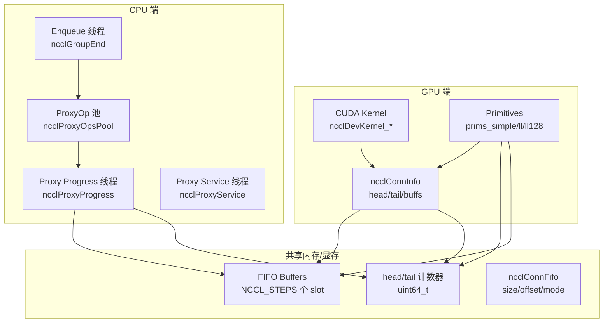
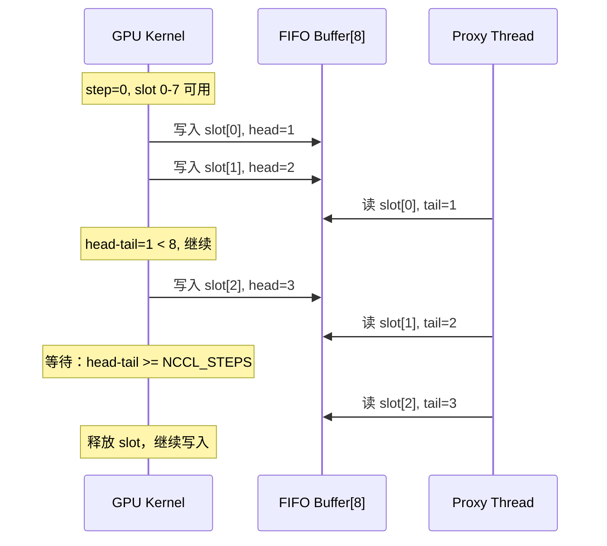
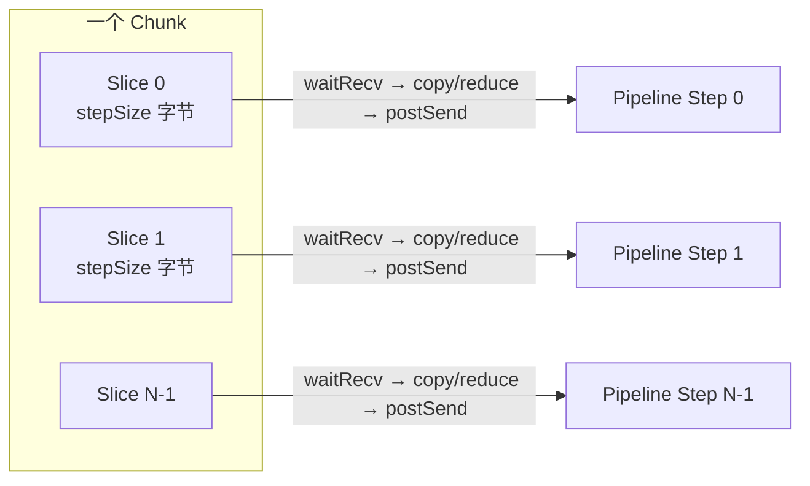
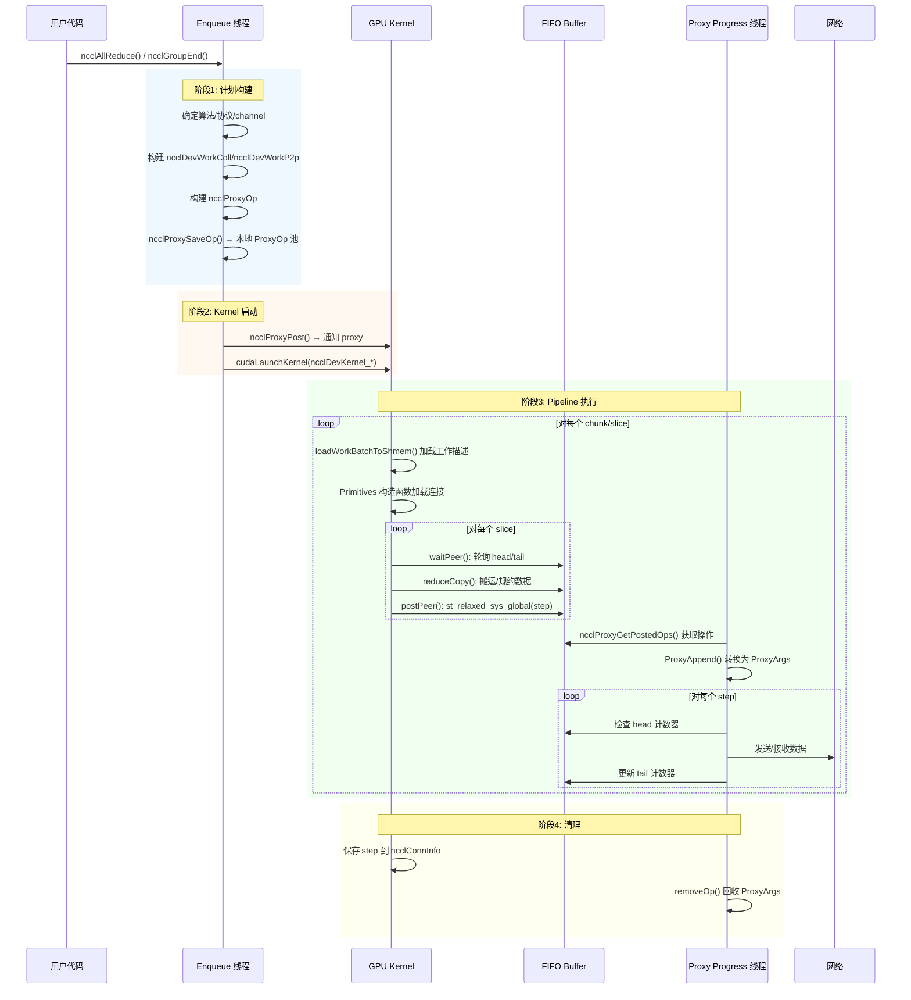
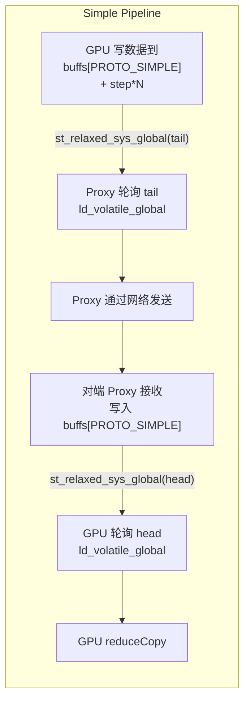
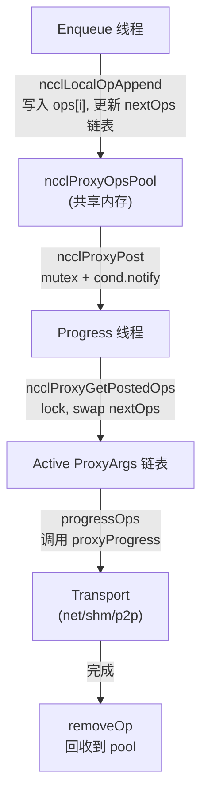
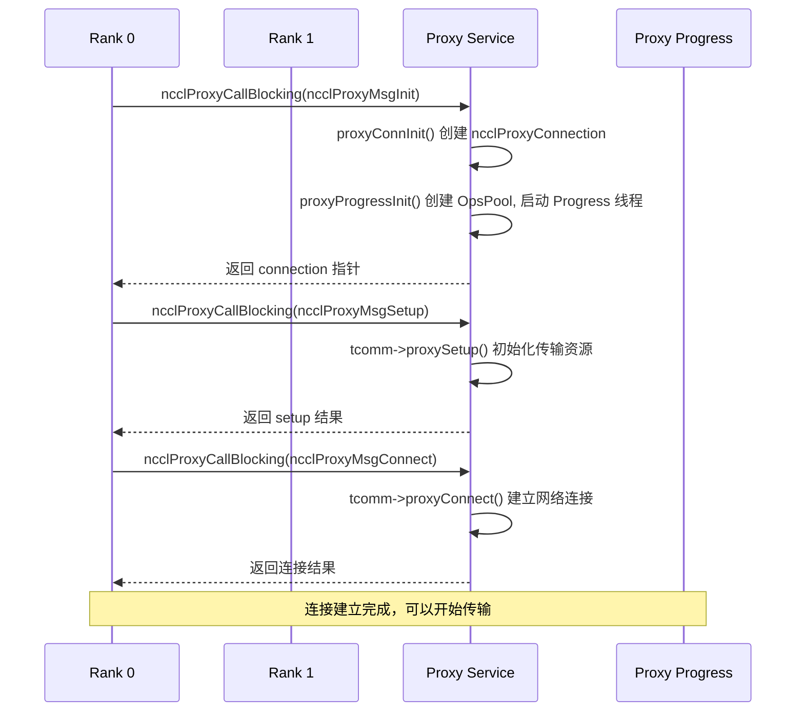

# NCCL Kernel-Proxy Pipeline 机制深度源码分析

> 基于 NCCL 源码（`/root/source/nccl`）的深入技术分析文档

---

## 目录

1. [总体架构概览](#1-总体架构概览)
2. [Channel 机制](#2-channel-机制)
3. [Steps 机制](#3-steps-机制)
4. [Chunk 与 Slice 机制](#4-chunk-与-slice-机制)
5. [Kernel-Proxy Pipeline 完整生命周期](#5-kernel-proxy-pipeline-完整生命周期)
6. [三种协议的 Pipeline 差异](#6-三种协议的-pipeline-差异)
7. [Proxy 线程架构](#7-proxy-线程架构)
8. [Enqueue 流程](#8-enqueue-流程)
9. [关键数据结构索引](#9-关键数据结构索引)

---

## 1. 总体架构概览

NCCL 的通信由 **GPU Kernel** 和 **CPU Proxy 线程**协同完成。GPU kernel 负责在 GPU 端搬运和规约数据，CPU proxy 线程负责通过网络传输数据。两者通过共享内存中的 **FIFO 缓冲区**和 **step 计数器**进行同步。



**核心协作模型**：
- GPU kernel 写入/读取 FIFO 缓冲区，并通过 `head`/`tail` 计数器通知 proxy
- Proxy 线程轮询 `head`/`tail`，检测到新数据后通过网络发送，或将网络接收到的数据写入 FIFO 并更新计数器
- 两者通过 **volatile 原子变量** 实现无锁同步

---

## 2. Channel 机制

### 2.1 数据结构

Channel 是 NCCL 中数据传输的基本通道单元。每个 channel 独立工作，多个 channel 可以并行传输以利用带宽。

**主机端 Channel**（`src/include/comm.h: struct ncclChannel`）：

```cpp
struct ncclChannel {
    struct ncclChannelPeer** peers;          // 每个对等 rank 的连接器
    struct ncclDevChannelPeer** devPeers;    // 设备端对等连接器
    struct ncclDevChannelPeer** devPeersHostPtr; // 设备端指针的主机副本
    struct ncclRing ring;                    // Ring 拓扑
    int* devRingUserRanks;
    struct ncclTree tree;                    // Tree 拓扑
    // Collnet, NVLS 拓扑...
    int id;                                  // Channel 编号
    uint32_t workFifoProduced;               // 工作 FIFO 生产计数
};
```

**设备端 Channel**（`src/include/device.h: struct ncclDevChannel`）：

```cpp
struct ncclDevChannel {
    struct ncclDevChannelPeer** peers;   // 设备端对等连接信息
    struct ncclRing ring;
    struct ncclTree tree;
    // ...
    uint32_t* workFifoDone;             // 工作完成计数器
    uint64_t workCounter;               // 工作 counter
};
```

**对等连接**（`src/include/device.h: struct ncclChannelPeer`）：

```cpp
struct ncclChannelPeer {
    struct ncclConnector send[NCCL_MAX_CONNS];  // 发送连接器 (最多2个)
    struct ncclConnector recv[NCCL_MAX_CONNS];  // 接收连接器 (最多2个)
    int refCount;
};
```

每个 `ncclConnector` 包含：
```cpp
struct ncclConnector {
    int connected;
    struct ncclProxyConnector proxyConn;   // Proxy 连接
    struct ncclTransportComm* transportComm; // 传输层接口
    void* transportResources;
    struct ncclConnInfo conn;              // 连接信息（核心！）
};
```

### 2.2 连接信息 ncclConnInfo

`ncclConnInfo`（`src/include/device.h`）是 GPU kernel 和 proxy 线程之间的共享状态：

```cpp
struct ncclConnInfo {
    char *buffs[NCCL_NUM_PROTOCOLS];    // FIFO 缓冲区数组（按协议）
    void* mhandles[NCCL_NUM_PROTOCOLS]; // 内存句柄
    uint64_t *tail;     // 对方写入的步进计数（recv端本地，send端远程）
    uint64_t *head;     // 本方写入的步进计数（send端本地，recv端远程）
    int flags;          // 直接通信标志
    int stepSize;       // SIMPLE 协议每步的字节数
    void **ptrExchange; // 直接通信时的指针交换
    struct ncclConnFifo* connFifo; // GPU-Proxy 通信 FIFO
    uint64_t step;      // 当前进度
};
```

### 2.3 Channel 与 Transport 的关系

Transport 是底层传输实现，定义在 `src/include/transport.h`：

```cpp
#define TRANSPORT_P2P 0      // GPU-GPU NVLink/PCIe
#define TRANSPORT_SHM 1      // 共享内存
#define TRANSPORT_NET 2      // 网络（IB/RoCE等）
#define TRANSPORT_COLLNET 3  // 集合网络
```

每个 transport 实现了以下接口：
- `proxyProgress`: proxy 进度回调（核心！负责实际数据搬运）
- `proxySetup`: proxy 初始化
- `proxyConnect`: proxy 连接

**Channel 选择逻辑**：
- `comm->nChannels`: 集合通信使用的 channel 数
- `comm->p2pnChannels`: P2P 通信使用的 channel 数
- 每个算法（Ring/Tree/Collnet/NVLS）会使用不同 channel 子集

---

## 3. Steps 机制

### 3.1 Step 的概念

Step 是 NCCL pipeline 中的**进度单位**。FIFO 缓冲区被分为 `NCCL_STEPS = 8` 个 slot，每个 step 对应一个 slot。

```cpp
// src/include/device.h
#define NCCL_STEPS 8
```

**核心同步机制**：
- **`head` 计数器**：GPU kernel（或 proxy）写入数据后递增，表示"我已经写到了第几步"
- **`tail` 计数器**：proxy（或 GPU kernel）读取数据后递增，表示"我已经读到了第几步"

**同步规则**：
- **发送方**（写 FIFO）：必须等待 `head - tail < NCCL_STEPS`，即有空闲 slot
- **接收方**（读 FIFO）：必须等待 `tail < head`，即有新数据



### 3.2 ProxySubArgs 中的 Step 跟踪

在 `src/include/proxy.h` 的 `ncclProxySubArgs` 中：

```cpp
struct ncclProxySubArgs {
    int nsteps;            // 总 step 数
    uint64_t base;         // 起始 step
    uint64_t posted;       // 已提交到网络的 step 数
    uint64_t received;     // 已从网络接收的 step 数
    uint64_t transmitted;  // 已传输完成的 step 数
    uint64_t flushed;      // 已 flush 的 step 数
    uint64_t done;         // 已确认完成的 step 数
    uint64_t end;          // 结束 step
    void* requests[NCCL_STEPS]; // 每步的网络请求
};
```

**Proxy 状态转换**（从 `proxy.cc: printProxyOp` 可见）：

对于 **Recv 模式**：
1. `posted < nsteps && posted < done + NCCL_STEPS` → **Init**：提交网络接收请求
2. `received < posted` → **Receiving**：等待网络数据到达
3. `transmitted < received` → **Flushing**：flush 数据到 GPU
4. `done < transmitted` → **Waiting GPU**：等待 GPU kernel 确认

对于 **Send 模式**：
1. `posted < nsteps && posted < done + NCCL_STEPS` → **Init**：准备发送
2. `transmitted < posted` → **Waiting GPU**：等待 GPU kernel 写入数据
3. `done < transmitted` → **Sending**：正在通过网络发送

### 3.3 GPU 端的 Step 轮询

在 Simple 协议的 `waitPeer` 函数中（`src/device/prims_simple.h`）：

```cpp
// 发送方等待：需要有空闲 slot（head 不超过 tail + NCCL_STEPS）
while (connStepCache + (isSendNotRecv ? NCCL_STEPS : 0) < step + StepPerSlice) {
    connStepCache = loadStepValue(connStepPtr);  // volatile 加载
    if (checkAbort(flags, Aborted, spins)) break;
}
```

- 发送方读 `head`（远程已读进度），判断 `head + NCCL_STEPS >= step`
- 接收方读 `tail`（远程已写进度），判断 `tail >= step`

数据写入完成后，通过 `postPeer` 更新计数器：

```cpp
st_relaxed_sys_global(connStepPtr, step);  // release 语义写入
```

---

## 4. Chunk 与 Slice 机制

### 4.1 Chunk 机制

Chunk 是在一次 kernel 调用中分配给单个 channel 的**数据总量**。

**Chunk 大小确定**：

在 `src/include/proxy.h` 的 `ncclProxyOp` 中：

```cpp
struct ncclProxyOp {
    size_t chunkSize;     // chunk 大小
    size_t sliceSize;     // slice 大小
    size_t loopSize;      // 循环大小
    size_t channelSize;   // channel 总大小
    uint8_t sliceSteps;   // 每个 slice 占用的 step 数
    uint8_t chunkSteps;   // 每个 chunk 占用的 step 数
};
```

**Chunk 大小计算**：
- `chunkSize = stepSize * chunkSteps`
- `stepSize = buffSize[protocol] / NCCL_STEPS`（FIFO 每个 slot 的大小）
- `buffSize` 取决于协议：
  - Simple: 直接数据缓冲
  - LL: 每行 8 字节数据 + 8 字节 flag
  - LL128: 128 字节行，120 字节数据 + 8 字节 flag

### 4.2 Slice 机制

Slice 是 channel 上更细粒度的**工作划分单位**。一个 chunk 被进一步切分为多个 slice。

**Slice 与 Chunk 的关系**（Simple 协议，`src/device/primitives.h`）：

```cpp
template<int SlicePerChunk_1, int StepPerSlice_1, ...>
struct ProtoSimple {
    static constexpr int SlicePerChunk = SlicePerChunk_1;  // 每 chunk 几个 slice
    static constexpr int StepPerSlice = StepPerSlice_1;    // 每 slice 几个 step
};
```

典型配置：
- `SlicePerChunk = 1`：一个 chunk 就是一个 slice（常见配置）
- `SlicePerChunk = 2`：一个 chunk 分成 2 个 slice
- `StepPerSlice = 1`：每个 slice 用 1 个 step（即 1 个 FIFO slot）

**Slice 在 pipeline 中的流转**：



在 `genericOp`（`src/device/prims_simple.h`）中，slice 的处理逻辑：

```cpp
do {
    sliceSize = sliceSize < nelem-offset ? sliceSize : nelem-offset;
    // 1. 设置源/目标指针
    if (tid == 0) {
        ncclShmem.groups[group].srcs[0] = ...;
        ncclShmem.groups[group].dsts[0] = ...;
    }
    // 2. 等待对端准备好（waitPeer）
    waitPeer<DirectRecv, DirectSend, Recv, Send, Src, Dst>(...);
    subBarrier();
    // 3. 执行数据搬运/规约（reduceCopy）
    reduceCopy<...>(...);
    // 4. 通知对端完成（postPeer）
    barrier();
    postPeer<Recv, Send>(0 < workSize);
    offset += sliceSize;
    slice += 1;
} while (slice < SlicePerChunk && offset < nelem);
```

### 4.3 Continuous Byte Distribution (CBD)

在集合通信中，数据被分配到多个 channel，使用 CBD 策略：

```cpp
// src/include/device.h: struct ncclDevWorkColl
struct ncclDevWorkColl {
    uint32_t channelLo:8, channelHi:8;  // channel 范围
    struct {
        size_t countLo, countMid, countHi;         // 各段数据量
        uint64_t chunkGrainsLo:21, chunkGrainsMid:21, chunkGrainsHi:21; // chunk 粒度
    } cbd;
};
```

每个 channel 根据其 ID 获取对应的数据段：
- `channelLo`: 获取 `countLo` 字节
- `channelLo+1` 到 `channelHi-1`: 获取 `countMid` 字节
- `channelHi`: 获取 `countHi` 字节

---

## 5. Kernel-Proxy Pipeline 完整生命周期

### 5.1 完整流程



### 5.2 阶段详细分析

#### 阶段 1: 计划构建

**代码路径**: `collectives.cc` → `enqueue.cc`

1. 用户调用集合通信 API（如 `ncclAllReduce`）
2. `ncclEnqueueCheck`（`enqueue.cc`）被调用
3. 创建 `ncclTaskColl` 任务
4. 调度器决定算法和协议
5. 构建 `ncclDevWorkColl` 设备工作描述
6. 构建 `ncclProxyOp` 代理操作，调用 `ncclProxySaveOp`

`ncclProxySaveOp`（`proxy.cc`）根据 pattern 类型确定需要 proxy 的方向：

```cpp
case ncclPatternRing:
case ncclPatternPipelineFrom:
case ncclPatternPipelineTo: {
    // Ring: forward (recv from prev, send to next)
    needProxy = NeedProxy(proxyRecv, ...);
    if (needProxy) SaveProxy(comm, channel, proxyRecv, ring->prev, op, 0, justInquire);
    needProxy = NeedProxy(proxySend, ...);
    if (needProxy) SaveProxy(comm, channel, proxySend, ring->next, op, 0, justInquire);
}
```

#### 阶段 2: Kernel 启动

1. `ncclProxyStart`（`proxy.cc`）将本地缓存的 proxy ops 通过 `ncclProxyPost` 发送到 progress 线程
2. `ncclProxyPost` 使用 mutex + condition variable 通知 progress 线程
3. CUDA kernel 被启动（如 `ncclDevKernel_AllReduce_Sum_f32_RING_Simple`）

#### 阶段 3: Pipeline 执行

**GPU 端**：

`ncclKernelMain`（`src/device/common.h`）是 kernel 入口：

```cpp
template<int SpecializedFnId, typename SpecializedRunWorkBatch>
__device__ void ncclKernelMain(struct ncclDevKernelArgs const* args) {
    // 1. 复制 kernel args 到 shmem
    // 2. 计算 channelId（从 channelMask bitset 中找第 blockIdx.x 个 set bit）
    // 3. 加载 comm, channel, work batch 到 shmem
    // 4. 循环处理 work batch
    while (ncclShmem.aborted == 0) {
        profiler(START);
        // 执行具体集合算法
        RunWorkBatch<...>().run();
        if (ncclShmem.nextBatchIx == -1) break;
        loadWorkBatchToShmem(...);
    }
}
```

**CPU Proxy 端**：

`ncclProxyProgress`（`proxy.cc`）是 progress 线程主循环：

```cpp
void* ncclProxyProgress(void *proxyState_) {
    do {
        int idle = 1;
        // 1. 推进所有活跃操作
        ret = progressOps(proxyState, state, state->active, &idle);
        // 2. 获取新提交的操作（频率由 PROGRESS_APPENDOP_FREQ 控制）
        if (idle || !state->active || (++proxyOpAppendCounter == ncclParamProgressAppendOpFreq())) {
            ret = ncclProxyGetPostedOps(proxyState, &added);
        }
    } while (!stop && !abortFlag);
}
```

#### 阶段 4: 清理

- GPU 端：Primitives 析构函数保存 `conn->step`
- Proxy 端：`progressOps` 中检测完成的操作，调用 `removeOp` 回收到池中

---

## 6. 三种协议的 Pipeline 差异

NCCL 支持三种数据传输协议，每种协议的 FIFO 格式和同步方式不同。

### 6.1 Simple 协议

**文件**: `src/device/prims_simple.h`

**特点**：
- 数据直接写入 FIFO 缓冲区
- 同步通过 `head`/`tail` 计数器
- 支持 Direct 通信（NVLink P2P 直接读写远程 GPU 内存）

**FIFO 格式**：
```
+------------------+
|  data (stepSize) | slot 0
+------------------+
|  data (stepSize) | slot 1
+------------------+
|      ...         |
+------------------+
|  data (stepSize) | slot 7
+------------------+
```

**数据流**：



**stepSize 计算**（`prims_simple.h: ProtoSimple`）：
```cpp
__device__ static int calcBytePerStep() {
    return ncclShmem.comm.buffSizes[NCCL_PROTO_SIMPLE] / NCCL_STEPS;
}
```

**关键同步代码**：

发送方等待空闲 slot：
```cpp
while (connStepCache + NCCL_STEPS < step + StepPerSlice) {
    connStepCache = loadStepValue(connStepPtr); // volatile load
}
```

写入后通知：
```cpp
st_relaxed_sys_global(connStepPtr, step);  // relaxed store + fence
```

### 6.2 LL (Low-Latency) 协议

**文件**: `src/device/prims_ll.h`

**特点**：
- 数据和 flag 交织存储，每 16 字节包含 8 字节数据 + 4 字节 flag + 4 字节 flag
- 通过 flag 轮询替代 head/tail 计数器实现更低延迟
- 不支持 Direct 通信

**FIFO 格式**（`ncclLLFifoLine`，`src/include/device.h`）：
```
+----------+------+----------+------+
| data1    |flag1 | data2    |flag2 |  16 字节一行
| (32-bit) |(32b) | (32-bit) |(32b) |
+----------+------+----------+------+
```

```cpp
union ncclLLFifoLine {
    struct {
        uint32_t data1;
        uint32_t flag1;
        uint32_t data2;
        uint32_t flag2;
    };
    uint64_t v[2];
    int4 i4;
};
```

**同步机制**：

LL 使用**内联 flag** 而非外部计数器。接收方通过 volatile load 检查 flag：

```cpp
__device__ uint64_t readLL(int offset, int i) {
    union ncclLLFifoLine* src = recvPtr(i) + offset;
    uint32_t flag = recvFlag(i);  // = NCCL_LL_FLAG(recvStep[i]+1)
    uint32_t data1, flag1, data2, flag2;
    do {
        asm volatile("ld.volatile.global.v4.u32 {%0,%1,%2,%3}, [%4];"
            : "=r"(data1), "=r"(flag1), "=r"(data2), "=r"(flag2)
            : "l"(&src->i4) : "memory");
    } while ((flag1 != flag) || (flag2 != flag));
    return data1 + (((uint64_t)data2) << 32);
}
```

发送方仍然使用 head 计数器与 proxy 同步（proxy 需要知道何时有数据可发）：

```cpp
__device__ void waitSend(int nbytes) {
    while (sendConnHeadCache + NCCL_STEPS < sendConnHead + 1) {
        sendConnHeadCache = *sendConnHeadPtr;
    }
    sendConnHead += 1;
}
```

**LL 清理机制**：当 step 的低 27 位接近回绕时（`NCCL_LL_CLEAN_MASK = 0x7ffffff8`），写入全 flag 以避免数据损坏：

```cpp
if ((sendStep[i] & NCCL_LL_CLEAN_MASK) == NCCL_LL_CLEAN_MASK) {
    for (int o = offset; o < stepLines; o += nthreads)
        storeLL(sendPtr(i)+o, 0, sendFlag(i));
}
```

**数据效率**：每 16 字节传输 8 字节数据 = **50% 有效载荷**。

### 6.3 LL128 协议

**文件**: `src/device/prims_ll128.h`

**特点**：
- 128 字节一行，120 字节数据 + 8 字节 flag
- flag 只由 "flag thread"（每 8 线程中的第 7 个）负责写入/检查
- 数据效率约 **93.75%**
- 使用 128 字节对齐的 load128/store128 指令

**FIFO 格式**：
```
+-------------------------------------------+---------+
| data[0..14]  (120 bytes = 15 × uint64_t)  | flag    |  128 字节一行
+-------------------------------------------+---------+
```

```cpp
#define NCCL_LL128_LINESIZE 128
#define NCCL_LL128_LINEELEMS (NCCL_LL128_LINESIZE/sizeof(uint64_t))  // 16
#define NCCL_LL128_DATAELEMS (NCCL_LL128_LINEELEMS-1)                // 15
```

**同步机制**：

使用 `__any_sync` warp 级同步来检查 flag：

```cpp
do {
    needReload = false;
    for (int u=0; u<ELEMS_PER_THREAD; u+=2) {
        load128(ptr+u*WARP_SIZE, vr[u], vr[u+1]);
        needReload |= flagThread && (vr[u+1] != flag);
    }
    needReload &= (0 == checkAbort(abort, 1, spins));
} while (__any_sync(WARP_MASK, needReload));
```

**Flag Thread 设计**：
```cpp
const bool flagThread = (tid%8)==7;  // 每 8 线程中第 7 个
```

- 非 flag thread 只读写数据
- Flag thread 额外负责读写 flag 字段
- 通过 warp 级 `__any_sync` 传递检查结果

**数据效率**：每 128 字节传输 120 字节数据 = **93.75% 有效载荷**。

### 6.4 三种协议对比

| 特性 | Simple | LL | LL128 |
|------|--------|-----|-------|
| **同步方式** | head/tail 计数器 | 内联 flag | 内联 flag + __any_sync |
| **数据效率** | 100% | 50% | 93.75% |
| **行大小** | stepSize (可变) | 16B (8B 数据) | 128B (120B 数据) |
| **延迟** | 高（需要 fence） | 低（volatile load） | 低（volatile load） |
| **Direct 支持** | ✅ | ❌ | ❌ |
| **最大线程数** | 512 | 512 | 640 |
| **Proxy 同步** | head/tail | head + connFifo | head + tail + connFifo |
| **适用场景** | 大数据量 | 极小消息 | 中等消息 |

---

## 7. Proxy 线程架构

NCCL 有三个级别的 proxy 线程：

### 7.1 Proxy Service 线程

**入口**: `ncclProxyService`（`proxy.cc`）

职责：
- 监听 socket 连接
- 处理控制消息（Init/Setup/Connect/Register 等）
- 管理 proxy 连接池（`ncclProxyConnectionPool`）
- 通过 poll 系统调用等待事件

```cpp
void* ncclProxyService(void* _args) {
    while (stop == PROXY_RUNNING || npeers > 0) {
        ret = poll(pollfds, NCCL_MAX_PROXY_CONNECTIONS+1, asyncOpCount ? 0 : 500);
        // 处理新连接
        // 处理异步操作（setup, connect, register）
        // 处理关闭
    }
}
```

### 7.2 Proxy Progress 线程

**入口**: `ncclProxyProgress`（`proxy.cc`）

职责：
- 从共享内存池获取新提交的 proxy ops
- 将 proxy ops 转换为 `ncclProxyArgs`
- 调用 transport 的 `proxyProgress` 回调推进数据传输

```cpp
void* ncclProxyProgress(void *proxyState_) {
    do {
        // 1. 推进所有活跃操作
        progressOps(proxyState, state, state->active, &idle);
        // 2. 获取新操作
        ncclProxyGetPostedOps(proxyState, &added);
    } while (!stop);
}
```

### 7.3 操作池与共享内存

Proxy ops 通过共享内存在 enqueue 线程和 progress 线程之间传递：

```
ncclProxyOpsPool (共享内存)
├── ops[MAX_OPS_PER_PEER * NCCL_MAX_LOCAL_RANKS]  // 操作数组
├── nextOps / nextOpsEnd                            // 待处理链表
├── freeOps[NCCL_MAX_LOCAL_RANKS]                  // 每个本地 rank 的空闲链表
├── mutex / cond                                    // 同步
```

**操作流程**：



### 7.4 ProxyArgs 聚合

多个 ProxyOp 可以被**聚合**为一个 `ncclProxyArgs`，共享同一个进度回调：

```cpp
// proxy.cc: ProxyAppend
if (shared && args->opCount == op->opCount) {
    // 相同 opCount 的操作可以合并为 sub
    ncclProxyOpToArgs(op, args, args->nsubs);
} else {
    // 新建独立的 ProxyArgs
    allocateArgs(state, &args);
    ncclProxyOpToArgs(op, args, 0);
}
```

`ncclProxyArgs` 最多有 `NCCL_PROXY_MAX_SUBS = MAXCHANNELS = 64` 个 sub。

---

## 8. Enqueue 流程

### 8.1 任务提交

用户通过 `ncclGroupStart/End` 提交任务。在 `ncclGroupEnd` 中：

1. 任务被分类为 Coll/P2p/Bcast/Rma
2. 调度器决定算法和协议
3. 构建 kernel plan（`ncclKernelPlan`）
4. 添加 proxy ops
5. 启动 kernel

### 8.2 Work Batch

GPU 端通过 **work batch** 机制接收工作描述：

```cpp
struct ncclDevWorkBatch {
    uint32_t nextJump:14, nextExtends:1;  // 链表
    uint32_t workType:2, funcId:15;       // 工作类型和函数 ID
    uint32_t offsetBase;                   // FIFO 偏移基址
    uint64_t offsetBitset;                 // 偏移位集
};
```

Kernel 中的 `loadWorkBatchToShmem`（`common.h`）负责将 work batch 从 global memory 加载到 shared memory：

```cpp
__device__ void loadWorkBatchToShmem(int tid, int tn, ...) {
    // 1. 读取 batch header
    // 2. 使用 FNS (find n-th set) 解析 offsetBitset
    // 3. 按 workType 确定结构体大小
    // 4. 以 16 字节为单位加载到 shmem
}
```

### 8.3 Kernel Plan 与 Channel 分配

`ncclKernelPlan`（`src/include/comm.h`）包含：
- `channelMask`: 哪些 channel 有工作
- `workQueue`: 工作列表
- `proxyOpQueue`: proxy 操作列表
- `p2pTaskQueue`, `collTaskQueue`, `bcastTaskQueue`: 各类任务队列

---

## 9. 关键数据结构索引

| 结构体 | 文件路径 | 用途 |
|--------|----------|------|
| `ncclComm` | `src/include/comm.h` | 通信器，包含所有状态 |
| `ncclChannel` | `src/include/comm.h` | 主机端 channel |
| `ncclDevChannel` | `src/include/device.h` | 设备端 channel |
| `ncclChannelPeer` | `src/include/device.h` | 对等连接器（send/recv） |
| `ncclConnInfo` | `src/include/device.h` | 连接信息（head/tail/buffs） |
| `ncclConnector` | `src/include/device.h` | 连接器（含 proxy 和 transport） |
| `ncclProxyOp` | `src/include/proxy.h` | 代理操作描述 |
| `ncclProxyArgs` | `src/include/proxy.h` | 代理执行参数 |
| `ncclProxySubArgs` | `src/include/proxy.h` | 代理子参数（per-connection） |
| `ncclProxyState` | `src/include/proxy.h` | 代理全局状态 |
| `ncclProxyOpsPool` | `src/include/proxy.h` | 共享内存操作池 |
| `ncclSendMem` | `src/include/comm.h` | 发送端共享内存布局 |
| `ncclRecvMem` | `src/include/comm.h` | 接收端共享内存布局 |
| `ncclLLFifoLine` | `src/include/device.h` | LL 协议 FIFO 行 |
| `ncclDevWorkColl` | `src/include/device.h` | 集合通信工作描述 |
| `ncclDevWorkP2p` | `src/include/device.h` | P2P 工作描述 |
| `ncclDevWorkBatch` | `src/include/device.h` | 工作批次描述 |
| `ncclShmemData` | `src/device/common.h` | Kernel shared memory 布局 |
| `ncclKernelPlan` | `src/include/comm.h` | Kernel 计划 |
| `ncclKernelPlanner` | `src/include/comm.h` | Kernel 计划构建器 |

---

## 附录 A: 连接建立流程



## 附录 B: ncclConnFifo 结构

`ncclConnFifo`（`src/include/nccl_device/core.h`）用于 GPU-Proxy 间的额外元数据交换：

```cpp
struct ncclConnFifo {
    int size;     // 数据大小（字节）
    int offset;   // 偏移模式下的偏移量
    int mode;     // 模式：NCCL_MODE_OFFSET 等
    int ready;    // 就绪标志
};
```

在 Simple 协议中，`connFifo` 用于：
- 发送方写入 `size`，告知 proxy 要发送多少数据
- 支持 offset 模式，让 proxy 知道数据的实际位置

---

*文档生成时间：2026-03-30*
*源码版本：基于 NCCL 主分支（含 NVLS/PAT 支持）*
