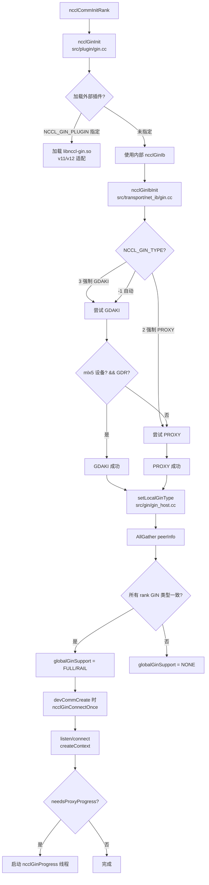
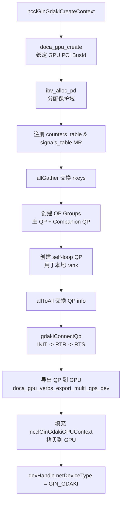
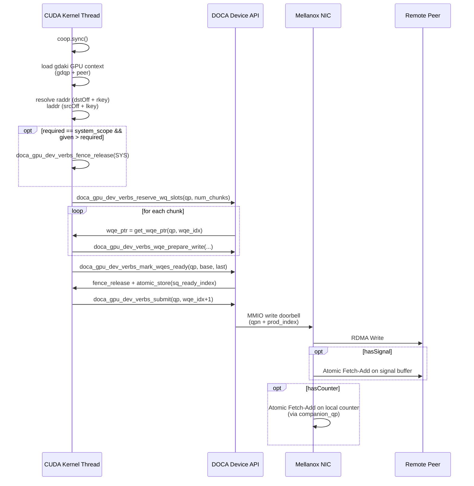
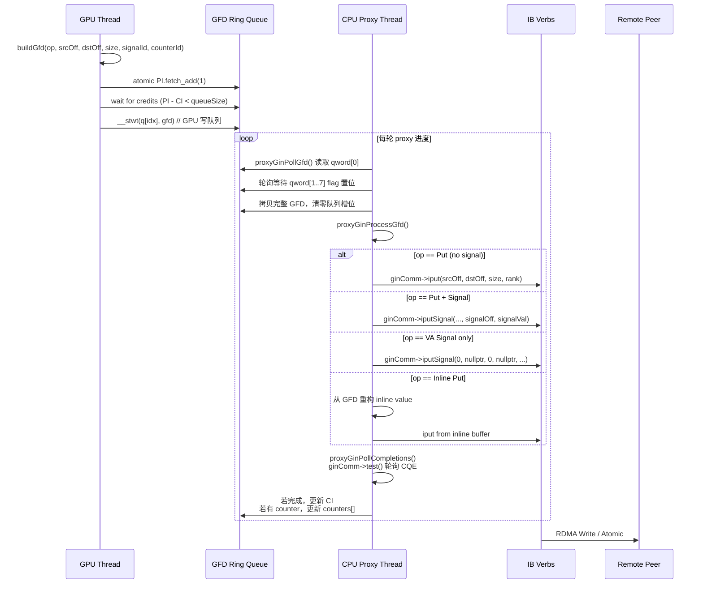
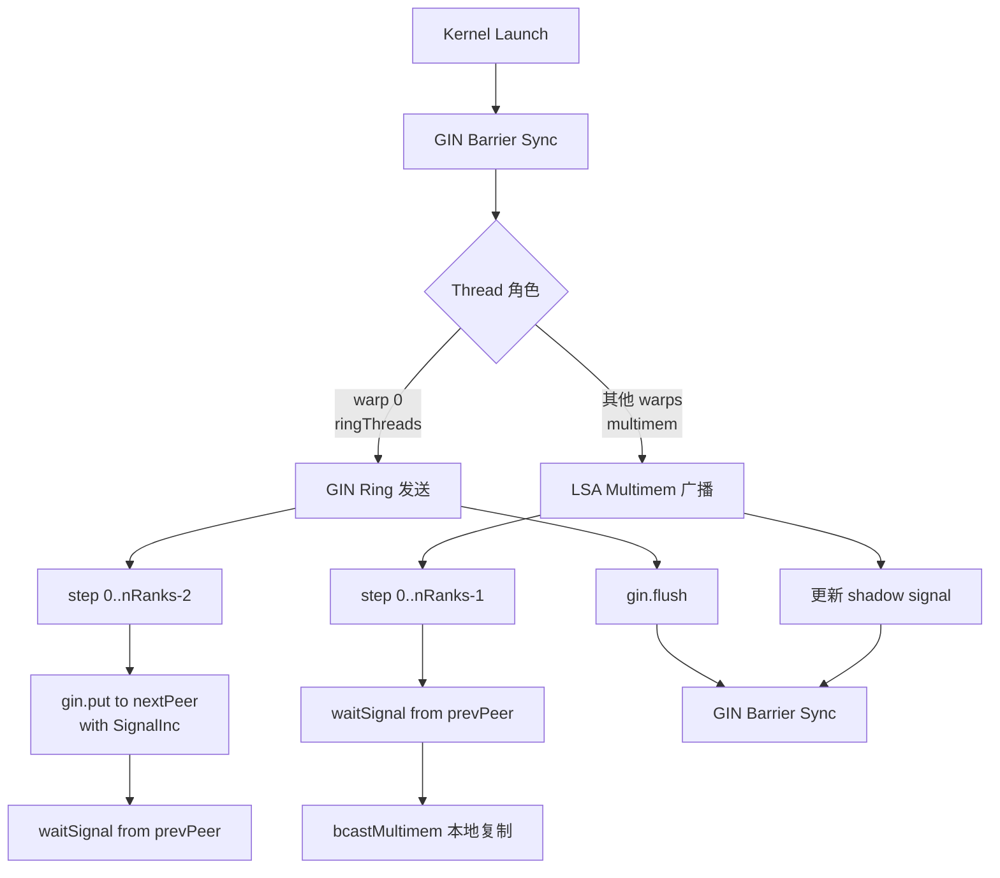
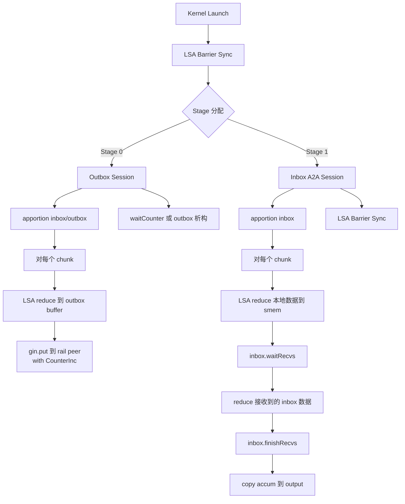

# GIN (GPU-Initiated Networking) 深度实现分析

> 基于 NCCL 源码分析整理，分析对象包括 `src/gin/`、`src/transport/net_ib/gin.cc`、
> `src/transport/net_ib/gdaki/`、`src/include/nccl_device/gin/`、`src/device/symmetric/*_gin.cuh` 等核心文件。

---

## 1. 概述与设计初衷

### 1.1 什么是 GIN

**GIN（GPU-Initiated Networking）** 是 NCCL 中允许 **GPU CUDA 内核直接发起 RDMA 网络操作** 的子系统，无需 CPU 介入。它打破了传统 "GPU Kernel → GPU Memory → CPU → NIC → Network" 的路径，实现了真正的零拷贝 GPU-Direct 跨节点通信。

传统路径 vs GIN 路径：

```
Traditional:  GPU Memory -> CPU (memcpy/driver) -> NIC -> Network
GIN:          GPU Memory -> NIC (GPU direct) -> Network
```

### 1.2 设计初衷

1. **消除 CPU 瓶颈**：大规模 AI 训练（LLM、MoE）中，all-reduce/all-gather 的通信量巨大，CPU 代理线程成为瓶颈。
2. **降低延迟**：GPU 直接写 WQE（Work Queue Entry）并 ring doorbell，省去了 CPU 中断/轮询/系统调用的开销。
3. **统一编程模型**：将网络操作抽象为设备端可调用的 `put()` / `signal()` / `waitSignal()` API，与 LSA（Local Shared Address）/NVLink 操作统一。
4. **向后兼容**：当硬件不支持 GPU-initiated RDMA 时，自动回退到 CPU Proxy 模式，保证可移植性。

### 1.3 两种后端

| 后端 | 全称 | 实现方式 | 适用场景 |
|------|------|---------|---------|
| **GDAKI** | GPU-Direct Async Kernel-Initiated | GPU 直接通过 DOCA GPUNetIO 写 WQE、ring DB | Mellanox mlx5 NIC + 支持 DMA-BUF/GDR 的 GPU |
| **PROXY** | CPU Proxy | GPU 将 GFD（GPU Fetch Descriptor）写入队列，CPU 线程消费并执行 IB Verbs | 兼容 fallback，任意 RDMA NIC |

选择由环境变量 `NCCL_GIN_TYPE` 控制：`-1`=自动（默认，先尝试 GDAKI，失败回退 PROXY），`2`=强制 PROXY，`3`=强制 GDAKI。

---

## 2. 架构总览

### 2.1 代码布局

```
src/
├── gin/
│   ├── gin_host.cc          # Host 侧 GIN 连接、注册、进度线程
│   └── gin_host_proxy.cc    # PROXY 后端 host 实现
├── transport/net_ib/
│   ├── gin.cc               # GIN-IB 工厂：选择 GDAKI/PROXY，连接管理
│   ├── gin.h                # ncclGinIbCollComm 结构
│   └── gdaki/
│       ├── gin_host_gdaki.cc    # GDAKI host 实现（DOCA QP 创建、导出）
│       ├── gin_host_gdaki.h
│       └── doca-gpunetio/       # Vendored DOCA GPUNetIO 库
├── include/
│   ├── gin/gin_host.h       # ncclGinState 定义
│   ├── plugin/gin/gin_v12.h # GIN 插件 vtable (ncclGin_v12_t)
│   └── nccl_device/gin/
│       ├── gin.h                    # 设备端 ncclGin 类 API
│       ├── gin_device_common.h      # 后端分发 (ncclGinCallImpl)
│       ├── gdaki/gin_gdaki.h        # GDAKI 设备实现
│       └── proxy/gin_proxy.h        # PROXY 设备实现
├── device/symmetric/
│   ├── all_gather_gin.cuh       # GIN AllGather kernel
│   ├── reduce_scatter_gin.cuh   # GIN ReduceScatter kernel
│   ├── gin_scratch__types.h     # Outbox/Inbox A2A session
│   └── gin_scratch__funcs.h
├── plugin/
│   └── gin.cc               # GIN 插件加载器（v11/v12 适配）
└── init.cc                  # 全局 GIN 支持度决策
```

### 2.2 层次架构

```
┌─────────────────────────────────────────────────────────────┐
│  Collective Kernels (AllGather/ReduceScatter/AllToAll)      │
│  src/device/symmetric/*_gin.cuh                             │
├─────────────────────────────────────────────────────────────┤
│  Device API: ncclGin::put(), signal(), flush(), waitSignal()│
│  src/include/nccl_device/gin.h                              │
├─────────────────────────────────────────────────────────────┤
│  Backend Dispatch: ncclGinCallImpl<>()                      │
│  编译期/运行期分派到 GDAKI 或 PROXY                         │
├──────────────────────────┬──────────────────────────────────┤
│  GDAKI Device            │  PROXY Device                    │
│  doca_gpu_dev_verbs_put* │  GFD queue post (GPU -> CPU)     │
├──────────────────────────┴──────────────────────────────────┤
│  Host Layer: ncclGinState, plugin loader, QP setup, MR reg  │
│  src/gin/gin_host.cc, src/transport/net_ib/gin.cc           │
├─────────────────────────────────────────────────────────────┤
│  IB Verbs / RDMA Hardware                                   │
└─────────────────────────────────────────────────────────────┘
```

---

## 3. 核心数据结构

### 3.1 Host 侧：ncclGinState

定义在 `src/include/gin/gin_host.h`：

```cpp
struct ncclGinState {
  ncclGin_t* ncclGin;                    // 插件 vtable
  void* ginInstance;                     // 插件实例上下文
  bool connected;
  ncclGinType_t ginType;                 // NONE / PROXY / GDAKI
  int ginCommCount;                      // 连接数（QPs / collComms）
  int ginContextCount;                   // 总上下文数
  void* ginComms[NCCL_GIN_MAX_CONNECTIONS];
  void* ginCtx[NCCL_GIN_MAX_CONNECTIONS];
  ncclNetDeviceHandle_t* ginDevHandles[NCCL_GIN_MAX_CONNECTIONS];
  int needsProxyProgress;                // 是否需要 CPU proxy 进度线程
  std::thread thread;                    // Proxy 进度线程
  ncclSpace signalSpace, counterSpace;   // ID 分配器
  int ctxFirstAvailable;                 // 共享上下文起始
  int ctxLastExclusive;                  // 独占上下文起始
  int ginQueueDepth;
  ncclGinConnectionType_t ginConnectionType; // FULL 或 RAIL
};
```

每个 `ncclComm` 的 `sharedRes` 中持有一个 `ncclGinState`。

### 3.2 插件 VTable：ncclGin_v12_t

定义在 `src/include/plugin/gin/gin_v12.h`：

```cpp
typedef struct {
  const char* name;
  ncclResult_t (*init)(void** ctx, uint64_t commId, ncclDebugLogger_t logFunction);
  ncclResult_t (*devices)(int* ndev);
  ncclResult_t (*getProperties)(int dev, ncclNetProperties_v11_t* props);
  ncclResult_t (*listen)(void* ctx, int dev, void* handle, void** listenComm);
  ncclResult_t (*connect)(void* ctx, void* handles[], int nranks, int rank,
                          int nConnections, int queueDepth, void* listenComm, void** collComm);
  ncclResult_t (*createContext)(void* collComm, int nSignals, int nCounters,
                                int nContexts, void** ginCtx, ncclNetDeviceHandle_v11_t** devHandle);
  ncclResult_t (*regMrSym)(void* collComm, void* data, size_t size, int type,
                           uint64_t mrFlags, void** mhandle, void** ginHandle);
  ncclResult_t (*regMrSymDmaBuf)(...);
  ncclResult_t (*deregMrSym)(void* collComm, void* mhandle);
  ncclResult_t (*destroyContext)(void* ginCtx);
  ncclResult_t (*closeColl)(void* collComm);
  ncclResult_t (*closeListen)(void* listenComm);
  ncclResult_t (*iput)(...);           // RDMA Write
  ncclResult_t (*iputSignal)(...);     // RDMA Write + Atomic Signal
  ncclResult_t (*test)(...);           // 轮询完成
  ncclResult_t (*ginProgress)(...);    // 进度函数
  ncclResult_t (*queryLastError)(...);
  ncclResult_t (*finalize)(void* ctx);
} ncclGin_v12_t;
```

该 vtable 同时被外部插件（`libnccl-gin.so`）和内部 IB 实现（`ncclGinIb`）实现。

### 3.3 GDAKI GPU 上下文

定义在 `src/include/nccl_device/gin/gdaki/gin_gdaki_device_host_common.h`：

```cpp
struct ncclGinGdakiGPUContext {
  struct doca_gpu_dev_verbs_qp *gdqp;          // 每个 peer 一个主 QP
  struct doca_gpu_dev_verbs_qp *companion_gdqp; // 每个 peer 一个 companion QP（用于 counter）
  struct ncclGinGdakiGlobalGPUBufferTable<uint64_t> counters_table;
  struct ncclGinGdakiGlobalGPUBufferTable<uint64_t> signals_table;
  __be32 sink_buffer_lkey;
};
```

### 3.4 PROXY GFD（GPU Fetch Descriptor）

定义在 `src/include/nccl_device/gin/proxy/gin_proxy_device_host_common.h`：

GFD 是一个 64 字节（8 qword）的结构，GPU 将其写入队列，CPU proxy 线程读取：

| QWord | 字段 | 含义 |
|-------|------|------|
| 0 | Header | op, size |
| 1 | SrcOff / InlineLow / VASignalOff | 源偏移或内联数据低 32b 或 VA signal 偏移 |
| 2 | SrcHandle / InlineHigh / VASignalHandle | 源 handle 或内联数据高 16b 或 VA signal window |
| 3 | DstOff | 目标偏移 |
| 4 | DstHandle | 目标 handle |
| 5 | Completion | counterId, signalId, signalValLow |
| 6 | SignalVal | signalValLow2, signalValHigh |
| 7 | Reserved | 保留 |

每个 rank 有一个环形队列，由 `PI`（Producer Index，GPU 写）和 `CI`（Consumer Index，CPU 写）管理。


---

## 4. 关键流程详解

### 4.1 初始化流程



#### 详细步骤

1. **插件加载** (`src/plugin/gin.cc:ncclGinInit`)
   - 进程级单例，尝试从 `NCCL_GIN_PLUGIN` 加载 `.so`，或回退到内部 `ncclGinIb`。
   - 支持 v11 到 v12 的适配（`gin_v11.cc` 将旧 API 桥接到新 API）。

2. **后端选择** (`src/transport/net_ib/gin.cc:ncclGinIbInitType`)
   - GDAKI 要求 `IB_PROVIDER_MLX5` 且支持 GDR（DMA-BUF 或 peerMem）。
   - `ncclGinIbGdakiInit()` 扫描 `ncclIbDevs[]`，仅保留 mlx5 设备到 `ncclGinIbGdakiDevIndexes[]`。
   - 若 GDAKI 条件不满足且为自动模式，回退 PROXY；若强制 GDAKI 失败则报错。

3. **全局能力协商** (`src/init.cc`)
   - `setLocalGinType()` 查询插件 `getProperties(0)` 的 `netDeviceType`。
   - `fillInfo()` 将 `supportedGinType` 写入 `peerInfo`。
   - `bootstrapAllGather()` 收集所有 rank 的信息。
   - 只有当所有 rank 的 `supportedGinType` 一致，且 `!globalNicFused && globalCuMemGdrSupport` 时，才设置 `globalGinSupport = FULL`（跨 NIC）或 `RAIL`（同节点 rail-only）。

4. **连接建立** (`src/gin/gin_host.cc:ncclGinConnectOnce`)
   - 在首次创建 `devComm` 时调用（`src/dev_runtime.cc`）。
   - 通过 `ncclTopoGetLocalGinDevs()` 获取本地 GIN 设备。
   - 每个 connection 执行 `listen()` + `bootstrapAllGather(handles)` + `connect()`。
   - 然后调用 `createContext()`：
     - **GDAKI**：调用 `ncclGinGdakiCreateContext()`，创建 DOCA QPs。
     - **PROXY**：调用 `ncclGinProxyCreateContext()`，创建 GFD 队列、信号/计数器缓冲区。
   - 若任意 `devHandle->needsProxyProgress == 1`，启动 `ncclGinProgress` 线程。

---

### 4.2 GDAKI 后端：CreateContext 与 QP 创建



#### 关键实现细节

代码在 `src/transport/net_ib/gdaki/gin_host_gdaki.cc:471-846`。

**QP 数量计算**：
- `nqps_per_rank = nContexts`
- `nqps_for_comm = nqps_per_rank * nranks`（通信 QP）
- `ncompanion_qps = nqps_for_comm * 2`（companion QP，包含 self-loop）
- `nqps = nqps_per_rank * (nranks + 1)`（+1 是本地 self-loop responder）

**QP Group**：
- 使用 `doca_gpu_verbs_create_qp_group_hl()` 创建，每个 group 包含一个 **Main QP** 和一个 **Companion QP**，共享一个 UAR。
- Send Queue 和 Completion Queue 使用 **GPU 分配的 UMEM**。

**DBR 模式**：
- 默认尝试 `DOCA_GPUNETIO_VERBS_SEND_DBR_MODE_EXT_NO_DBR_HW`（reliable DB，跳过中间 doorbell）。
- 失败则回退 `NO_DBR_SW_EMULATED`，再失败回退 `VALID_DBR`。

**QP 连接**：
- 使用 `allToAll` 交换 `gdaki_exch_info`（lid, qpn, gid）。
- `gdakiConnectQp()` 调用 DOCA Verbs API 将 QP 从 `INIT` 经过 `RTR` 设置到 `RTS`。
- 本地 rank 的 self-loop QP 也经过同样的连接流程，确保 GPU 可以向自己发送数据（在某些算法中需要）。

**QP 导出**：
- `doca_gpu_verbs_export_multi_qps_dev()` 将 host 侧的 `doca_gpu_verbs_qp*` 数组导出为 GPU 可直接访问的 `doca_gpu_dev_verbs_qp*` 数组。
- 导出后的结构包含：WQE 缓冲区地址、doorbell 地址、CQ 信息、qpn 等，全部对 GPU kernel 可见。

---

### 4.3 GDAKI 设备端 PUT 流程



#### WQE 构建与 Doorbell

代码在 `src/include/nccl_device/gin/gdaki/gin_gdaki.h`。

`putImpl()` 的核心逻辑（leader thread，即 `coop.thread_rank() == 0`）：

1. **获取 QP**：`doca_gpu_dev_verbs_qp* qp = loadConst(&gdaki->gdqp) + peer;`
2. **解析地址**：
   - 远程地址：`raddr.addr = dstOff`，`raddr.key = dstMh->rkeys[peer]`
   - 本地地址：`laddr.addr = srcOff`，`laddr.key = srcMh->lkey`
3. **信号地址**：
   - Indexed signal：`signalOffset = sizeof(uint64_t) * (signalId + signals_table.offset)`，`signalKey = signals_table.rkeys[peer]`
   - VA signal：直接使用用户提供的 window + offset
4. **内存栅栏**：若 `required == cuda::thread_scope_system` 且 `given > required`，插入 `doca_gpu_dev_verbs_fence_release<SYS>()`。
5. **调用 DOCA API**：根据是否有 data / signal / counter 组合，调用以下之一：
   - `doca_gpu_dev_verbs_put`
   - `doca_gpu_dev_verbs_put_signal`
   - `doca_gpu_dev_verbs_put_signal_counter`
   - `doca_gpu_dev_verbs_signal`
   - `doca_gpu_dev_verbs_signal_counter`

DOCA 内部（`doca_gpunetio_dev_verbs_onesided.cuh`）执行：
- `reserve_wq_slots`：原子增加 `sq_rsvd_index`，若空间不足则轮询 CQ。
- `wqe_prepare_write`：在 GPU 显存中直接填充 mlx5 WQE（CTRL + ETH + RADDR + DSEG 四个 16B segment）。
- `mark_wqes_ready`：通过 `fence_release` + `atomic_store(sq_ready_index)` 通知 NIC 这些 WQE 已就绪。
- `submit`：构造 doorbell value（`qpn_ds + (prod_index << shift)`），通过 MMIO 原子写通知 NIC 开始处理。

**WQE 格式**（mlx5 ConnectX）：
```
+--------------+--------------+--------------+--------------+
| CTRL (16B)   | ETH (16B)    | RADDR (16B)  | DSEG (16B)   |
+--------------+--------------+--------------+--------------+
```
- CTRL：opcode, qpn, wqe_index, signature
- ETH：用于 RoCE，源/目的 MAC 等
- RADDR：remote_addr (64b) + rkey (32b)
- DSEG：local_addr (64b) + lkey (32b) + length (32b)

**Flush 机制**（`ncclGinApi_Flush<GDAKI>`）：
- 每个 peer 的 QP 上，GPU 读取 `sq_rsvd_index` 得到 ticket。
- 轮询 CQ 直到 ticket 对应的 CQE 出现（`doca_gpu_dev_verbs_poll_one_cq_at`）。
- 这意味着 flush 会等待之前所有 WQE 的完成确认。

---

### 4.4 PROXY 后端：设备端到 Host 端流程



#### PROXY Host 实现细节

代码在 `src/gin/gin_host_proxy.cc`。

**Context 创建** (`ncclGinProxyCreateContext`)：
- 为每个 context 分配：
  - `queues`：GFD 队列，大小 `queueSize * nRanks`。
  - `cis` / `pis`：消费/生产索引，使用 `allocMemCPUAccessible`（优先 GDR，否则 CPU 内存）。
  - `counters`：每个 context 独立的 `uint64_t` 数组，用于本地完成跟踪。
  - `signalsDev`：GPU 上的 signal 缓冲区，注册为 MR 并 allGather rkeys。
  - `inlines`：CPU 上的内联值缓冲区，用于 `putValue`。
- `devHandle->needsProxyProgress = 1`，强制启用 host 线程。

**Proxy 进度线程** (`ncclGinProxyProgress`)：
- 对每个 context、每个 targetRank：
  1. `proxyGinPollCompletions`：轮询之前已提交的 `iput`/`iputSignal` 的完成状态。
     - 调用 `ginComm->test(request, &done)`。
     - 若完成且带 counter，则 `counters[counterId]++`。
     - 按顺序更新 `cis[targetRank]`（只有队首 GFD 完成才推进 CI）。
  2. `proxyGinPollGfd`：读取队列中的下一个 GFD。
     - 先读 `qword[0]`（header），若 `flag == 1` 则继续。
     - 等待 `qword[1..7]` 的 flag 置位，确保 GPU 写完整。
     - 将 GFD 拷贝到本地栈变量，然后将队列中的 8 qword 清零。
  3. `proxyGinProcessGfd`：根据 GFD 的 op 字段构造 IB Verbs 调用。
     - 从 GFD 解析 `srcOff`, `dstOff`, `size`, `signalId`, `signalVal`。
     - 若是 inline 操作，从 GFD 的 `inlineLow/High` 重构 64b 值写入 `inlines[]` 缓冲区。
     - 调用 `ncclGinIbProxyIPut` 或 `ncclGinIbProxyIPutSignal`。

**IB Verbs 调用** (`src/transport/net_ib/gin.cc:475-654`)：
- `ncclGinIbProxyIPut`：构造 `ibv_send_wr`（`IBV_WR_RDMA_WRITE`），`send_flags = IBV_SEND_SIGNALED`，调用 `wrap_ibv_post_send`。
- `ncclGinIbProxyIPutSignal`：构造两个 WR：
  - WR0：`IBV_WR_RDMA_WRITE`（数据传输，`send_flags = 0`）
  - WR1：`IBV_WR_ATOMIC_FETCH_AND_ADD`（信号，`send_flags = IBV_SEND_SIGNALED`）
  - 通过 `wr[0].next = &wr[1]` 链式提交。
- `ncclGinIbProxyTest`：调用 `wrap_ibv_poll_cq` 读取 CQE，匹配 `wr_id`，递减 `req->events`，完成时释放 request。

---

### 4.5 设备端 API 分发机制

代码在 `src/include/nccl_device/gin/gin_device_common.h`。

```cpp
template <template <ncclNetDeviceType> typename ApiFn, typename... Arg>
NCCL_DEVICE_INLINE static decltype(auto) ncclGinCallImpl(unsigned beMask, ncclGinCtx ctx, Arg&&... arg) {
  bool singleton = (beMask & (beMask - 1)) == 0;  // 仅一个 bit 被设置
  switch (singleton ? __popc(beMask - 1) : (int)ctx.backend) {
    case (int)NCCL_NET_DEVICE_GIN_PROXY:
      return ApiFn<NCCL_NET_DEVICE_GIN_PROXY>::call(ctx, static_cast<Arg&&>(arg)...);
    case (int)NCCL_NET_DEVICE_GIN_GDAKI:
      return ApiFn<NCCL_NET_DEVICE_GIN_GDAKI>::call(ctx, static_cast<Arg&&>(arg)...);
    default:
      __builtin_unreachable();
  }
}
```

- `backendMask` 在编译期由 `NCCL_GIN_BACKEND_MASK_ALL` 决定，包含 PROXY 和 GDAKI 的位掩码。
- 若编译时只启用一个后端，`switch` 会被优化为直接跳转（`singleton` 分支）。
- 若同时启用多个后端，则根据运行时 `ctx.backend` 动态分发。
- 这种设计允许同一份 CUDA kernel 代码在 GDAKI 和 PROXY 硬件上无需重新编译即可运行。


---

## 5. 集体通信 Kernel 实现

### 5.1 AllGather GIN Kernel

代码在 `src/device/symmetric/all_gather_gin.cuh`。

算法：**Rail-Ring + LSA Multimem**



#### 详细逻辑

每个 block 被分为两个角色：
- **Ring Threads**（warp 0，32 线程）：负责通过 GIN 跨节点发送数据。
- **Multicast Threads**（其余 warps）：负责通过 LSA multimem 在同节点内广播数据。

**发送流程**（Ring 部分）：
1. 对 `step = 0 .. rail.nRanks-2`：
   - 计算 `dataPeer = (rail.rank - step + nRanks) % nRanks`。
   - 若 `dataPeer == rail.rank`：直接将本地 input 数据 `gin.put` 给 `nextPeer`，附带 `ncclGin_SignalInc{railSignals + rail.rank}`。
   - 否则：先 `gin.waitSignal(railSignals + prevPeer, localSignalValue + 1)` 等待上一步数据到达，然后将已收到的 output 数据 `gin.put` 给 `nextPeer`。
2. 最后 `gin.flush(warps)` 确保所有发送完成。

**广播流程**（Multicast 部分）：
1. 对每个 `dataPeer`：
   - 若 `dataPeer == rail.rank`：使用 `bcastMultimem` 将 input 复制到 output（同节点广播）。
   - 否则：等待 `prevPeer` 的 signal（意味着 ring 线程已完成该数据块的跨节点接收），然后使用 `bcastMultimem` 广播该数据块。

**Shadow Signal**：
- `localSignalPtr = gin.getSignalShadowPtr(railSignals + prevPeer)`
- 每次 `waitSignal` 成功后 `localSignalValue++`。
- kernel 退出前将 `localSignalValue` 写回 shadow，避免下次 kernel 重复等待。

这实现了 **inter-node GIN ring** + **intra-node LSA multimem** 的混合算法，充分利用两种硬件路径。

---

### 5.2 ReduceScatter GIN Kernel

代码在 `src/device/symmetric/reduce_scatter_gin.cuh`。

算法：**Hierarchical Reduce-Scatter**
- Stage 0：LSA Reduce（同节点内归约）+ GIN Outbox 发送（跨节点）
- Stage 1：GIN Inbox 接收 + LSA Reduce（跨 rail 数据归约）+ 写回 output



#### 详细逻辑

**数据流**：
1. **Stage 0**（发送阶段）：
   - 在同节点 LSA 域内，将属于不同 rail peer 的数据块 reduce 到 **outbox scratch buffer**。
   - 然后对每个 rail peer（除了自己）执行 `gin.put` 发送 reduce 后的数据。
   - 使用 `ncclGin_CounterInc` 跟踪发送完成（pure rail 时）或 outbox credit 机制（hybrid 时）。

2. **Stage 1**（接收阶段）：
   - 在 **inbox scratch buffer** 中等待其他 rail peer 发来的数据。
   - 使用 **credit-based** 的 A2A session：`inbox.waitRecvs()` 等待信号，然后从 inbox buffer 读取数据。
   - 将本地数据（`input + world.rank * nAllElts`）与接收到的 peer 数据做 reduce。
   - 最终结果写回 `output`。

**Scratch Buffer 管理** (`src/device/symmetric/gin_scratch__types.h`)：
- `ncclGinOutboxSession`：提供有限数量的缓冲区（`nBufs = 1 << nBufs_log2`），循环使用。
  - `waitBufs()`：等待有可用缓冲区。
  - `getBuf(i)`：获取第 i 个缓冲区的指针。
  - `advance(n)`：推进 cursor，释放旧缓冲区。
- `ncclGinInboxA2ASession`：管理接收缓冲区。
  - `apportion()`：分配 inbox 的 buffer 和信号资源。
  - `postSends()`：发起 GIN put 发送。
  - `waitRecvs()`：等待 `C2S`（credit-to-send）和 `R2R`（ready-to-receive）信号。
  - `finishRecvs()`：重置接收状态，推进 monoRound。

**信号系统**（Inbox）：
- `C2S` 信号：发送方告知接收方"我发送了数据"，接收方通过 `waitC2S` 确认。
- `R2R` 信号：接收方告知发送方"我已读完该 buffer"，发送方可以复用该 buffer。
- 信号索引按 `phase`（0..3）轮转，避免不同 phase 间的信号冲突。

---

## 6. 内存注册（Memory Registration）

### 6.1 GDAKI 的 MR 注册

代码在 `src/transport/net_ib/gdaki/gin_host_gdaki.cc:933-994`。

```cpp
ncclResult_t ncclGinGdakiRegMrSym(...) {
  // 1. 调用 gdakiRegMr 注册 IB MR
  gdakiRegMr(&mr, gdaki_ctx->ib_pd, data, size, access_flags, force_strict_ordering);
  
  // 2. allGather 交换 rkeys
  rkey = htobe32(mr->rkey);
  allGather(&rkey, rkeys_hd_mhandle->host_buf, sizeof(__be32));
  
  // 3. 拷贝到 GPU
  copy_h_to_d(rkeys_hd_mhandle);
  
  // 4. 构建 ncclGinGdakiMemHandle
  gdaki_mhandle_hd_mhandle->host_buf->rkeys = rkeys_hd_mhandle->gpu_buf;
  gdaki_mhandle_hd_mhandle->host_buf->lkey = htobe32(mr->lkey);
  copy_h_to_d(gdaki_mhandle_hd_mhandle);
  
  *ginHandle = gdaki_mhandle_hd_mhandle->gpu_buf;  // GPU 可见
}
```

**gdakiRegMr 流程** (`gdakiRegMr` 函数)：
1. 若启用 relaxed ordering，添加 `IBV_ACCESS_RELAXED_ORDERING`。
2. **优先尝试 DMA-BUF**：
   - 调用 `cuMemGetHandleForAddressRange(..., CU_MEM_RANGE_HANDLE_TYPE_DMA_BUF_FD, ...)` 获取 fd。
   - 若 `NCCL_IB_DATA_DIRECT=1` 且 CUDA >= 12.8，尝试 `MLX5DV_REG_DMABUF_ACCESS_DATA_DIRECT`（更优的直连路径）。
   - 失败则回退普通 `wrap_ibv_reg_dmabuf_mr`。
3. **DMA-BUF 失败则回退 `wrap_ibv_reg_mr_iova2`**（传统 GDR/peerMem 路径）。

### 6.2 PROXY 的 MR 注册

代码在 `src/transport/net_ib/gin.cc:436-457` 和 `src/gin/gin_host_proxy.cc:278-313`。

- `ncclGinIbProxyRegMrSym` 调用 `ncclGinIbProxyRegMrSymDmaBuf`。
- 使用 `ncclIbRegMrDmaBufInternal` 或 `ncclNetIb.regMr` 注册 MR。
- 然后通过 `allGather` 交换所有 rank 的 `base_va` 和 `rkey`。
- 最终生成 `ncclIbGinProxyMrHandle`：
  ```cpp
  struct ncclIbGinProxyMrHandle {
    struct ncclIbMrHandle *mrHandle;  // 本地 MR
    uintptr_t *base_vas;              // 每个 rank 的基地址
    uint32_t *rkeys;                  // 每个 rank 的 rkey
  };
  ```

Proxy 的设备端不需要直接访问 QPs，只需要知道 remote base VA 和 rkey，因为实际的 IB post send 由 CPU 执行。

---

## 7. 底层硬件特性与通信原理

### 7.1 GPUDirect RDMA / DMA-BUF

**GPUDirect RDMA** 是 NVIDIA 的一项技术，允许 RDMA 设备（如 Mellanox NIC）直接读写 GPU 显存，绕过 CPU 和系统内存。

传统路径需要：
- `nvidia_peermem` / `nv_p2p` 内核模块（将 GPU 显存 pin 到内核并导出 DMA 地址）。
- 较新的路径使用 **DMA-BUF**（Linux 4.6+）：通过 `cuMemGetHandleForAddressRange` 获取 GPU 内存的 dma-buf fd，然后 NIC 驱动通过 `ibv_reg_dmabuf_mr` 注册 MR。

**DATA DIRECT**（CUDA 12.8+，mlx5）：
- 进一步优化的 DMA-BUF 模式，允许 NIC 直接通过 PCIe 读取 GPU 显存，无需经过 CPU 侧的 IOMMU/SMMU 映射，减少延迟和 CPU 开销。

### 7.2 Mellanox mlx5 WQE 与 Doorbell

Mellanox ConnectX 系列 NIC 使用基于 mlx5 的 Verbs 接口。WQE（Work Queue Entry）是 GPU/CPU 提交给 NIC 的工作描述符。

**mlx5 WQE 结构**（Send Queue）：
- 每个 WQE 大小为 **64 字节**（`1 << DOCA_GPUNETIO_IB_MLX5_WQE_SQ_SHIFT`，即 `1 << 6`）。
- 由 4 个 16 字节段组成：
  1. **CTRL Segment**：opcode, qpn, wqe_index, signature, fm_ce_se
  2. **ETH Segment**（RoCE 需要）：源 MAC, 目的 MAC, VLAN 等
  3. **RADDR Segment**：remote address (64b) + rkey (32b) + reserved (32b)
  4. **DSEG（Data Segment）**：local address (64b) + lkey (32b) + length (32b)

**Doorbell 机制**：
- NIC 的 Send Queue 有一块内存映射的 WQE 缓冲区（位于 GPU 或 CPU 内存）。
- 提交者先写入 WQE 到缓冲区，然后更新 **DBR（Doorbell Record）** 和/或 **DB（Doorbell）**。
- **DBR**：位于 WQE 缓冲区末尾的 8 字节记录，存储当前 producer index 的低 16 位。NIC 通过读取 DBR 知道有新的 WQE。
- **DB（Doorbell）**：MMIO 映射的 64 位寄存器，写入 `{qpn_ds, wqe_index}`。这是通知 NIC 立即开始处理的真正中断信号。
- GDAKI 中，GPU 直接通过 `cuda::atomic_ref` 或内联 PTX 写 DB/MMIO，无需 CPU 介入。

**Reliable DB（NO_DBR_HW）**：
- 某些硬件支持跳过中间 WQE 的 DBR 更新，只在最后一个 WQE 提交时 ring doorbell。
- 这减少了 GPU 对 DBR 的写操作次数，提升吞吐量。由 `NCCL_GDAKI_USE_RELIABLE_DB` 控制。

### 7.3 QP（Queue Pair）与 Companion QP

- **Main QP**：用于数据传输（RDMA Write）。
- **Companion QP**：用于独立的控制操作（Atomic Fetch-Add on counter）。
- 分离的原因是避免数据 WQE 和控制 WQE 竞争同一个 SQ 的完成通知。例如，PUT 操作本身不需要 CQE（可 unsignaled），但 counter increment 需要独立的完成跟踪。

### 7.4 Atomic Operations for Signaling

GIN 使用 **RDMA Atomic Fetch-and-Add** 作为跨节点信号机制：
- `IBV_WR_ATOMIC_FETCH_AND_ADD` 对远程的 64 位内存地址执行 `*addr += value`。
- 相比单独的 RDMA Write 发送信号值，Atomic FAA 无需 CPU 参与计算，且天然是原子的。
- Signal 操作通常使用 `value=1`（`SignalInc`）或用户指定值（`SignalAdd`）。
- Counter 操作也使用 Atomic FAA，但作用于本地（通过 companion QP 写回自己的 counter buffer）。

### 7.5 LSA（Local Shared Address）与 NVLink

- **LSA** 是指同一节点内、通过 NVLink/NVSwitch 互联的 GPU 之间可以直接访问的共享地址空间。
- 在 NCCL 中，通过 `nvlink` 或 `p2p` 路径，使用 `cudaMemcpyAsync`（Copy Engine）或 `multimem`（多拷贝原子操作）进行通信。
- GIN 集体 kernel（如 AllGather/ReduceScatter）通常将 **inter-node** 部分交给 GIN，**intra-node** 部分交给 LSA，实现双路径并行。

---

## 8. 性能分析

### 8.1 GDAKI vs PROXY

| 指标 | GDAKI | PROXY |
|------|-------|-------|
| **WQE 构造** | GPU 直接写 | CPU 构造 |
| **Doorbell** | GPU MMIO | CPU syscall (`ibv_post_send`) |
| **CPU 开销** | 接近零 | 显著，随通信量线性增长 |
| **延迟** | 亚微秒级 | 微秒级（受 CPU 调度影响）|
| **吞吐量** | 接近线速 | 受 CPU 线程能力限制 |
| **兼容性** | 仅限 Mellanox mlx5 | 通用 RDMA NIC |
| **依赖** | DOCA GPUNetIO | 标准 IB Verbs |

### 8.2 影响 GDAKI 性能的关键因素

1. **QP Depth** (`NCCL_GIN_GDAKI_QP_DEPTH`，默认 128）：
   - 较大的 depth 允许更多未完成的 WQE，提高流水线效率，但增加内存占用。
2. **Reliable DB** (`NCCL_GDAKI_USE_RELIABLE_DB`)：
   - 减少 doorbell 写入次数，提升小消息吞吐。
3. **NIC Handler** (`NCCL_GIN_GDAKI_NIC_HANDLER`)：
   - 选择 NIC 处理 WQE 的硬件路径（AUTO/HW/SW）。
4. **Chunk Size**（Collective kernel 内）：
   - AllGather 使用 256KB-1MB 的 chunk size 平衡流水线深度和 WQE 数量。
5. **Context 数量**：
   - 更多的 context 意味着更多的 QP 组，可以提高并发度，但也增加 QP 内存和连接开销。

### 8.3 PROXY 性能优化

1. **GFD 批处理**：CPU 线程一次处理多个 GFD，但每次仍需独立调用 `ibv_post_send`。
2. **Queue Size** (`NCCL_GIN_PROXY_QUEUE_SIZE`)：
   - 默认等于 `NCCL_NET_MAX_REQUESTS * maxRecvs`。过小会导致 GPU 等待 credit；过大浪费内存。
3. **GDR 访问 CIs**：
   - 若 `allocMemCPUAccessible` 成功使用 GDR，CPU 可直接从 GPU 内存读取 `PI`/`CI`，减少 PCIe 往返。

---

## 9. 设计权衡与决策分析

### 9.1 为什么同时保留 GDAKI 和 PROXY

- **GDAKI 是性能目标**：在支持的硬件上提供最佳性能，消除 CPU 瓶颈。
- **PROXY 是兼容基线**：确保 NCCL 在旧硬件、非 mlx5 NIC、或 DOCA 不可用的环境中仍能使用 GIN 编程模型。
- **无缝回退**：`NCCL_GIN_TYPE=-1` 的自动检测逻辑使用户无需关心底层硬件差异。

### 9.2 为什么使用 DMA-BUF 优先

- `nvidia_peermem` 需要内核模块，且在较新的 CUDA/UVM 系统中可能不稳定。
- DMA-BUF 是 Linux 内核标准机制，与 CUDA UVM 集成更好。
- `DATA DIRECT` 进一步消除 PCIe 桥接开销。

### 9.3 为什么需要 Main + Companion QP

- 如果数据 PUT 和 counter/signal atomic 共用同一个 QP，它们的完成事件（CQE）会混合在同一个 CQ 中。
- Counter 操作需要可靠的完成通知（用于本地进度跟踪），而数据 PUT 可以大部分 unsignaled。
- 分离后，companion QP 的处理逻辑更简单，且不会阻塞数据路径。

### 9.4 为什么 GFD 队列需要清零机制

- GPU 写入 GFD 后，CPU proxy 读取并处理。如果不清零，`proxyGinPollGfd` 会在下一轮再次看到 `flag=1` 而重复处理。
- 清零通过 `COMPILER_ATOMIC_STORE(&q[idx].qword[k].raw, 0)` 完成，确保 GPU 看到可用槽位。

### 9.5 Signal Shadow 机制

- 设备端 `waitSignal` 需要知道"上次等待到的值"，以便计算下一个期望值。
- Shadow 是每个 signal 的本地副本，存储在 `ncclGin_C` 的 `_signalShadows` 数组中。
- Kernel 开始读取 shadow，过程中递增，结束时写回。这避免了重复从全局内存查询初始值。


---

## 10. 第三方库：DOCA GPUNetIO

### 10.1 库概述

**DOCA GPUNetIO** 是 NVIDIA DOCA 框架下的一个子库，专门用于让 CUDA GPU 直接操控网络设备（主要是 Mellanox ConnectX NIC）。NCCL 在 `src/transport/net_ib/gdaki/doca-gpunetio/` 中 vendored 了一份该库的代码。

### 10.2 关键文件与功能

| 文件 | 功能 |
|------|------|
| `include/host/doca_gpunetio.h` | Host API：`doca_gpu_create/destroy`, `doca_gpu_verbs_export_qp` |
| `include/host/doca_gpunetio_high_level.h` | High-level QP Group API |
| `src/doca_gpunetio_high_level.cpp` | QP/CQ 创建、GPU UMEM 分配、UAR 处理 |
| `src/doca_gpunetio.cpp` | GPU 设备绑定、内存分配、UAR export |
| `include/device/doca_gpunetio_dev_verbs_qp.cuh` | 设备端 QP/WQE/DB 操作 |
| `include/device/doca_gpunetio_dev_verbs_onesided.cuh` | 设备端 RDMA Put/Signal/Inline 操作 |
| `include/device/doca_gpunetio_dev_verbs_cq.cuh` | 设备端 CQ 轮询 |
| `include/device/doca_gpunetio_dev_verbs_common.cuh` | 底层原子操作、fence、字节序转换 |

### 10.3 Host 侧核心函数

**`doca_gpu_create(const char* pci_bus_id, struct doca_gpu** gdev)`**
- 根据 GPU 的 PCI Bus ID 创建一个 DOCA GPU 对象。
- 内部会查询 GPU 与 NIC 的拓扑关系，确定 UAR（User Access Region）映射方式。

**`doca_gpu_verbs_create_qp_group_hl(...)`**
- High-level API，创建一个 QP Group。
- 输入参数包括 `doca_gpu_dev_verbs_qp_init_attr_hl`：
  - `gpu_dev`：DOCA GPU 对象
  - `ibpd`：IB Protection Domain
  - `sq_nwqe`：Send Queue WQE 数量
  - `nic_handler`：NIC 处理模式（AUTO/HW/SW）
  - `send_dbr_mode_ext`：DBR 模式（VALID_DBR / NO_DBR_HW / NO_DBR_SW_EMULATED）
- 输出一个 `doca_gpu_verbs_qp_group_hl*`，包含 `qp_main` 和 `qp_companion`。

**`doca_gpu_verbs_export_multi_qps_dev(...)`**
- 将 host 侧创建的多个 `doca_gpu_verbs_qp*` 导出为 GPU 设备端可访问的 `doca_gpu_dev_verbs_qp*` 数组。
- 导出的结构会被拷贝到 GPU 显存中，CUDA kernel 通过指针直接访问。

### 10.4 Device 侧核心函数

**`doca_gpu_dev_verbs_reserve_wq_slots(qp, count, code_opt)`**
- 原子增加 `qp->sq_rsvd_index`，返回 base WQE index。
- 若 `code_opt` 未设置 `SKIP_AVAILABILITY_CHECK`，会调用 `wait_until_slot_available` 轮询 CQ 确保空间足够。

**`doca_gpu_dev_verbs_get_wqe_ptr(qp, wqe_idx)`**
- 计算 WQE 地址：`wqe_addr + (wqe_idx & mask) * 64`。
- 返回 `doca_gpu_dev_verbs_wqe*`（16B × 4 的结构）。

**`doca_gpu_dev_verbs_wqe_prepare_write(qp, wqe, idx, opcode, fm_ce_se, raddr, rkey, laddr, lkey, size)`**
- 在 GPU 线程中直接填充 mlx5 WQE 的各个字段。
- 使用内联 PTX 或 `volatile` store 确保顺序。

**`doca_gpu_dev_verbs_mark_wqes_ready(qp, from, to)`**
- 推进 `qp->sq_ready_index`。
- 根据 resource sharing mode（EXCLUSIVE/CTA/GPU）插入适当的 `fence_release` 和原子 store。

**`doca_gpu_dev_verbs_submit(qp, prod_index, code_opt)`**
- 调用 `doca_gpu_dev_common_ring_db`：
  - 准备 DB value：`{qpn_ds, (prod_index << idx_shift)}`
  - 插入 `fence_release`
  - 通过 `cuda::atomic_ref<uint64_t, cuda::thread_scope_system>` 或 `store_relaxed_mmio` 写入 DB

**`doca_gpu_dev_verbs_wait(qp)` / `poll_one_cq_at(cq, ticket)`**
- 轮询 CQ（Completion Queue）中的 CQE。
- CQ 也是 GPU 可访问的内存，因此 GPU 可以直接查询发送完成状态。

### 10.5 DOCA 与 NCCL 的集成方式

NCCL 并不动态链接外部 DOCA 库，而是将 DOCA GPUNetIO 的源码直接编译进 `libnccl.so` 中。这样做的好处是：
- 避免对外部 DOCA 版本的依赖。
- 允许 NCCL 针对自身需求做定制修改（如增加 `skip_availability_check` 等优化标志）。
- 简化部署（用户不需要单独安装 DOCA GPUNetIO SDK）。

---

## 11. 代码核对与准确性验证

本节根据实际源码逐条核对文档中关键结论的正确性。

### 11.1 后端选择逻辑

**文档描述**：GDAKI 优先，条件不满足时回退 PROXY。

**源码核对** (`src/transport/net_ib/gin.cc:75-109`)：
```cpp
ncclResult_t ncclGinIbInitType(...) {
  if (ginType == NCCL_GIN_TYPE_GDAKI) goto try_gdaki;
  if (ginType == NCCL_GIN_TYPE_PROXY) goto try_proxy;
  // Auto: try GDAKI first
  try_gdaki:
    // ...
    if (ncclGinIbGdakiNDevs == 0 && ginType == -1) goto try_proxy;
    NCCLCHECK(ncclGinIbGdrSupport(&gdrSupport, /*gdaki*/ true));
    if (!gdrSupport && ginType == -1) goto try_proxy;
    // GDAKI ok
  try_proxy:
    // ...
}
```
✅ **确认**：自动模式下确实先尝试 GDAKI，失败（无 mlx5 设备或 GDR 不支持）则回退 PROXY。

### 11.2 GDAKI 的 QP 创建数量

**文档描述**：`nqps_for_comm = nContexts * nranks`，`ncompanion_qps = nqps_for_comm * 2`。

**源码核对** (`gin_host_gdaki.cc:484-488`)：
```cpp
const int nqps_for_comm = nqps_per_rank * nranks;
const int ncompanion_qps = nqps_for_comm * 2;
const int nqps = nqps_per_rank * (nranks + 1);
```
✅ **确认**：与文档一致。companion QP 数量是 main QP 的两倍，因为包含 self-loop。

### 11.3 GDAKI 的 WQE 提交流程

**文档描述**：reserve -> prepare_write -> mark_ready -> submit (ring DB)。

**源码核对** (`doca_gpunetio_dev_verbs_onesided.cuh:65-99`)：
```cpp
base_wqe_idx = doca_gpu_dev_verbs_reserve_wq_slots(qp, num_chunks, code_opt);
for (...) {
    wqe_ptr = doca_gpu_dev_verbs_get_wqe_ptr(qp, wqe_idx);
    doca_gpu_dev_verbs_wqe_prepare_write(...);
}
doca_gpu_dev_verbs_mark_wqes_ready(qp, base_wqe_idx, wqe_idx);
doca_gpu_dev_verbs_submit(qp, wqe_idx + 1, code_opt);
```
✅ **确认**：流程完全匹配。

### 11.4 PROXY GFD 结构大小

**文档描述**：64 字节，8 个 qword。

**源码核对** (`gin_proxy_device_host_common.h`)：
```cpp
struct ncclGinProxyGfd_t {
  ncclGinProxyQword_t qword[ncclGinProxyGfdQwords];
};
```
其中 `ncclGinProxyGfdQwords = 8`（通过枚举 `ncclGinProxyGfdReserved = 7` 确认）。
✅ **确认**：8 qword × 8 byte = 64 byte。

### 11.5 Proxy 的 `iputSignal` 链式 WR

**文档描述**：WR0 为 RDMA Write（数据，unsignaled），WR1 为 Atomic FAA（信号，signaled），通过 `next` 链接。

**源码核对** (`gin.cc:556-604`)：
```cpp
wr[0].opcode = IBV_WR_RDMA_WRITE;
wr[0].send_flags = 0;
wr[0].next = &wr[1];

wr[1].opcode = IBV_WR_ATOMIC_FETCH_AND_ADD;
wr[1].send_flags = IBV_SEND_SIGNALED;
wr[1].next = NULL;
```
✅ **确认**：与文档一致。数据 WR 不需要 CQE，信号 WR 需要 CQE 来跟踪完成。

### 11.6 AllGather GIN Kernel 的分工

**文档描述**：warp 0 负责 GIN ring 发送，其余 warps 负责 LSA multimem 广播。

**源码核对** (`all_gather_gin.cuh:25-92`)：
```cpp
if (threadIdx.x < ringThreads) {  // ringThreads = WARP_SIZE = 32
    // gin.put / gin.waitSignal / gin.flush
} else {
    // bcastMultimem
}
```
✅ **确认**：warp 0 处理 GIN，其他 warps 处理 multimem。

### 11.7 ReduceScatter 的 Stage 0 / Stage 1 分工

**文档描述**：Stage 0 = LSA reduce + GIN outbox 发送；Stage 1 = GIN inbox 接收 + reduce + 写回。

**源码核对** (`reduce_scatter_gin.cuh:126-268`)：
- `stage == 0` 分支：调用 `reduceLsaBatch` 到 `outbox_getBufPtr`，然后 `inbox.postSends`。
- `stage == 1` 分支：调用 `reduceLsa` 到 smem，`inbox.waitRecvs`，`reduce`  inbox 数据，`copy` 到 output。
✅ **确认**：与文档描述完全一致。

### 11.8 `globalGinSupport` 的决策条件

**文档描述**：所有 rank GIN 类型一致 + `!globalNicFused && globalCuMemGdrSupport`。

**源码核对** (`src/init.cc:1470-1473`)：
```cpp
comm->globalGinSupport = NCCL_GIN_CONNECTION_NONE;
if (globalGinSupport && !globalNicFused && globalCuMemGdrSupport) {
    comm->globalGinSupport = globalCrossNicSupport ? NCCL_GIN_CONNECTION_FULL : NCCL_GIN_CONNECTION_RAIL;
}
```
✅ **确认**：与文档一致。`globalCrossNicSupport` 决定是 FULL 还是 RAIL。

### 11.9 GDAKI 的 `needsProxyProgress`

**文档描述**：当 `doca_gpu_verbs_export_multi_qps_dev` 导出的 QP 的 `cpu_proxy` 标志为 true 时需要。

**源码核对** (`gin_host_gdaki.cc:716-728`)：
```cpp
for (int qp_idx = 0; qp_idx < nranks; qp_idx++) {
    gverbs_qps[qp_idx] = gdaki_ctx->gqps[...]->qp_gverbs;
    need_cpu_proxy |= (gverbs_qps[qp_idx]->cpu_proxy);
}
// ...
devHandle->needsProxyProgress = need_cpu_proxy;
```
✅ **确认**：与文档一致。某些 DOCA 配置下 UAR 无法直接映射到 GPU，需要 CPU 代理进度。

### 11.10 DMA-BUF 的 DATA DIRECT 路径

**文档描述**：CUDA 12.8+ 支持 `CU_MEM_RANGE_FLAG_DMA_BUF_MAPPING_TYPE_PCIE`，然后调用 `wrap_mlx5dv_reg_dmabuf_mr` 并带上 `MLX5DV_REG_DMABUF_ACCESS_DATA_DIRECT`。

**源码核对** (`gin_host_gdaki.cc:101-124`)：
```cpp
#if CUDA_VERSION >= 12080
if (ncclParamIbDataDirect()) {
    pfn_cuMemGetHandleForAddressRange(..., CU_MEM_RANGE_FLAG_DMA_BUF_MAPPING_TYPE_PCIE);
    status = wrap_mlx5dv_reg_dmabuf_mr(mr, pd, 0, aligned_size, 0, dmabuf_fd, access,
                                       MLX5DV_REG_DMABUF_ACCESS_DATA_DIRECT);
}
#endif
```
✅ **确认**：与文档一致。

---

## 12. 总结

GIN 是 NCCL 面向未来超大规模 GPU 集群通信的核心基础设施。其设计体现了以下核心思想：

1. **硬件原生性能**：通过 GDAKI + DOCA GPUNetIO，让 GPU 直接驱动 Mellanox NIC，消除了 CPU 代理的中间开销。
2. **统一抽象**：无论底层是 GDAKI 还是 PROXY，设备端 API（`ncclGin::put`, `signal`, `waitSignal`）完全一致，kernel 代码无需重写。
3. **混合路径优化**：在 AllGather/ReduceScatter 等集体操作中，GIN 负责跨节点，LSA/NVLink 负责同节点，实现通信路径的最优组合。
4. **渐进式兼容**：自动检测硬件能力，从 GDAKI 回退到 PROXY，确保代码的可移植性和部署简易性。
5. **细粒度信号系统**：通过 RDMA Atomic FAA、Counter、Shadow Signal、Credit-based Inbox/Outbox 等机制，实现了无锁、GPU 原生的同步与流量控制。

理解 GIN 的实现，对于优化大规模分布式训练（如 GPT、MoE）的通信效率、调试 NCCL 网络问题、以及评估硬件选型都有重要价值。

---

**文档生成日期**：2026-04-09  
**基于 NCCL Commit**：49839df (master)
