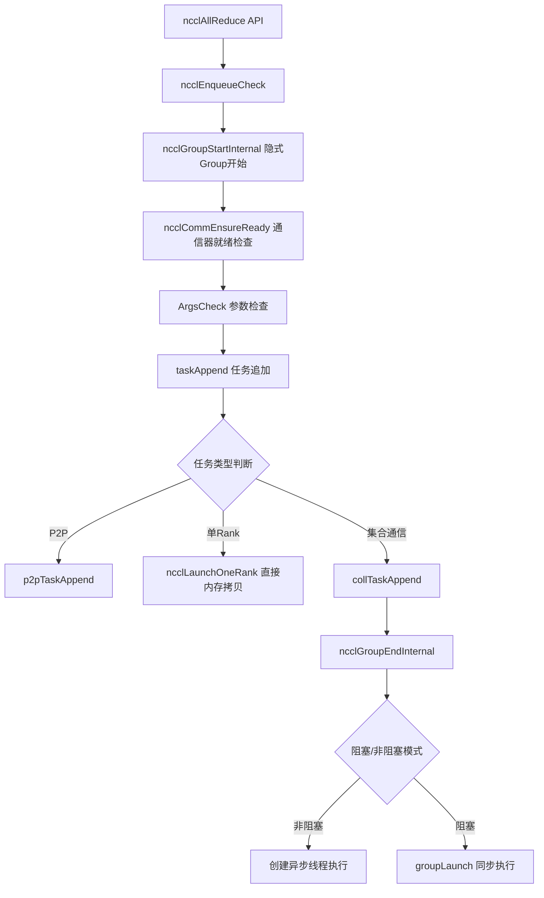
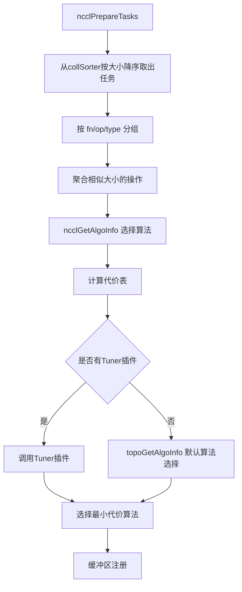
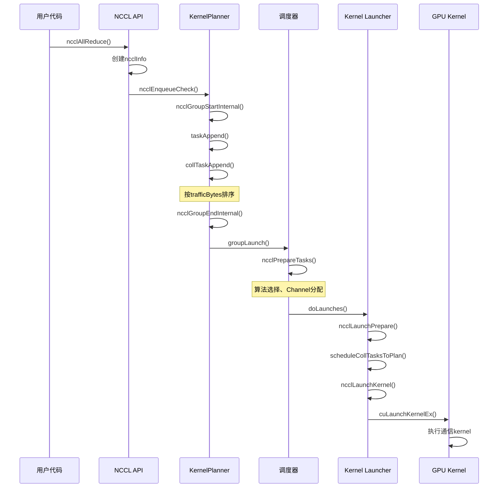
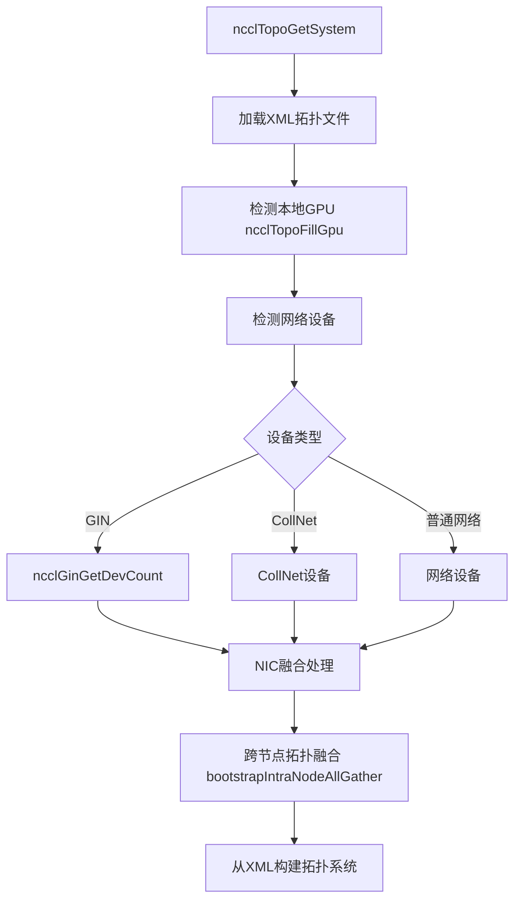
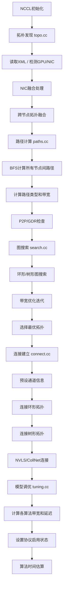
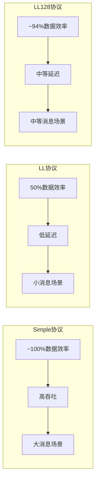
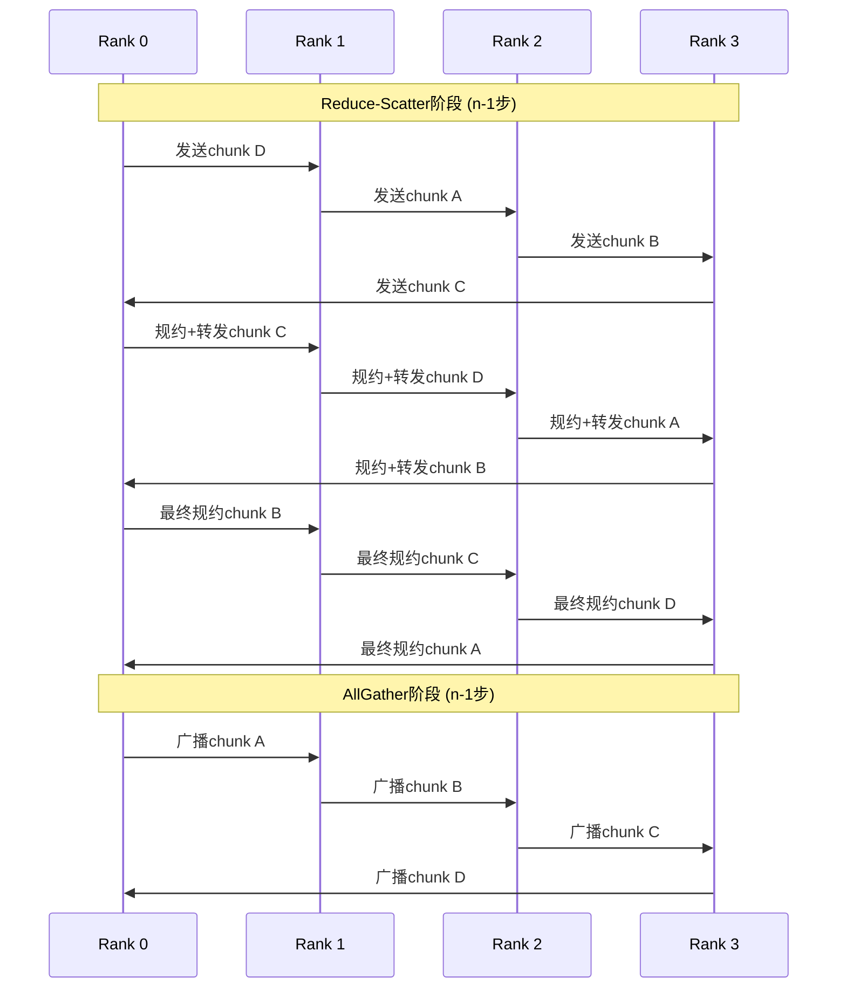
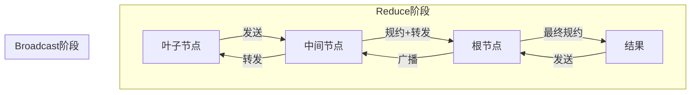

# NCCL 集合通信深度分析文档

本文档深入分析NCCL (NVIDIA Collective Communications Library) 的核心实现机制，涵盖Collective任务流程、通信拓扑创建、Device Kernel实现等关键模块。

---

## 目录

1. [Collective任务流程](#1-collective任务流程)
2. [通信拓扑创建与Tuning](#2-通信拓扑创建与tuning)
3. [Device Kernel实现](#3-device-kernel实现)
4. [AllReduce完整实现机制](#4-allreduce完整实现机制)
5. [数据结构与常量定义](#5-数据结构与常量定义)

---

## 1. Collective任务流程

### 1.1 API调用入口

NCCL提供标准的集合通信API，以`ncclAllReduce`为例：

```cpp
// collectives.cc:111-122
ncclResult_t ncclAllReduce(const void* sendbuff, void* recvbuff, size_t count,
    ncclDataType_t datatype, ncclRedOp_t op, ncclComm* comm, cudaStream_t stream) {
  NVTX3_FUNC_WITH_PARAMS(AllReduce, NcclNvtxParamsAllReduce, ...);
  
  struct ncclInfo info = { ncclFuncAllReduce, "AllReduce",
    sendbuff, recvbuff, count, datatype, op, 0, comm, stream,
    ALLREDUCE_CHUNKSTEPS, ALLREDUCE_SLICESTEPS };
  
  return ncclEnqueueCheck(&info);
}
```

**ncclInfo数据结构** (`info.h:17-41`):
```cpp
struct ncclInfo {
  ncclFunc_t coll;           // 操作类型: AllReduce, AllGather等
  const char* opName;
  const void* sendbuff;
  void* recvbuff;
  size_t count;
  ncclDataType_t datatype;
  ncclRedOp_t op;
  int root;
  ncclComm_t comm;
  cudaStream_t stream;
  int chunkSteps, sliceSteps;  // 分块参数
};
```

### 1.2 入队机制



**任务追加核心函数** (`enqueue.cc:2565-2630`):
```cpp
static ncclResult_t collTaskAppend(struct ncclComm* comm, struct ncclInfo* info,
                                    struct ncclDevRedOpFull opDev) {
  struct ncclKernelPlanner *planner = &comm->planner;
  
  // 加入group
  ncclGroupCommJoin(info->comm, ncclGroupTaskTypeCollective);
  
  // 创建ncclTaskColl任务
  struct ncclTaskColl* t = ncclMemoryPoolAlloc<struct ncclTaskColl>(...);
  t->func = info->coll;
  t->sendbuff = info->sendbuff;
  t->recvbuff = info->recvbuff;
  t->count = info->count;
  t->trafficBytes = t->count * elementSize * ncclFuncTrafficPerByte(t->func, comm->nRanks);
  
  // 按大小排序插入collSorter (大任务优先处理)
  ncclTaskCollSorterInsert(&planner->collSorter, t, t->trafficBytes);
  planner->nTasksColl += 1;
}
```

### 1.3 Group操作机制

```cpp
// group.cc:24-29
thread_local int ncclGroupDepth = 0;  // Group嵌套深度
thread_local ncclResult_t ncclGroupError = ncclSuccess;
thread_local struct ncclComm* ncclGroupCommHead[ncclGroupTaskTypeNum] = {nullptr};
```

**GroupEnd核心启动流程** (`group.cc:570-730`):
```cpp
static ncclResult_t groupLaunch(struct ncclAsyncJob *job_, ncclSimInfo_t* simInfo) {
  // 1. 执行P2P预连接
  // 2. 异步任务执行
  NCCLCHECK(asyncJobLaunch(asyncJobsMain, groupAbortFlag));
  
  // 3. 对称缓冲区注册
  // 4. 准备任务并进行连接
  NCCLCHECK(ncclPrepareTasksAndCollPreconnect(comm, simInfo, &asyncCollJobs));
  
  // 5. 注册并执行任务入队
  NCCLCHECK(ncclTasksRegAndEnqueue(comm));
  
  // 6. 执行kernel launch
  NCCLCHECK(doLaunches(groupCommHeadMain[ncclGroupTaskTypeCollective]));
}
```

### 1.4 任务准备与算法选择



**算法选择核心函数** (`enqueue.cc:2030-2087`):
```cpp
ncclResult_t ncclGetAlgoInfo(struct ncclComm* comm, struct ncclTaskColl* info, ...) {
  size_t nBytes = elementSize * ncclFuncMaxSendRecvCount(info->func, comm->nRanks, info->count);
  
  // 初始化代价表
  float collCostTable[NCCL_NUM_ALGORITHMS][NCCL_NUM_PROTOCOLS];
  initCollCostTable((float **)collCostTable);
  
  // 更新每种算法的代价估算
  NCCLCHECK(updateCollCostTable(comm, info, nBytes, collNetSupport, nvlsSupport, ...));
  
  // 如果有tuner插件，调用插件
  if (comm->tuner != NULL) {
    NCCLCHECK(comm->tuner->getCollInfo(...));
  }
  
  // 选择最小代价的算法
  NCCLCHECK(topoGetAlgoInfo(comm, info, nBytes, (float **)collCostTable, simInfo));
}
```

### 1.5 Kernel Plan构建

```cpp
// enqueue.cc:1507-1662
ncclResult_t ncclLaunchPrepare(struct ncclComm* comm) {
  struct ncclKernelPlanner* planner = &comm->planner;
  
  do {
    // 1. 分配KernelPlan
    struct ncclKernelPlan* plan = ncclMemoryPoolAlloc<struct ncclKernelPlan>(...);
    plan->comm = comm;
    plan->workStorageType = persistent ? ncclDevWorkStorageTypePersistent
                                       : ncclDevWorkStorageTypeFifo;
    
    // 2. 调度不同类型任务
    if (planner->nTasksColl != 0) {
      NCCLCHECK(scheduleCollTasksToPlan(comm, plan, &budget));
    }
    
    // 3. 完成Plan构建
    finishPlan(comm, plan);
    
    // 4. 设置CUDA流依赖
    // 5. 设置Host回调(用于Proxy操作)
    
  } while (planner->nTasksColl + planner->nTasksP2p + planner->nTasksBcast != 0 ...);
}
```

### 1.6 Kernel Launch

```cpp
// enqueue.cc:1677-1776
ncclResult_t ncclLaunchKernel(struct ncclComm* comm, struct ncclKernelPlan* plan) {
  struct ncclKernelPlanner* planner = &comm->planner;
  int nChannels = countOneBits(plan->channelMask);
  
  // 1. 计算grid/block配置
  dim3 grid = {(unsigned)nChannels, 1, 1};
  dim3 block = {(unsigned)plan->threadPerBlock, 1, 1};
  int smem = ncclShmemDynamicSize(comm->cudaArch);
  
  // 2. 准备kernel参数
  void* extra[] = {
    CU_LAUNCH_PARAM_BUFFER_POINTER, plan->kernelArgs,
    CU_LAUNCH_PARAM_BUFFER_SIZE, &plan->kernelArgsSize,
    CU_LAUNCH_PARAM_END
  };
  
  // 3. 配置launch属性(CGAs, MemSyncDomain等)
  CUlaunchConfig launchConfig = {0};
  CUlaunchAttribute launchAttrs[6] = {};
  
  // Cluster配置(sm90+)
  if (clusterSize) {
    launchAttrs[attrs].id = CU_LAUNCH_ATTRIBUTE_CLUSTER_DIMENSION;
    launchAttrs[attrs++].value.clusterDim = {clusterSize, 1, 1};
  }
  
  // MemSync域(CUDA 12.0+)
  if (compCap >= 90 && driverVersion >= 12000) {
    launchAttrs[attrs].id = CU_LAUNCH_ATTRIBUTE_MEM_SYNC_DOMAIN;
    launchAttrs[attrs++].value.memSyncDomain = ncclParamMemSyncDomain();
  }
  
  // 4. 执行kernel
  CUCHECK(cuLaunchKernelEx(&launchConfig, fn, nullptr, extra));
}
```

### 1.7 完整流程图



---

## 2. 通信拓扑创建与Tuning

### 2.1 核心数据结构

**节点类型定义**:
```cpp
const char* topoNodeTypeStr[] = { "GPU", "PCI", "NVS", "CPU", "NIC", "NET", "GIN" };
```

**路径类型定义** (`paths.cc:29`):
```cpp
const char* topoPathTypeStr[] = { 
  "LOC",   // 0: 本地
  "NVL",   // 1: NVLink直连
  "NVB",   // 2: NVLink桥接
  "C2C",   // 3: CPU-GPU直连
  "PIX",   // 4: 同PCI交换机
  "PXB",   // 5: 跨PCI交换机
  "P2C",   // 6: CPU直连
  "PXN",   // 7: 通过NVLink中继
  "PHB",   // 8: 同CPU
  "SYS",   // 9: 跨CPU
  "NET",   // 10: 网络
  "DIS"    // 11: 断开
};
```

### 2.2 拓扑发现流程



### 2.3 路径计算

**BFS路径搜索算法** (`paths.cc:37-114`):
```cpp
static ncclResult_t ncclTopoSetPaths(struct ncclTopoNode* baseNode, 
                                      struct ncclTopoSystem* system) {
    struct ncclTopoNodeList nodeList;
    nodeList.count = 1; 
    nodeList.list[0] = baseNode;
    
    basePath->count = 0;
    basePath->bw = LOC_BW;
    basePath->type = PATH_LOC;
    
    while (nodeList.count) {
        for (int n=0; n<nodeList.count; n++) {
            for (int l=0; l<node->nlinks; l++) {
                float bw = std::min(path->bw, link->bw);  // 瓶颈带宽
                
                // 确定路径类型
                if (node->type == PCI && remNode->type == PCI) type = PATH_PXB;
                if (link->type == LINK_PCI && 
                    (node->type == CPU || link->remNode->type == CPU)) type = PATH_PHB;
                
                remPath->type = std::max(path->type, type);  // 取最差路径类型
            }
        }
    }
}
```

### 2.4 图搜索算法

**GPU排序策略** (`search.cc:182-202`):
```cpp
struct ncclGpuScore {
    int g;             // GPU索引
    int startIndex;    // 起始位置(优先级最低)
    int intraNhops;    // 节点内跳数
    int intraBw;       // 节点内带宽
    int interNhops;    // 节点间跳数
    int interPciBw;    // 节点间PCI带宽
    int interBw;       // 节点间带宽(最高优先级)
};

// 排序比较函数: 优先选择高interBw, 低interNhops, 高intraBw
static int cmpScore(const void * g1, const void * g2) {
    if ((d = (s2->interBw - s1->interBw))) return d;
    if ((d = (s2->interPciBw - s1->interPciBw))) return d;
    if ((d = (s1->interNhops - s2->interNhops))) return d;
    // ...
}
```

**主要搜索流程** (`search.cc:1015-1203`):
```cpp
ncclResult_t ncclTopoCompute(ncclTopoSystem* system, struct ncclTopoGraph* graph) {
    // 1. 确定搜索参数
    int crossNic = (system->nodes[NET].count > 1) && ... ? ncclParamCrossNic() : 0;
    
    // 2. 带宽搜索数组
    float speedArrayIntra[] = { 40.0, 30.0, 20.0, 18.0, 15.0, ... };
    float speedArrayInter[] = { 48.0, 30.0, 28.0, 24.0, ... };
    
    // 3. 两阶段搜索: Pass 1寻找可行解, Pass 2优化带宽
search:
    NCCLCHECK(ncclTopoSearchRec(system, &tmpGraph, graph, &time));
    
    // 尝试不同配置
    if (tmpGraph.sameChannels == 1) { tmpGraph.sameChannels = 0; goto search; }
    if (tmpGraph.typeIntra < maxIntra) { tmpGraph.typeIntra += 1; goto search; }
    // ...
}
```

### 2.5 环形拓扑构建

```cpp
// rings.cc:29-71
ncclResult_t ncclBuildRings(int nrings, int* rings, int rank, int nranks, 
                            int* prev, int* next) {
    for (int r=0; r<nrings; r++) {
        int current = rank;
        for (int i=0; i<nranks; i++) {
            rankFound[current/64] |= (1ULL<<(current%64));  // 标记已访问
            rings[r*nranks+i] = current;
            current = next[r*nranks+current];  // 沿着next指针前进
        }
        
        // 验证环完整性
        if (current != rank) { /* 环未闭合 */ }
    }
}
```

### 2.6 树形拓扑构建

**二叉树构建** (`trees.cc:32-66`):
```cpp
ncclResult_t ncclGetBtree(int nranks, int rank, int* u, int* d0, int* d1, ...) {
    // 找到第一个非零位
    for (bit=1; bit<nranks; bit<<=1) {
        if (bit & rank) break;
    }
    
    if (rank == 0) {
        *u = -1;      // 根节点无父节点
        *d1 = nranks > 1 ? bit >> 1 : -1;
        return ncclSuccess;
    }
    
    // 计算父节点和子节点
    up = (rank ^ bit) | (bit << 1);
    if (up >= nranks) up = (rank ^ bit);
    *u = up;
    
    down0 = lowbit == 0 ? -1 : rank - lowbit;
    down1 = lowbit == 0 ? -1 : rank + lowbit;
}
```

**树结构示例 (14 ranks)**:
```
0---------------8
         ______/ \______
        4               12
      /   \            /  \
    2       6       10     \
   / \     / \     /  \     \
  1   3   5   7   9   11    13
```

### 2.7 连接建立

**预设阶段** (`connect.cc:20-93`):
```cpp
ncclResult_t ncclTopoPreset(struct ncclComm* comm, ...) {
    for (int c=0; c<nChannels; c++) {
        struct ncclChannel* channel = comm->channels + c;
        
        // 初始化环形连接
        int* ringIntra = graphs[NCCL_ALGO_RING]->intra + c*localRanks;
        for (int i=0; i<localRanks; i++) {
            if (ringIntra[i] == rank) {
                topoRanks->ringRecv[c] = ringIntra[0];
                topoRanks->ringSend[c] = ringIntra[localRanks-1];
                topoRanks->ringPrev[c] = (i == 0) ? -1 : ringIntra[i-1];
                topoRanks->ringNext[c] = (i == localRanks-1) ? -1 : ringIntra[i+1];
            }
        }
        
        // 初始化树形连接
        // ...
    }
}
```

### 2.8 调优策略

**调优常量** (`tuning.cc:143-200`):
```cpp
static const ncclTunerConstants_t ncclTunerConstantsDefaults = {
    .baseLatencies = {
        {  6.8, 14.0,  8.4 }, {  6.6, 14.0,  8.4 },  // Tree, Ring (LL/LL128/Simple)
        // ...
    },
    .hwLatencies = {
        /* NVLINK */
        { { .6, 1.25, 4.0 }, { .6, 1.9, 3.4 }, ... },
        /* PCI */
        { { 1.0, 1.9, 4.0 }, { 1.0, 2.5, 5.7 }, ... },
        /* NET */
        { { 5.0, 8.5, 14 }, { 2.7, 4.0, 14.0 }, ... },
    },
    .llMaxBws = {
        {39.0, 39.0, 20.4},   // Volta-N1/Intel-N2/Intel-N4
        {87.7, 22.5, 19.0},   // Ampere-N1/AMD-N2/AMD-N4
        {141.0, 45.0, 35.0},  // Hopper
        {2*141.0, 2*45.0, 2*35.0}, // Blackwell
    },
};
```

**算法时间估算** (`tuning.cc:587-605`):
```cpp
ncclResult_t ncclTopoGetAlgoTime(struct ncclComm* comm, int coll, 
                                  int algorithm, int protocol, 
                                  size_t nBytes, int numPipeOps, float* time) {
    float bw = comm->bandwidths[coll][algorithm][protocol];
    float lat = comm->latencies[coll][algorithm][protocol];
    
    // 根据数据大小应用修正因子
    int logSize = log2i(nBytes>>6);
    if (algorithm == NCCL_ALGO_TREE && coll == ncclFuncAllReduce && logSize >= 0) 
        bw *= treeCorrectionFactor[protocol][logSize];
    
    // 计算总时间 = 延迟 + 数据传输时间
    int latCount = algorithm == NCCL_ALGO_RING ? numPipeOps : DIVUP(numPipeOps, ...);
    *time = lat * latCount + nBytes / (1000 * bw);
}
```

### 2.9 拓扑流程图



---

## 3. Device Kernel实现

### 3.1 线程与Warp配置

**基本配置** (`common.h`):
```cpp
#define WARP_SIZE 32
#define NCCL_MAX_NTHREADS  最大线程数
#define NCCL_MAX_TREE_ARITY 3  // 树算法最大扇入/扇出
#define NCCL_MAX_ARITY 最大连接数
```

**线程角色分配** (`prims_simple.h:24-38`):
```cpp
static constexpr int RoleInput = 0x01,
                     RoleOutput = 0x02,
                     RoleWaitRecv = 0x04,   // 等待接收数据
                     RoleWaitSend = 0x08,   // 等待发送槽位
                     RolePostSend = 0x10,   // 发布发送完成
                     RolePostRecv = 0x20,   // 发布接收完成
                     Aborted = 0x40,
                     NetRegMode = 0x80,
                     ConnFifoEnabled = 0x100,
                     DirectWrite = 0x200,
                     DirectRead = 0x400;
```

**线程角色分配策略** (`prims_simple.h:619-624`):
```cpp
if (tid < nrecv)                 { flags |= RoleWaitRecv; index = tid; }
else if (tid < nrecv+nsend)      { flags |= RoleWaitSend; index = tid-nrecv; }
else if (nthreads-nsend <= tid)  { flags |= RolePostSend; index = tid-(nthreads-nsend); }
else if (nthreads-nrecv-nsend <= tid) { flags |= RolePostRecv; index = tid-(nthreads-nrecv-nsend); }
```

### 3.2 Warp分配示例

**NVLS算法Warp分配** (`all_reduce.h:394-398`):
```cpp
const int totalWarps = NCCL_MAX_NTHREADS/WARP_SIZE;
const int bcastWarps = hasOut ? (work->regUsed ? ((totalWarps - 2) >> 1) - 1 : 2) : 0;
const int reduceWarps = work->regUsed ? (totalWarps - bcastWarps - 2) : (hasOut ? 3 : nranks <= 6 ? 7 : 5);
const int scatterWarps = work->regUsed ? 1 : (totalWarps - reduceWarps - bcastWarps + 1) >> 1;
const int gatherWarps = work->regUsed ? 1 : (totalWarps - reduceWarps - bcastWarps) >> 1;
```

### 3.3 三种协议对比



| 特性 | Simple | LL | LL128 |
|------|--------|-----|-------|
| 数据效率 | ~100% | 50% | ~94% |
| 延迟 | 高 | 低 | 中 |
| 适用场景 | 大消息 | 小消息/低延迟 | 中等消息 |
| MaxGroupWidth | 2 | 1 | 1 |
| 同步方式 | Step计数器 | Flag匹配 | Flag+数据 |
| 直接访问 | 支持 | 不支持 | 不支持 |

### 3.4 ProtoSimple实现

```cpp
template<int SlicePerChunk_1, int StepPerSlice_1, int Unroll_1 = COLL_UNROLL, ...>
struct ProtoSimple {
  static constexpr int Id = NCCL_PROTO_SIMPLE;
  static constexpr int MaxGroupWidth = 2;  // 支持多个group
  
  __device__ static int calcBytePerStep() {
    return ncclShmem.comm.buffSizes[NCCL_PROTO_SIMPLE]/NCCL_STEPS;
  }
};
```

**同步机制**:
```cpp
// 等待发送槽位
while (connStepCache + NCCL_STEPS < step + StepPerSlice) {
  connStepCache = loadStepValue(connStepPtr);
}
```

### 3.5 ProtoLL实现

**数据格式** (16字节行):
```
| data1 (4B) | flag1 (4B) | data2 (4B) | flag2 (4B) |
```

**同步机制** (`prims_ll.h:90-101`):
```cpp
__device__ uint64_t readLL(int offset, int i) {
    union ncclLLFifoLine* src = recvPtr(i) + offset;
    uint32_t flag = recvFlag(i);
    uint32_t data1, flag1, data2, flag2;
    int spins = 0;
    do {
      asm volatile("ld.volatile.global.v4.u32 {%0,%1,%2,%3}, [%4];" 
                   : "=r"(data1), "=r"(flag1), "=r"(data2), "=r"(flag2) 
                   : "l"(&src->i4) : "memory");
      if (checkAbort(abort, 1, spins)) break;
    } while ((flag1 != flag) || (flag2 != flag));
    return data1 + (((uint64_t)data2) << 32);
}
```

### 3.6 ProtoLL128实现

**数据格式** (128字节行):
- 更高数据效率
- 使用flag线程机制 (每8个线程中第7个线程携带flag)

**Flag线程机制** (`prims_ll128.h:10`):
```cpp
#define NCCL_LL128_FLAGTHREAD (NCCL_LL128_LINEELEMS-1)

// 数据加载与flag检查
const bool flagThread = (tid%8)==7;  // 第7个线程是flag线程
load128(ptr+u*WARP_SIZE, vr[u], vr[u+1]);
needReload |= flagThread && (vr[u+1] != flag);
```

### 3.7 Primitives操作类型

```cpp
// 主要操作函数 (prims_simple.h)
send(inpIx, eltN)                    // 从输入缓冲发送
recv(outIx, eltN)                    // 接收到输出缓冲
directSend(inpIx, outIx, eltN)       // 直接发送(绕过FIFO)
directRecv(outIx, eltN)              // 直接接收
directRecvReduceDirectSend(...)      // 接收+规约+直接发送
directRecvReduceCopyDirectSend(...)  // 接收+规约+复制+直接发送
directRecvCopyDirectSend(...)        // 接收+复制+直接发送
scatter/gather(...)                  // Scatter/Gather操作
```

### 3.8 关键数据结构

**ncclShmemGroup** (`common.h:29-41`):
```cpp
struct ncclShmemGroup {
  ncclConnInfo *recvConns[NCCL_MAX_ARITY];  // 接收连接
  ncclConnInfo *sendConns[NCCL_MAX_ARITY];  // 发送连接
  void* userInput;   // 用户输入缓冲
  void* userOutput;  // 用户输出缓冲
  void* srcs[NCCL_MAX_ARITY+1];  // 源指针数组
  void* dsts[NCCL_MAX_ARITY+1];  // 目标指针数组
  uint64_t redOpArgs;  // 规约操作参数
};
```

**ncclShmemData** (`common.h:43-65`):
```cpp
struct ncclShmemData {
  struct ncclDevKernelArgs args;
  int channelId;
  int aborted;
  struct ncclKernelComm comm;
  struct ncclDevChannel channel;
  struct ncclShmemGroup groups[NCCL_MAX_GROUPS];
  char workStorage[ncclMaxDevWorkBatchBytes()];
};
```

---

## 4. AllReduce完整实现机制

### 4.1 Ring AllReduce



**Ring算法实现** (`all_reduce.h:14-84`):
```cpp
template<typename T, typename RedOp, typename Proto>
__device__ __forceinline__ void runRing(int tid, int nthreads, struct ncclDevWorkColl* work) {
  ncclRing *ring = &ncclShmem.channel.ring;
  int ringIx = ring->index;
  const int nranks = ncclShmem.comm.nRanks;
  
  // 获取数据分区信息
  ncclCollCbdPart(work, ncclShmem.channelId, Proto::Id, sizeof(T), 
                  (ssize_t*)nullptr, &gridOffset, &channelCount, &chunkCount);
  const ssize_t loopCount = nranks * chunkCount;

  Primitives<T, RedOp, FanSymmetric<1>, 1, Proto, 0> prims
    (tid, nthreads, &ring->prev, &ring->next, work->sendbuff, work->recvbuff, ...);

  for (ssize_t elemOffset = 0; elemOffset < channelCount; elemOffset += loopCount) {
    // Step 0: 发送本地数据到下一个GPU
    prims.directSend(offset, offset, nelem);
    
    // Steps 1 to k-2: 接收、规约、转发
    for (int j = 2; j < nranks; ++j) {
      prims.directRecvReduceDirectSend(offset, offset, nelem);
    }
    
    // Step k-1: 最终规约并存储结果
    prims.directRecvReduceCopyDirectSend(offset, offset, nelem, /*postOp=*/true);
    
    // Steps k to 2k-2: 广播结果
    for (int j = 1; j < nranks - 1; ++j) {
      prims.directRecvCopyDirectSend(offset, offset, nelem);
    }
    
    // 最终接收
    prims.directRecv(offset, nelem);
  }
}
```

### 4.2 Tree AllReduce



**TreeUpDown模式** (`all_reduce.h:87-147`):
```cpp
template<typename T, typename RedOp, typename Proto>
__device__ __forceinline__ void runTreeUpDown(int tid, int nthreads, struct ncclDevWorkColl* work) {
  ncclTree *tree = &ncclShmem.channel.tree;
  
  { // Reduce : max number of recv is 3, max number of send is 1
    Primitives<T, RedOp, FanAsymmetric<NCCL_MAX_TREE_ARITY, 1>, /*Direct=*/1, Proto, 0> prims
      (tid, nthreads, tree->down, &tree->up, work->sendbuff, work->recvbuff, ...);
      
    if (tree->up == -1) {
      // 根节点: 接收所有子节点数据并规约
      prims.directRecvReduceCopy(offset, offset, nelem, /*postOp=*/true);
    }
    else if (tree->down[0] == -1) {
      // 叶子节点: 发送数据到父节点
      prims.directSend(offset, offset, nelem);
    }
    else {
      // 中间节点: 接收子节点数据、规约、转发到父节点
      prims.directRecvReduceDirectSend(offset, offset, nelem);
    }
  }

  { // Broadcast : max number of recv is 1, max number of send is 3
    Primitives<T, RedOp, FanAsymmetric<1, NCCL_MAX_TREE_ARITY>, /*Direct=*/1, Proto, 0> prims
      (tid, nthreads, &tree->up, tree->down, work->sendbuff, work->recvbuff, ...);
      
    if (tree->up == -1) {
      // 根节点: 发送结果到子节点
      prims.directSendFromOutput(offset, nelem);
    }
    else if (tree->down[0] == -1) {
      // 叶子节点: 接收结果
      prims.directRecv(offset, nelem);
    }
    else {
      // 中间节点: 接收并转发到子节点
      prims.directRecvCopyDirectSend(offset, offset, nelem);
    }
  }
}
```

**TreeSplit模式** (`all_reduce.h:149-230`):
```cpp
// 线程分割策略
int nthreadsSplit;
if (Proto::Id == NCCL_PROTO_SIMPLE) {
  nthreadsSplit = nthreads/2;
  if (nthreadsSplit >= 256) nthreadsSplit += 64;
} else { // LL & LL128
  // 70%用于reduce, 30%用于broadcast
  nthreadsSplit = (nthreads*7/(10*WARP_SIZE))*WARP_SIZE;
}

if (tid < nthreadsSplit) {
  // Reduce上行线程
} else {
  // Broadcast下行线程
}
```

### 4.3 NVLS AllReduce

**NVLS算法Warp分配**:
```
| scatter | gather | reduce | bcast |
|  warps  | warps  | warps  | warps |
```

**NVLS实现** (`all_reduce.h:389-518`):
```cpp
template<typename T, typename RedOp>
struct RunWorkColl<ncclFuncAllReduce, T, RedOp, NCCL_ALGO_NVLS, NCCL_PROTO_SIMPLE> {
  __device__ __forceinline__ void run(int tid, int/*nthreads*/, struct ncclDevWorkColl* work) {
    struct ncclNvls* nvls = &ncclShmem.channel.nvls;
    
    // Warp分配
    const int totalWarps = NCCL_MAX_NTHREADS/WARP_SIZE;
    const int bcastWarps = hasOut ? (work->regUsed ? ((totalWarps - 2) >> 1) - 1 : 2) : 0;
    const int reduceWarps = work->regUsed ? (totalWarps - bcastWarps - 2) : ...;
    const int scatterWarps = work->regUsed ? 1 : ...;
    const int gatherWarps = work->regUsed ? 1 : ...;

    if (work->oneNode) {
      if (tid < tidEndScatter) {
        // Scatter: 发送数据到NVLS
        prims.scatter(offset, nelem, chunkSize, chunkSize, -1, 0);
      } else if (tid < tidEndGather) {
        // Gather: 从NVLS接收结果
        prims.gather(offset, nelem, chunkSize, chunkSize, -1, 0);
      } else if (tid < tidEndReduce && nvls->headRank != -1) {
        // Reduce: 通过NVLS进行规约
        prims.directRecvDirectSend(offset, offset, nelem);
      }
    } else {
      // 多节点NVLS + IB SHARP
      // Scatter -> Reduce -> Bcast
    }
  }
};
```

### 4.4 CollNet Direct AllReduce

**CollNet Direct实现** (`all_reduce.h:253-386`):
```cpp
template<typename T, typename RedOp>
struct RunWorkColl<ncclFuncAllReduce, T, RedOp, NCCL_ALGO_COLLNET_DIRECT, NCCL_PROTO_SIMPLE> {
  __device__ __forceinline__ void run(int tid, int/*nthreads*/, struct ncclDevWorkColl* work) {
    struct ncclDirect* direct = &ncclShmem.channel.collnetDirect;
    
    // 线程分配
    const int nThreadsScatter = WARP_SIZE + ...;
    const int nThreadsGather  = ...;
    const int nThreadsBcast   = WARP_SIZE + ...;
    const int nThreadsReduce = work->nWarps*WARP_SIZE - nThreadsScatter - nThreadsGather - nThreadsBcast;

    if (tid >= tidStartScatter && tid < tidStartReduce && hasUp) {
      // Scatter: 发送数据到网络
      prims.scatter(offset, nelem, chunkSize, peerOffset, direct->headRank, direct->shift);
    } else if (tid >= tidStartReduce && direct->out != -1) {
      if (hasDn) {
        // Reduce: 规约并发送到网络
        prims.recvReduceDirectSend(offset, offset, nelem);
      } else {
        // 直接发送到网络
        prims.send(offset, nelem);
      }
    } else if (tid < tidStartBcast && hasUp) {
      // Gather: 从网络接收结果
      prims.directGather(offset, nelem, chunkSize, peerOffset, direct->headRank, direct->shift);
    } else if (tid >= tidStartBcast && tid < tidStartScatter && direct->out != -1) {
      if (hasDn) {
        // 从网络接收并广播
        prims.directRecvCopyDirectSend(offset, offset, nelem, /*postOp=*/true);
      } else {
        // 从网络接收
        prims.recv(offset, nelem, /*postOp=*/true);
      }
    }
  }
};
```

### 4.5 数据切分与流动

**数据分区** (`device.h:330-355`):
```cpp
// CBD (Continuous-Byte-Distribution) 将数据连续分配到Channel
// channelLo: 起始Channel
// channelHi: 结束Channel  
// countLo: 第一个Channel的数据量
// countMid: 中间Channel的数据量(相等)
// countHi: 最后一个Channel的数据量

if (channelId == work->channelLo) {
  *partOffset = 0;
  *partCount = work->cbd.countLo;
} else if (channelId == work->channelHi) {
  *partOffset = work->cbd.countLo + nMidChannels*work->cbd.countMid;
  *partCount = work->cbd.countHi;
} else {
  int mid = channelId - work->channelLo - 1;
  *partOffset = work->cbd.countLo + mid*work->cbd.countMid;
  *partCount = work->cbd.countMid;
}
```

**多Channel并行示意图**:
```
总数据: [============================================]
          |         |         |         |
Channel 0 [=========]
Channel 1           [=========]
Channel 2                     [=========]
Channel 3                               [=========]
```

### 4.6 Ring算法数据流动详解 (4 ranks示例)

```
初始状态:
Rank 0: [A0] [B0] [C0] [D0]
Rank 1: [A1] [B1] [C1] [D1]
Rank 2: [A2] [B2] [C2] [D2]
Rank 3: [A3] [B3] [C3] [D3]

Reduce-Scatter (3 steps):
Step 0: 
  Rank 0→1发送D, Rank 1→2发送A, Rank 2→3发送B, Rank 3→0发送C
Step 1: 
  各rank接收并规约，转发
Step 2: 
  最终规约

最终各rank持有完整规约结果的一个chunk:
Rank 0: [A0+A1+A2+A3]
Rank 1: [B0+B1+B2+B3]
Rank 2: [C0+C1+C2+C3]
Rank 3: [D0+D1+D2+D3]

AllGather (3 steps):
各rank广播自己的规约结果给其他ranks
```

### 4.7 FIFO缓冲区管理

```
NCCL_STEPS = 8 (默认)

Buffer: [Step0][Step1][Step2][Step3][Step4][Step5][Step6][Step7]
          ↑                          ↑
        sendStep                  recvStep
        
生产者等待: sendConnHead + NCCL_STEPS > sendConnHeadCache
消费者等待: recvStep < recvConnHead
```

---

## 5. 数据结构与常量定义

### 5.1 Channel结构

```cpp
// comm.h:143-165
struct ncclChannel {
  struct ncclChannelPeer** peers;           // 每个rank的peer连接
  struct ncclDevChannelPeer** devPeers;     // 设备端peer指针
  struct ncclRing ring;                      // Ring拓扑
  struct ncclTree tree;                      // Tree拓扑
  struct ncclTree collnetChain;              // Collnet链式拓扑
  struct ncclDirect collnetDirect;           // Collnet直连拓扑
  struct ncclNvls nvls;                      // NVLS拓扑
  int id;                                    // Channel索引
  uint32_t workFifoProduced;                 // Work FIFO生产计数
};
```

### 5.2 ChannelPeer结构

```cpp
// device.h:229-233
#define NCCL_MAX_CONNS 2
struct ncclChannelPeer {
  struct ncclConnector send[NCCL_MAX_CONNS]; // 发送连接器
  struct ncclConnector recv[NCCL_MAX_CONNS]; // 接收连接器
  int refCount;                              // 引用计数
};
```

### 5.3 任务结构

```cpp
// comm.h:186-228
struct ncclTaskColl {
  struct ncclTaskColl* next;
  ncclFunc_t func;              // 操作类型
  void const* sendbuff;
  void* recvbuff;
  size_t count;
  int root;
  ncclDataType_t datatype;
  ncclRedOp_t opHost;
  int32_t nMaxChannels:8;       // 最大Channel数
  int32_t nWarps:8;
  int32_t algorithm:8, protocol:8;
  size_t trafficBytes;
  // ...
};
```

### 5.4 Kernel Planner结构

```cpp
// comm.h:424-497
struct ncclKernelPlanner {
  // 任务累积状态
  struct Peer* peers;           // 每个peer的任务队列
  int nTasksColl, nTasksP2p, nTasksBcast;
  
  // 待调度任务队列
  struct ncclIntruQueue<ncclTaskColl> collTaskQueue;
  
  // 当前构建中的Plan
  struct WipPlan {
    struct Channel {
      struct ncclIntruQueue<ncclWorkBatchList> workBatchQueue;
      struct ncclIntruQueue<ncclProxyOp> proxyOpQueue;
    } channels[MAXCHANNELS];
  } wipPlan;
  
  // 已构建的Plan队列
  struct ncclIntruQueue<ncclKernelPlan> planQueue;
};
```

### 5.5 关键常量

```cpp
// 常量定义
#define NCCL_STEPS 8              // FIFO步数
#define WARP_SIZE 32              // CUDA warp大小
#define NCCL_MAX_TREE_ARITY 3     // 树算法最大扇入/扇出
#define NCCL_LL128_LINEELEMS 8    // LL128每行元素数
#define NCCL_LL128_DATAELEMS 7    // LL128数据元素数

// 路径类型
enum ncclTopoPathType {
  PATH_LOC = 0,   // 本地
  PATH_NVL = 1,   // NVLink直连
  PATH_NVB = 2,   // NVLink桥接
  PATH_PIX = 4,   // 同PCI交换机
  PATH_PXB = 5,   // 跨PCI交换机
  PATH_PHB = 8,   // 同CPU
  PATH_SYS = 9,   // 跨CPU
  PATH_NET = 10,  // 网络
  PATH_DIS = 11   // 断开
};

// 算法类型
enum ncclAlgo {
  NCCL_ALGO_RING = 0,
  NCCL_ALGO_TREE = 1,
  NCCL_ALGO_NVLS = 2,
  NCCL_ALGO_NVLS_TREE = 3,
  NCCL_ALGO_COLLNET_DIRECT = 4,
  NCCL_ALGO_COLLNET_CHAIN = 5,
  NCCL_ALGO_PAT = 6
};

// 协议类型
enum ncclProto {
  NCCL_PROTO_LL = 0,
  NCCL_PROTO_LL128 = 1,
  NCCL_PROTO_SIMPLE = 2
};
```

---

## 总结

NCCL通过精心设计的架构实现了高效的GPU集合通信：

1. **任务流程**: 从API调用到kernel launch，通过Group机制批量处理，算法选择基于代价模型
2. **拓扑管理**: BFS路径搜索，支持Ring/Tree/NVLS等多种拓扑，动态调优选择最优方案
3. **Kernel实现**: 线程角色分离，多协议支持，数据切分并行
4. **AllReduce**: Ring适合均匀负载，Tree适合低延迟，NVLS利用NVLink Switch优化

关键设计决策：
- 按trafficBytes排序任务，大任务优先
- 多Channel并行提高吞吐
- 三种协议适应不同消息大小
- 直接内存访问减少拷贝开销
