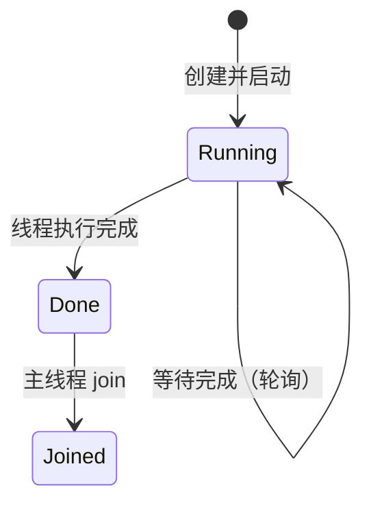
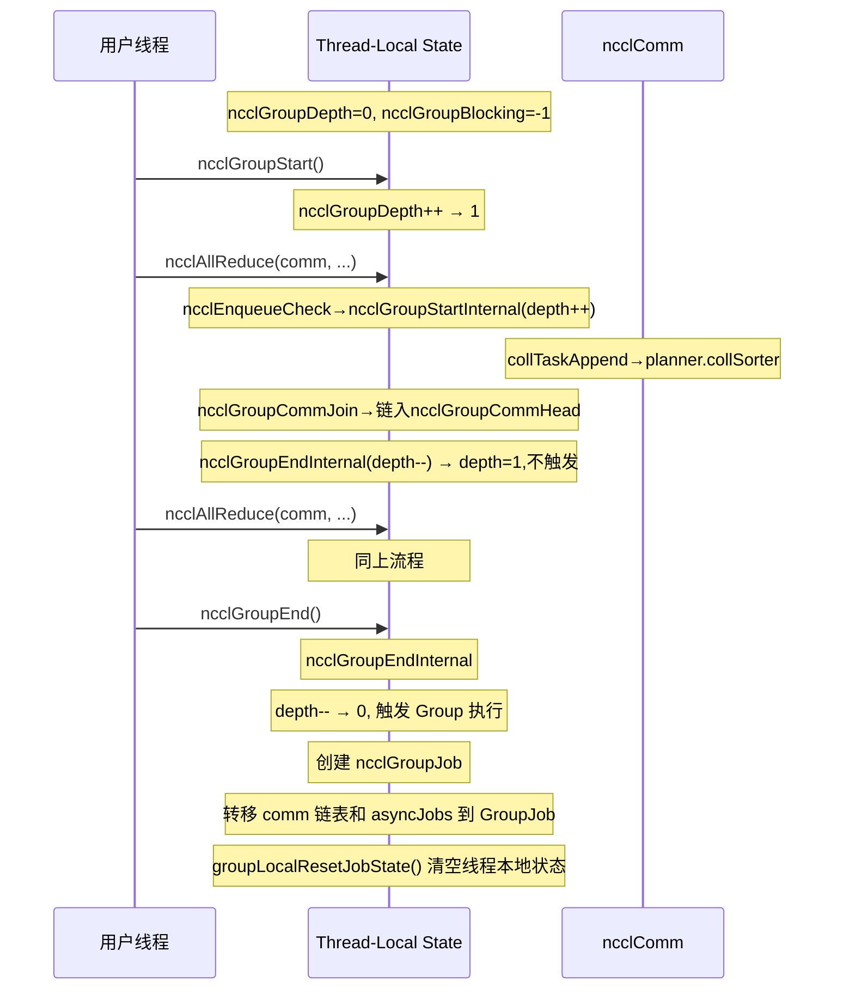
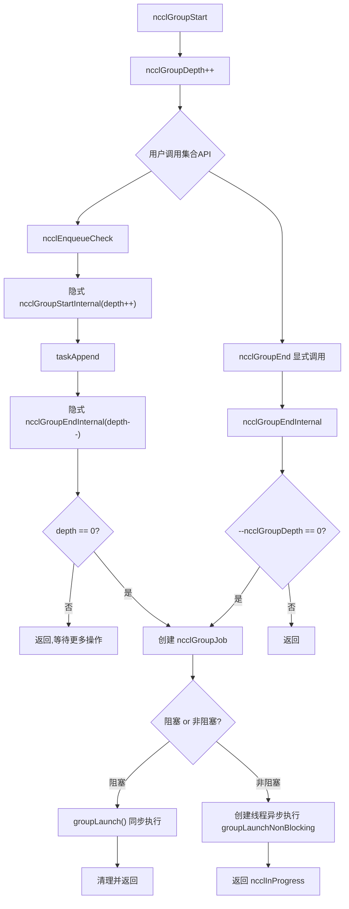
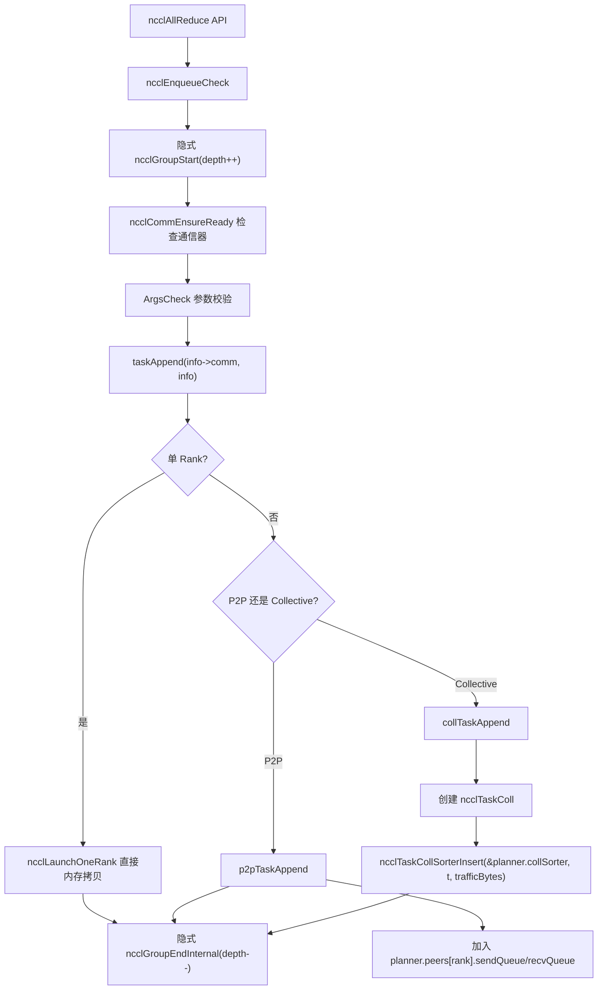
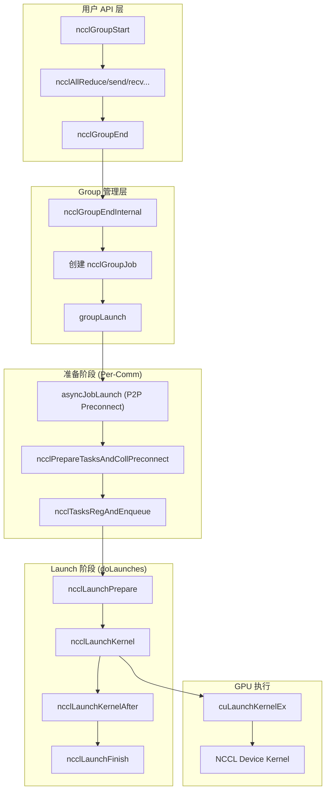
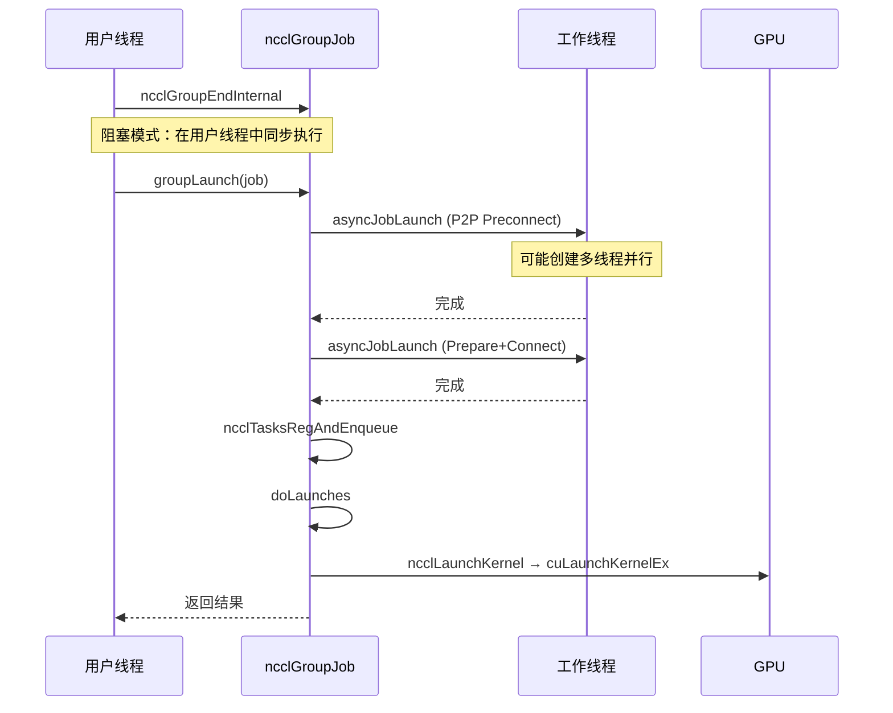
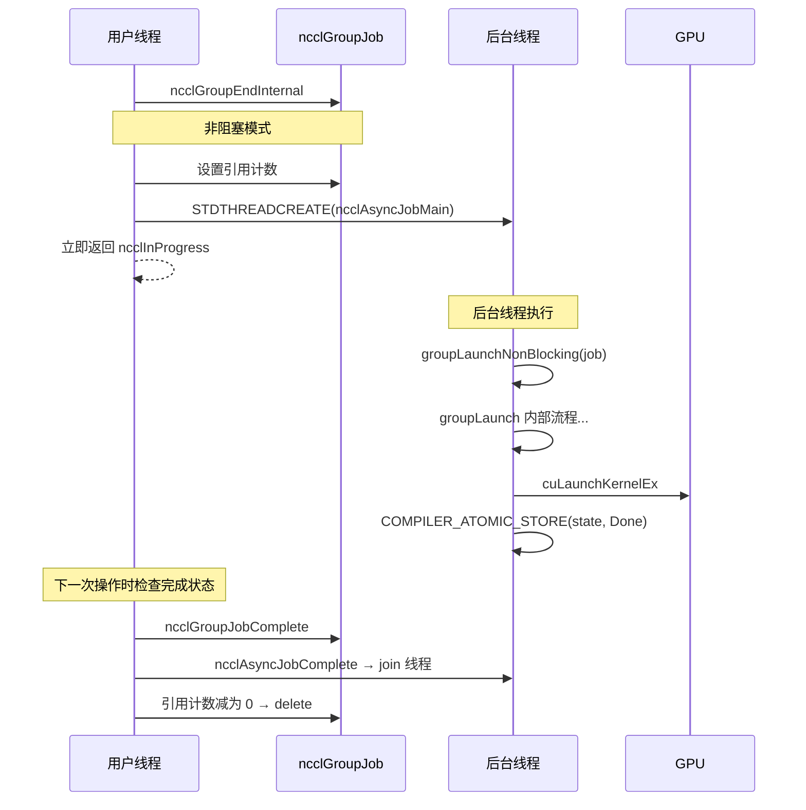
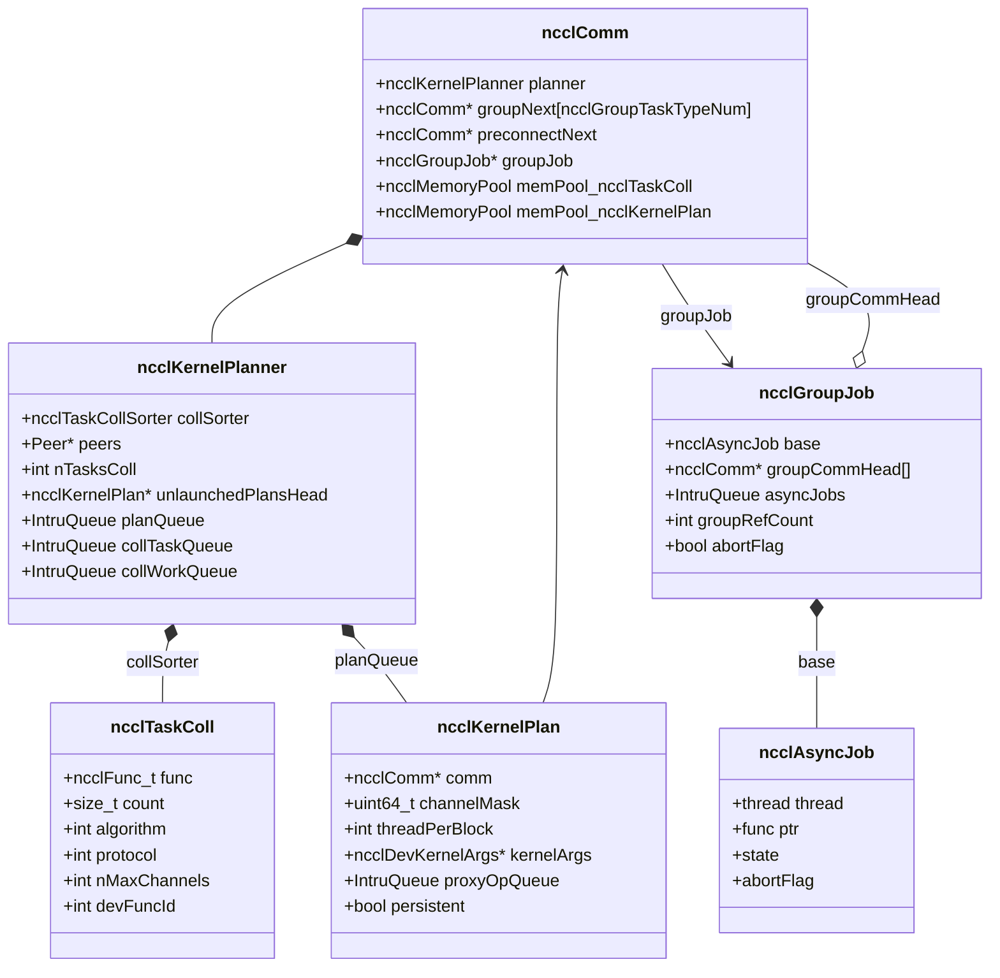

# NCCL Group 操作与 Launch 流程深度分析

本文档深入分析 NCCL 中 Group 操作的数据结构、线程本地状态、任务管理，以及从 `ncclGroupEnd()` 到 GPU kernel launch 的完整流程。

---

## 目录

1. [核心数据结构](#1-核心数据结构)
2. [线程本地状态（Thread-Local Variables）](#2-线程本地状态thread-local-variables)
3. [Group 操作机制](#3-group-操作机制)
4. [任务管理](#4-任务管理)
5. [Launch 完整流程](#5-launch-完整流程)
6. [异步任务生命周期](#6-异步任务生命周期)
7. [Launch 详细步骤分解](#7-launch-详细步骤分解)
8. [总结](#8-总结)

---

## 1. 核心数据结构

### 1.1 ncclAsyncJob — 异步任务基类

所有异步操作的基础单元，贯穿整个 Group 和 Launch 流程。

```cpp
// group.h
struct ncclAsyncJob {
  struct ncclAsyncJob* next;      // 链表指针，用于 ncclIntruQueue
  std::thread thread;             // 异步执行线程（C++ std::thread）
  ncclResult_t result;            // 执行结果
  ncclResult_t(*func)(struct ncclAsyncJob*);  // 任务函数指针
  void(*undo)(struct ncclAsyncJob*);          // 回滚函数（失败时调用）
  void(*destructor)(void*);                    // 析构函数
  ncclGroupJobState_t state;       // 任务状态：Running/Done/Joined
  uint32_t* abortFlag;             // 指向 comm->abortFlag（终止信号）
  uint32_t* abortFlagDev;          // 指向 comm->abortFlagDev（设备端终止信号）
  uint32_t* childAbortFlag;        // 子通信器终止信号
  uint32_t* childAbortFlagDev;     // 子通信器设备端终止信号
  ncclComm_t comm;                 // 关联的通信器
  int destroyFlag;                 // 通信器是否正在销毁
  bool isThreadMain;               // 是否在主线程中直接执行（单任务优化）
};
```

**任务状态机**：



### 1.2 ncclGroupJob — Group 级异步任务

继承自 `ncclAsyncJob`，管理整个 Group 操作的生命周期。

```cpp
// group.h
struct ncclGroupJob {
  struct ncclAsyncJob base;          // 继承基类
  int groupRefCount;                 // 引用计数（comm数量+asyncJob数量）
  bool nonBlockingInit;              // 是否为非阻塞模式
  bool joined;                       // 是否已被 join（原子交换，防重复）
  struct ncclComm *groupCommHead[ncclGroupTaskTypeNum];  // 各类型通信器链表头
  struct ncclComm *groupCommPreconnectHead;              // 需要预连接的通信器链表
  ncclResult_t groupError;           // Group 级错误码
  bool abortFlag;                    // Group 级终止标志
  struct ncclIntruQueue<struct ncclAsyncJob, &ncclAsyncJob::next> asyncJobs;  // 异步任务队列
};
```

**关键字段说明**：
- `groupCommHead[type]`：按任务类型（Collective/P2P/SymRegister 等）组织的通信器链表
- `groupRefCount`：原子引用计数，用于非阻塞模式下安全释放 GroupJob
- `joined`：使用原子交换确保只有一个线程执行 join

### 1.3 ncclGroupJobState — 任务状态枚举

```cpp
typedef enum ncclGroupJobState {
  ncclGroupJobRunning = 0,  // 正在执行
  ncclGroupJobDone    = 1,  // 执行完成，等待 join
  ncclGroupJobJoined  = 2,  // 已被主线程 join
} ncclGroupJobState_t;
```

### 1.4 ncclKernelPlanner — 内核规划器

`ncclKernelPlanner` 是 `ncclComm` 中的核心组件，负责在 Group 期间累积任务，然后在 Launch 时将任务调度到多个 `ncclKernelPlan` 中。

```cpp
// comm.h
struct ncclKernelPlanner {
  // 任务累积状态（ncclGroupStart/End 期间）
  struct Peer {
    bool sendSeen, recvSeen;
    struct ncclIntruQueue<struct ncclTaskP2p, &ncclTaskP2p::next> sendQueue;
    struct ncclIntruQueue<struct ncclTaskP2p, &ncclTaskP2p::next> recvQueue;
    struct ncclIntruQueue<struct ncclTaskBcast, &ncclTaskBcast::next> bcastQueue;
  };

  struct ncclTaskCollSorter collSorter;   // 按大小排序的集合任务
  struct Peer* peers;                     // peers[nRanks]，每 rank 的 P2P/Bcast 队列
  int nTasksColl, nTasksP2p, nTasksBcast, nTasksRma;
  int nTasksP2pSend, nTasksP2pRecv;

  struct {
    int minBcastPeer;   // 初始化为 INT_MAX
    int maxBcastPeer;   // 初始化为 INT_MIN
    int BcastPeers;     // 初始化为 0
  } bcast_info;

  bool persistent;                  // 是否为持久化（CUDA Graph）模式
  struct ncclCudaStreamList* streams;  // 聚合的用户 CUDA 流
  cudaStream_t streamRecent;          // 最近的用户流

  // Launch 规划状态（ncclLaunchPrepare 期间使用）
  struct ncclKernelPlan* unlaunchedPlansHead;  // 待启动的 Plan 链表
  cudaGraph_t capturingGraph;                  // 当前捕获的 CUDA Graph

  // 已完成规划的 Plan 队列
  struct ncclIntruQueue<struct ncclKernelPlan, &ncclKernelPlan::link> planQueue;

  // 临时工作队列（ncclPrepareTasks 期间使用）
  struct ncclIntruQueue<struct ncclTaskColl, &ncclTaskColl::next> collTaskQueue;
  struct ncclIntruQueue<struct ncclWorkList, &ncclWorkList::next> collWorkQueue;
  struct ncclIntruQueue<struct ncclWorkList, &ncclWorkList::next> tmpCollWorkQueue;
  struct ncclIntruQueue<struct ncclTaskColl, &ncclTaskColl::next> collSymTaskQueue;
  struct ncclIntruQueue<struct ncclTaskColl, &ncclTaskColl::next> collCeTaskQueue;
  struct ncclIntruQueue<struct ncclTaskRma, &ncclTaskRma::next> rmaTaskQueues;

  // 正在构建的 Plan 的临时状态
  struct WipPlan {
    struct Channel {
      struct ncclIntruQueue<struct ncclWorkBatchList, &ncclWorkBatchList::link> workBatchQueue;
      struct ncclIntruQueue<struct ncclProxyOp, &ncclProxyOp::link> proxyOpQueue;
      int nWorkBatchesP2p, nWorkBatchesBcast;
      struct {
        size_t workBytes;
        int nP2ps, p2pEpoch;
        int p2pRounds[NCCL_MAX_DEV_WORK_P2P_PER_BATCH];
        int nBcasts;
      } wipBatch;
    } channels[MAXCHANNELS];
  } wipPlan;

  // 清理队列（缓冲区注册清理）
  struct ncclIntruQueue<struct ncclCollCleanup, &ncclCollCleanup::next> collCleanupQueue;
};
```

### 1.5 ncclKernelPlan — 单次 Kernel Launch 计划

一个 `ncclKernelPlan` 对应一次 `cuLaunchKernelEx` 调用。

```cpp
// 关键字段（从代码推断，enqueue.cc 中大量使用）
struct ncclKernelPlan {
  struct ncclKernelPlan* next;         // 链表指针（unlaunchedPlansHead 使用）
  struct ncclKernelPlan* link;         // planQueue 链表指针
  struct ncclComm* comm;               // 关联的通信器
  bool persistent;                     // 是否持久化（CUDA Graph）
  bool isSymColl;                      // 是否为对称集合通信
  bool isCeColl;                       // 是否为 Copy Engine 集合通信
  bool isRma;                          // 是否为 RMA 操作
  bool hasProxyOps;                    // 是否包含代理操作
  bool isHostCbEnq;                    // 是否通过 Host Callback 提交代理操作
  bool kernelSpecialized;              // kernel 函数是否已特化

  // Kernel 配置
  void* kernelFn;                      // CUDA kernel 函数指针
  uint64_t channelMask;                // 使用的 channel 位掩码
  int threadPerBlock;                  // 每 block 线程数
  int nWorkBatches;                    // WorkBatch 数量
  size_t workBytes;                    // Work 数据总字节数
  size_t kernelArgsSize;               // Kernel 参数大小
  struct ncclDevKernelArgs* kernelArgs; // Kernel 参数（含 WorkBatch + Work 数据）

  enum ncclDevWorkStorageType workStorageType;  // Args/Fifo/Persistent

  // Work 数据存储
  int collOpCount;                     // 集合操作计数器

  // Proxy 操作队列
  struct ncclIntruQueue<struct ncclProxyOp, &ncclProxyOp::link> proxyOpQueue;

  // 回收函数
  struct { void (*fn)(struct ncclComm*, struct ncclKernelPlan*); } reclaimer;

  // CE/RMA 专用参数
  struct ncclCeCollArgs* ceCollArgs;
  void* rmaArgs;

  // Profiler
  void* groupApiEventHandle;
  int kernelDynSmem;
};
```

### 1.6 ncclTaskColl — 集合通信任务

```cpp
struct ncclTaskColl {
  struct ncclTaskColl* next;     // 链表指针
  ncclFunc_t func;               // 操作类型：AllReduce/AllGather/ReduceScatter等
  const void* sendbuff;
  void* recvbuff;
  size_t count;                  // 元素数量
  ncclDataType_t datatype;
  struct ncclDevRedOpFull opDev; // 规约操作
  int root;                      // 根节点（用于 Broadcast/Reduce）
  size_t trafficBytes;           // 流量字节数
  int chunkSteps, sliceSteps;    // 分块参数
  int algorithm;                 // 选择的算法：Ring/Tree/NVLS/CollNet等
  int protocol;                  // 选择的协议：Simple/LL/LL128
  int nMaxChannels;              // 最大可用 channel 数
  int nWarps;                    // warp 数
  int devFuncId;                 // 设备 kernel 函数 ID
  bool isCollnet, isNvls;        // 是否使用 CollNet/NVLS
  uint8_t nChannels;             // 实际使用的 channel 数
  int regBufType;                // 注册缓冲区类型
  size_t sendbuffOffset, recvbuffOffset;
  void* sendbuffRmtAddrs, *recvbuffRmtAddrs;
  // 注册相关
  void* sendWin, *recvWin;
  void** sendNetHandles, **recvNetHandles, **srecvNetHandles;
  // Profiler
  uint32_t eActivationMask;
  void* collApiEventHandle;
  void* groupApiEventHandle;
};
```

### 1.7 ncclTaskCollSorter — 集合任务排序器

按 `trafficBytes` 降序排列任务，大任务优先处理。

```cpp
struct ncclTaskCollSorter {
  struct ncclTaskColl* head;             // 排好序的链表头
  struct ncclTaskColl* bins[64];         // 64 个大小桶（按 trafficBytes 分桶）
};
```

**插入策略**（`ncclTaskCollSorterInsert`）：
1. 将 `trafficBytes` 映射到 64 个桶中的一个（对数分桶）
2. 将任务插入桶头（LIFO）
3. 合并所有桶时，按桶序（大 → 小）链接，实现近似降序排列

### 1.8 ncclIntruQueue — 侵入式链表队列

NCCL 自实现的高性能侵入式队列，大量使用成员指针作为模板参数。

```cpp
template<typename T, T* T::*next_ptr>
struct ncclIntruQueue {
  T* head;
  T* tail;
};
// 示例：ncclIntruQueue<struct ncclAsyncJob, &ncclAsyncJob::next>
// 利用 ncclAsyncJob::next 字段链接
```

**核心操作**：
- `ncclIntruQueueEnqueue`：尾部插入
- `ncclIntruQueueDequeue`：头部弹出
- `ncclIntruQueueTransfer`：将另一个队列的所有元素追加到当前队列
- `ncclIntruQueueConstruct`：初始化为空队列

### 1.9 ncclDevWorkBatch / ncclDevWorkColl — 设备端工作描述

```cpp
struct ncclDevWorkBatch {
  uint32_t nextExtends;   // 是否有扩展 batch
  uint32_t offsetBase;    // 基准偏移
  uint64_t offsetBitset;  // 偏移位图（标记哪些偏移有数据）
  uint32_t workType;      // 工作类型：Coll/P2p/Bcast
  uint32_t funcId;        // kernel 函数 ID
  int nextJump;           // 跳转到下一个 batch 的偏移
};

struct ncclDevWorkColl {
  void* sendbuff;
  void* recvbuff;
  size_t sendbuffOffset, recvbuffOffset;
  void* sendbuffRmtAddrs, *recvbuffRmtAddrs;
  int root;
  int channelLo, channelHi;      // channel 范围
  int nWarps;
  uint64_t redOpArg;
  bool redOpArgIsPtr;
  bool oneNode;
  bool isOneRPN;
  bool netRegUsed, regUsed;
  bool profilerEnabled;
  int direct;                    // 直接访问标志
  union {
    struct {                     // CBD (Channel-Based Distribution)
      size_t countLo, countMid, countHi;
      uint32_t chunkGrainsLo, chunkGrainsMid, chunkGrainsHi;
    } cbd;
    struct {                     // CollNet
      size_t count;
      uint32_t chunkCount;
    } collnet;
  };
};
```

### 1.10 ncclDevKernelArgs — Kernel 启动参数

```cpp
struct ncclDevKernelArgs {
  struct ncclKernelComm* comm;         // 设备端通信器
  uint64_t channelMask;                // 使用的 channel 掩码
  enum ncclDevWorkStorageType workStorageType;  // 数据存储类型
  // 紧跟其后的是 ncclDevWorkBatch 数组 + Work 数据
};
```

---

## 2. 线程本地状态（Thread-Local Variables）

NCCL 使用多个 `thread_local` 变量管理当前线程的 Group 上下文。这些变量**不需要锁**，因为每个线程有独立的副本。

```cpp
// group.cc
thread_local int ncclGroupDepth = 0;
// Group 嵌套深度。ncclGroupStart() 递增，ncclGroupEnd() 递减。
// 当 depth 归零时触发实际的 Group 操作。

thread_local ncclResult_t ncclGroupError = ncclSuccess;
// Group 内累积的错误码。任何操作失败时设置，在 GroupEnd 时检查。

thread_local struct ncclComm* ncclGroupCommHead[ncclGroupTaskTypeNum] = {nullptr};
// 按任务类型组织的通信器链表头。
// ncclGroupTaskTypeNum 包含：Collective, P2P, SymRegister 等类型。
// 每个 comm 通过 comm->groupNext[type] 链接。

thread_local struct ncclComm* ncclGroupCommPreconnectHead = nullptr;
// 需要运行时预连接（P2P transport setup）的通信器链表。

thread_local struct ncclIntruQueue<struct ncclAsyncJob, &ncclAsyncJob::next> ncclAsyncJobs;
// 当前 Group 中的异步任务队列。
// 在 ncclGroupEnd 时转移到 ncclGroupJob::asyncJobs。

thread_local int ncclGroupBlocking = -1;
// Group 的阻塞模式。
// -1: 未初始化（第一个 comm 加入时确定）
// 0: 非阻塞模式
// 1: 阻塞模式
// 不允许阻塞和非阻塞 comm 混在同一个 Group 中。
```

**线程本地状态生命周期**：



### 2.1 ncclGroupCommJoin — 通信器加入 Group

当 comm 首次加入 Group 时（`comm->groupNext[type] == 0x1`）：

```cpp
inline void ncclGroupCommJoin(struct ncclComm* comm, int type) {
  if (comm->groupNext[type] == reinterpret_cast<struct ncclComm*>(0x1)) {
    // 按 intraComm0 分组：同一进程的 comm 相邻排列
    // 同 intraComm0 的 comm 按 commHash 升序排列
    struct ncclComm** pp = &ncclGroupCommHead[type];
    while (*pp != nullptr && comm->intraComm0 != (*pp)->intraComm0)
      pp = &(*pp)->groupNext[type];
    if (*pp == nullptr) {
      pp = &ncclGroupCommHead[type];
      while (*pp != nullptr && (*pp)->commHash < comm->commHash)
        pp = &(*pp)->groupNext[type];
    }
    comm->groupNext[type] = *pp;
    *pp = comm;

    // 为 comm 推入新的内存栈作用域
    ncclMemoryStackPush(&comm->memScoped);

    // 初始化 planner（清空上次 Group 的状态）
    if (type == ncclGroupTaskTypeCollective) {
      ncclKernelPlanner::Peer* tmp = comm->planner.peers;
      ncclIntruQueue<ncclTaskRma, ...>* tmpRmaQueues = comm->planner.rmaTaskQueues;
      memset(&comm->planner, 0, sizeof(comm->planner));
      comm->planner.peers = tmp;
      comm->planner.bcast_info.minBcastPeer = INT_MAX;
      comm->planner.bcast_info.maxBcastPeer = INT_MIN;
      comm->planner.rmaTaskQueues = tmpRmaQueues;
      // ...
    }
  }
  ncclGroupBlocking = comm->config.blocking;
}
```

**排列策略的重要性**：`doLaunches()` 要求同一进程内的 comm（同 `intraComm0`）连续排列，因为它们需要进程内屏障同步。

---

## 3. Group 操作机制

### 3.1 ncclGroupStart / ncclGroupEnd



### 3.2 ncclGroupEndInternal — Group 执行入口

这是 Group 操作的核心入口函数：

```cpp
ncclResult_t ncclGroupEndInternal(ncclSimInfo_t* simInfo) {
  // 1. 检查嵌套深度
  if (ncclGroupDepth == 0) { /* 错误：不在 Group 中 */ }
  if ((--ncclGroupDepth) > 0) goto exit;  // 内层 Group，仅减少深度

  // 2. 检查累积错误
  if ((ret = ncclGroupError) != ncclSuccess) goto fail;

  // 3. 创建 ncclGroupJob，从线程本地状态转移所有权
  ncclGroupJob* groupJob = new ncclGroupJob();
  ncclIntruQueueConstruct(&groupJob->asyncJobs);
  memcpy(groupJob->groupCommHead, ncclGroupCommHead, sizeof(ncclGroupCommHead));
  groupJob->groupCommPreconnectHead = ncclGroupCommPreconnectHead;
  ncclIntruQueueTransfer(&groupJob->asyncJobs, &ncclAsyncJobs);  // 转移异步任务

  // 4. 判断阻塞/非阻塞模式
  if (ncclGroupBlocking == 0) {
    // 非阻塞：设置引用计数，创建异步线程
    // ... 设置 comm->groupJob, groupRefCount++ ...
    groupJob->base.func = groupLaunchNonBlocking;
    STDTHREADCREATE(groupJob->base.thread, ncclAsyncJobMain, &groupJob->base);
    ret = ncclInProgress;  // 立即返回
  } else {
    // 阻塞：在当前线程同步执行
    groupLaunch(&groupJob->base, simInfo);
    delete groupJob;
  }

  // 5. 重置线程本地状态
  groupLocalResetJobState();
}
```

---

## 4. 任务管理

### 4.1 任务类型

```cpp
enum ncclGroupTaskType {
  ncclGroupTaskTypeCollective,  // 集合通信：AllReduce, AllGather 等
  ncclGroupTaskTypeP2p,        // 点对点通信：Send, Recv
  ncclGroupTaskTypeSymRegister,// 对称注册
  ncclGroupTaskTypeNum         // 类型总数
};
```

### 4.2 任务累积流程



### 4.3 collTaskAppend — 集合任务追加

```cpp
static ncclResult_t collTaskAppend(struct ncclComm* comm, struct ncclInfo* info, ...) {
  struct ncclKernelPlanner *planner = &comm->planner;

  // 加入 Group（如果是首次）
  ncclGroupCommJoin(info->comm, ncclGroupTaskTypeCollective);

  // 从内存池分配 ncclTaskColl
  struct ncclTaskColl* t = ncclMemoryPoolAlloc<struct ncclTaskColl>(&comm->memPool_ncclTaskColl, &comm->memPermanent);
  t->func = info->coll;
  t->sendbuff = info->sendbuff;
  t->recvbuff = info->recvbuff;
  t->count = info->count;
  t->trafficBytes = t->count * elementSize * ncclFuncTrafficPerByte(t->func, comm->nRanks);

  // 按流量字节数降序插入排序器（大任务优先）
  ncclTaskCollSorterInsert(&planner->collSorter, t, t->trafficBytes);
  planner->nTasksColl += 1;
}
```

### 4.4 任务准备 — ncclPrepareTasks

在 `groupLaunch` 中被调用，完成算法选择和 Work 结构构建：

```cpp
ncclResult_t ncclPrepareTasks(struct ncclComm* comm, bool* algoNeedConnect, bool* needConnect, ...) {
  // 1. 从 collSorter 取出按大小排序的任务
  struct ncclTaskColl* task = ncclTaskCollSorterDequeueAll(&planner->collSorter);

  // 2. 按 (func, op, datatype) 分桶
  struct ncclTaskColl* tasksByFnOpTy[ncclNumFuncs * ncclNumDevRedOps * ncclNumTypes];

  // 3. 对每个 (func, op, datatype) 组合：
  //    - 聚合大小在 4X 以内的任务
  //    - 调用 ncclGetAlgoInfo() 选择算法和协议
  //    - 按 (collnet, nvls) 分到 4 个 bin 中

  // 4. 拼接成最终 collTaskQueue（collnet 在外层，nvls 在内层）
  // 顺序：non-collnet/non-nvls → non-collnet/nvls → collnet/non-nvls → collnet/nvls

  // 5. 为每个任务构建 ncclDevWorkColl 设备端工作结构
  //    - 注册缓冲区（ncclRegisterCollBuffers / ncclRegisterCollNvlsBuffers）
  //    - 检查是否需要运行时连接（runtimeConn）
}
### 4.5 缓冲区注册与 Work 构建 — ncclTasksRegAndEnqueue

```cpp
ncclResult_t ncclTasksRegAndEnqueue(struct ncclComm* comm) {
  struct ncclKernelPlanner* planner = &comm->planner;
  struct ncclTaskColl* task = ncclIntruQueueHead(&planner->collTaskQueue);

  while (task != nullptr) {
    // 1. 跳过 NVLS/NVLS_TREE（它们的 Work 在 ncclPrepareTasks 中已构建）
    if (task->algorithm == NCCL_ALGO_NVLS_TREE || task->algorithm == NCCL_ALGO_NVLS) {
      workNode = ncclIntruQueueDequeue(&planner->tmpCollWorkQueue);
      goto next;
    }

    // 2. 注册集合通信缓冲区
    ncclRegisterCollBuffers(comm, task, regBufSend, regBufRecv, ...);

    // 3. 构建 ncclDevWorkColl 设备端工作结构
    struct ncclDevWorkColl devWork = {};
    devWork.sendbuff = task->sendbuff;
    devWork.recvbuff = task->recvbuff;
    devWork.nWarps = task->nWarps;
    devWork.redOpArg = task->opDev.scalarArg;
    // ... 其他字段

    // 4. 根据 regBufType 决定存储方式
    if (task->regBufType & NCCL_NVLS_REG_BUFFER) {
      // NVLS 注册缓冲区 → ncclDevWorkCollReg（包含 dnInputs/dnOutputs）
    } else {
      // 普通 → ncclDevWorkColl
    }

    // 5. 入队到 planner->collWorkQueue
    ncclIntruQueueEnqueue(&planner->collWorkQueue, workNode);
  next:
    ncclIntruQueueEnqueue(&planner->tmpCollWorkQueue...); // NVLS 任务的 work
    task = task->next;
  }
}
```

---

## 5. Launch 完整流程

### 5.1 整体架构图



### 5.2 groupLaunch — 完整执行流程

```cpp
static ncclResult_t groupLaunch(ncclAsyncJob* job_, ncclSimInfo_t* simInfo) {
  ncclGroupJob* gjob = (ncclGroupJob*)job_;
  ncclComm** groupCommHeadMain = gjob->groupCommHead;
  ncclIntruQueue<ncclAsyncJob, &ncclAsyncJob::next>* asyncJobsMain = &gjob->asyncJobs;

  // ===== 阶段 1: P2P 预连接 =====
  if (groupCommPreconnectHeadMain != nullptr) {
    // 为每个需要预连接的 comm 创建异步任务
    comm = groupCommPreconnectHeadMain;
    do {
      job = new ncclPreconnectJob();
      job->base.func = ncclP2PPreconnectFunc;  // ncclTransportP2pSetup
      ncclIntruQueueEnqueue(asyncJobsMain, job);
      comm = comm->preconnectNext;
    } while (comm != nullptr);
  }
  asyncJobLaunch(asyncJobsMain, groupAbortFlag);  // 并行执行所有预连接

  // ===== 阶段 2: 对称注册 =====
  // 对 SymRegister 类型的 comm 进行批量注册
  for (type = ncclGroupTaskTypeSymRegister; ...) {
    asyncJobLaunch(&asyncSymJobs, ...);
  }

  // ===== 阶段 3: 集合任务准备和连接 =====
  if (groupCommHeadMain[ncclGroupTaskTypeCollective] != nullptr) {
    // 按 clique（同一进程的 comm 组）分批处理
    do {
      comm = cliqueHead;
      do {
        ncclPrepareTasksAndCollPreconnect(comm, simInfo, &asyncCollJobs);
        comm = comm->groupNext[ncclGroupTaskTypeCollective];
      } while (同 clique 内);
      asyncJobLaunch(&asyncCollJobs, ...);  // 并行准备+连接
    } while (cliqueHead != nullptr);

    // 缓冲区注册和 Work 入队
    comm = groupCommHeadMain[ncclGroupTaskTypeCollective];
    do {
      ncclTasksRegAndEnqueue(comm);
      comm = comm->groupNext[ncclGroupTaskTypeCollective];
    } while (comm);
  }

  // ===== 阶段 4: 实际 Launch =====
  doLaunches(groupCommHeadMain[ncclGroupTaskTypeCollective]);

  // ===== 阶段 5: 清理 =====
  // 释放异步任务、leave comm、重置 planner
}
```

### 5.3 asyncJobLaunch — 异步任务执行引擎

```cpp
static ncclResult_t asyncJobLaunch(
    ncclIntruQueue<ncclAsyncJob, &ncclAsyncJob::next>* asyncJobsMain,
    volatile bool* groupAbortFlag) {

  if (队列为空) return ncclSuccess;

  struct ncclAsyncJob* job = ncclIntruQueueHead(asyncJobsMain);

  // 优化：只有一个任务时直接在当前线程执行
  if (job->next == nullptr) {
    job->isThreadMain = true;
    ncclAsyncJobMain(job);  // 直接调用
    return job->result;
  }

  // 多任务：为每个任务创建独立线程
  do {
    STDTHREADCREATE(job->thread, ncclAsyncJobMain, job);
    job = job->next;
  } while (job != nullptr);

  // 轮询等待所有线程完成
  do {
    jobsDone = true;
    job = ncclIntruQueueHead(asyncJobsMain);
    do {
      state = COMPILER_ATOMIC_LOAD(&job->state);
      if (state == ncclGroupJobRunning) {
        jobsDone = false;  // 还在跑
      } else if (state == ncclGroupJobDone) {
        ncclThreadJoin(job->thread);  // join 完成的线程
        job->state = ncclGroupJobJoined;
        if (job->result != ncclSuccess) {
          ret = job->result;
          errorJobAbortFlag = true;
        }
      }
      // 如果有错误，设置 abortFlag 让其他任务感知
      if (errorJobAbortFlag) {
        COMPILER_ATOMIC_STORE(job->abortFlag, 1);
        COMPILER_ATOMIC_STORE(job->abortFlagDev, 1);
      }
      job = job->next;
    } while (job != nullptr);
    if (!jobsDone) usleep(1);  // 避免忙等
  } while (!jobsDone);
}
```

---

## 6. 异步任务生命周期

### 6.1 阻塞模式



### 6.2 非阻塞模式



### 6.3 ncclGroupJobComplete — 非阻塞完成检查

```cpp
ncclResult_t ncclGroupJobComplete(ncclGroupJob* groupJob) {
  if (groupJob && groupJob->nonBlockingInit) {
    // 原子交换确保只有一个线程执行 join
    if (!COMPILER_ATOMIC_EXCHANGE(&groupJob->joined, true)) {
      ret = ncclAsyncJobComplete(&groupJob->base);  // join 线程
    }
    // 引用计数减 1，到 0 时释放
    if (ncclAtomicRefCountDecrement(&groupJob->groupRefCount) == 0) {
      delete groupJob;
    }
  }
}
```

### 6.4 ncclGroupJobAbort — 非阻塞中止

```cpp
ncclResult_t ncclGroupJobAbort(ncclGroupJob* groupJob) {
  if (groupJob && groupJob->nonBlockingInit) {
    if (!COMPILER_ATOMIC_EXCHANGE(&groupJob->joined, true)) {
      COMPILER_ATOMIC_STORE(&groupJob->abortFlag, true);  // 设置终止标志
      ncclAsyncJobComplete(&groupJob->base);  // 等待线程响应并结束
    }
    if (ncclAtomicRefCountDecrement(&groupJob->groupRefCount) == 0) {
      delete groupJob;
    }
  }
}
```

---

## 7. Launch 详细步骤分解

### 7.1 doLaunches — Launch 核心调度器

`doLaunches` 按 **clique**（同一进程的 comm 组）和 **round**（多轮 launch）组织 kernel launch：

```cpp
static ncclResult_t doLaunches(ncclComm* head) {
  ncclComm* cliqueHead = head;
  bool useBarrier = (ncclParamLaunchMode == ncclLaunchModeGroup);

  do {
    // === Round 0: 准备阶段（对 clique 内所有 comm）===
    ncclComm* comm = cliqueHead;
    do {
      cudaSetDevice(comm->cudaDev);
      ncclLaunchPrepare(comm);  // 构建所有 ncclKernelPlan
      if (useBarrier) ncclCommIntraBarrierIn(comm, 1);  // 进程内屏障同步
      comm = comm->groupNext[ncclGroupTaskTypeCollective];
    } while (comm 同 clique);

    // === Round 1..N: 逐个 launch kernel ===
    while (true) {
      bool moreRounds = false;
      comm = cliqueHead;
      do {
        if (useBarrier) {
          moreRounds = ncclCommIntraBarrierOut(comm);  // 屏障结果决定是否还有下一轮
        } else {
          moreRounds |= (comm->planner.unlaunchedPlansHead != nullptr);
        }

        if (moreRounds) {
          // 取出下一个待 launch 的 Plan
          ncclKernelPlan* plan = comm->planner.unlaunchedPlansHead;
          if (plan != nullptr) {
            comm->planner.unlaunchedPlansHead = plan->next;

            // 三步 launch 流程
            ncclLaunchKernelBefore_NoUncapturedCuda(comm, plan);  // 上传 Work 数据
            if (plan->isCeColl)      ncclLaunchCeColl(comm, plan);
            else if (plan->isRma)    ncclLaunchRma(comm, plan);
            else                     ncclLaunchKernel(comm, plan);  // cuLaunchKernelEx
          }
          if (plan != nullptr)
            ncclLaunchKernelAfter_NoCuda(comm, plan);  // 提交 proxy ops
        } else {
          // 最后一轮：收尾
          ncclLaunchFinish(comm);
        }
        comm = next;
      } while (comm != cliqueNextHead);

      if (!moreRounds) break;
    }

    cliqueHead = cliqueNextHead;
  } while (cliqueHead != nullptr);
}
```

### 7.2 ncclLaunchPrepare — Plan 构建核心

```cpp
ncclResult_t ncclLaunchPrepare(ncclComm* comm) {
  ncclKernelPlanner* planner = &comm->planner;

  // 循环构建 ncclKernelPlan，直到所有任务被消耗
  do {
    ncclKernelPlan* plan = ncclMemoryPoolAlloc<ncclKernelPlan>(&comm->memPool_ncclKernelPlan, ...);
    plan->workStorageType = persistent ? Persistent : Fifo;

    if (有 RMA 任务) {
      scheduleRmaTasksToPlan(comm, plan);
    } else if (有 CE 任务) {
      // 构建 Copy Engine 集合通信 Plan
      plan->isCeColl = true;
    } else {
      // 构建预算
      ncclKernelPlanBudget budget;
      budget.inArgsBytes = comm->workArgsBytes - sizeof(ncclDevKernelArgs);
      budget.outArgsBytes = persistent ? (1<<30) : comm->workFifoBytes/2;

      // 优先消耗集合任务，再处理 P2P/Bcast
      if (nTasksColl != 0)
        scheduleCollTasksToPlan(comm, plan, &budget);
      if (nTasksColl == 0 && nTasksBcast != 0)
        ncclScheduleBcastTasksToPlan(comm, plan, &budget);
      if (nTasksColl == 0 && nTasksBcast == 0 && nTasksP2p != 0)
        scheduleP2pTasksToPlan(comm, &p2pEpoch, &p2pRound, plan, &budget);

      finishPlan(comm, plan);  // 完成计划：构建 kernelArgs、排布 WorkBatch
    }

    if (plan->workBytes != 0)
      ncclIntruQueueEnqueue(&planner->planQueue, plan);
  } while (还有任务);

  planner->unlaunchedPlansHead = ncclIntruQueueHead(&planner->planQueue);

  // === 流同步 ===
  cudaStream_t launchStream = planner->streams->stream;
  // 1. launchStream 等待所有用户流
  // 2. launchStream 等待 deviceStream
  // 3. 如有 proxy ops，注册 host callback 或直接提交

  return ncclSuccess;
}
```

### 7.3 scheduleCollTasksToPlan — 集合任务调度到 Plan

```cpp
static ncclResult_t scheduleCollTasksToPlan(
    ncclComm* comm, ncclKernelPlan* plan, ncclKernelPlanBudget* budget) {

  // 阶段 1: 估算能放入此 Plan 的任务数量
  // 遍历 collTaskQueue，累计 workBytes，直到预算不足

  // 阶段 2: 逐任务分配 channel
  while (nPlanColls != 0 && !队列为空) {
    ncclTaskColl* task = 队列头;
    ncclDevWorkColl* devWork = 对应的 Work 结构;

    int kind = 2*task->isCollnet + task->isNvls;

    if (task->isCollnet) {
      // CollNet: 使用所有 nChannels
      devWork->channelLo = 0;
      devWork->channelHi = nChannels-1;
    } else {
      // 非CollNet: 按 trafficPerChannel 分配 channel 范围
      // 将 count 拆分为 countLo/countMid/countHi 分配到不同 channel
      // CBD (Channel-Based Distribution):
      //   channelLo: countLo 个元素
      //   channelLo+1..channelHi-1: countMid 个元素 (均分)
      //   channelHi: countHi 个元素
    }

    // 为每个 channel 创建 WorkBatch 和 ProxyOp
    for (c = channelLo; c <= channelHi; c++) {
      ncclAddWorkBatchToPlan(comm, plan, c, workType, devFuncId, ...);
      ncclAddProxyOpIfNeeded(comm, plan, proxyOp);
    }

    // 更新 Plan 的 channelMask 和 threadPerBlock
    plan->channelMask |= (2ull << channelHi) - (1ull << channelLo);
    plan->threadPerBlock = max(plan->threadPerBlock, task->nWarps * WARP_SIZE);
    plan->kernelFn = ncclDevKernelForFunc[task->devFuncId];

    // 从队列中移除已调度的任务
    ncclIntruQueueDequeue(&planner->collTaskQueue);
  }
}
```

### 7.4 finishPlan — 完成 Plan 构建

```cpp
static void finishPlan(ncclComm* comm, ncclKernelPlan* plan) {
  // 1. 确保 threadPerBlock >= NCCL_MIN_NTHREADS

  // 2. 决定 Work 存储方式
  if (sizeof(ncclDevKernelArgs) + batchBytes + workBytes <= comm->workArgsBytes) {
    plan->workStorageType = ncclDevWorkStorageTypeArgs;  // 放在 kernel 参数中
  }
  // 否则使用 Fifo（环形缓冲区）或 Persistent

  // 3. 分配并填充 ncclDevKernelArgs
  plan->kernelArgs = ncclMemoryStackAlloc(...);
  plan->kernelArgs->comm = comm->devComm;
  plan->kernelArgs->channelMask = plan->channelMask;

  // 4. 将 WorkBatch 按 channel 轮转排布到 kernelArgs 中
  // 确保 blockIdx.x 可以直接索引到对应 channel 的第一个 batch
  uint64_t hasBatchMask = plan->channelMask;
  while (hasBatchMask != 0) {
    // 轮转每个有 batch 的 channel，依次取出一个 batch 放入 batchZero[]
  }

  // 5. 归并排序各 channel 的 ProxyOp，按 opCount 合并到 plan->proxyOpQueue
  // ProxyOp 按 opCount 排序，确保全局执行顺序正确
}
```

### 7.5 ncclLaunchKernelBefore_NoUncapturedCuda — 上传 Work

```cpp
ncclResult_t ncclLaunchKernelBefore_NoUncapturedCuda(ncclComm* comm, ncclKernelPlan* plan) {
  // 在 intra-process barrier 之后调用
  // 此时不能调用非捕获的 CUDA API
  NCCLCHECK(uploadWork(comm, plan));
  return ncclSuccess;
}
```

`uploadWork` 根据 `workStorageType` 选择不同的上传方式：
- **Args**: Work 数据已在 kernelArgs 中，无需额外操作
- **Fifo**: 将 Work 数据写入环形缓冲区 `comm->workFifoBuf`，更新 `workFifoProduced`
- **Persistent**: Work 数据在持久化缓冲区中

### 7.6 ncclLaunchKernel — 最终 GPU Launch

```cpp
ncclResult_t ncclLaunchKernel(ncclComm* comm, ncclKernelPlan* plan) {
  int nChannels = countOneBits(plan->channelMask);
  void* sym = plan->kernelFn;
  dim3 grid = {(unsigned)nChannels, 1, 1};         // Grid: nChannels 个 block
  dim3 block = {(unsigned)plan->threadPerBlock, 1, 1};  // Block: threadPerBlock 个线程
  int smem = ncclShmemDynamicSize(comm->cudaArch);
  cudaStream_t launchStream = planner->streams->stream;

  // Kernel 参数
  void* extra[] = {
    CU_LAUNCH_PARAM_BUFFER_POINTER, plan->kernelArgs,
    CU_LAUNCH_PARAM_BUFFER_SIZE, &plan->kernelArgsSize,
    CU_LAUNCH_PARAM_END
  };

  CUfunction fn;
  cudaGetFuncBySymbol(&fn, sym);

  // 构建 Launch 配置（CUDA 11.8+）
  CUlaunchConfig launchConfig = {};
  CUlaunchAttribute launchAttrs[6] = {};
  int attrs = 0;

  // CGA (Cooperative Group Array / Thread Block Cluster)
  if (compCap >= 90) {
    unsigned int clusterSize = comm->config.cgaClusterSize;
    if (clusterSize && grid.x % clusterSize == 0) {
      launchAttrs[attrs].id = CU_LAUNCH_ATTRIBUTE_CLUSTER_DIMENSION;
      launchAttrs[attrs++].value.clusterDim = {clusterSize, 1, 1};
      // Spread 调度策略：cluster 分散到不同 SM
      launchAttrs[attrs].id = CU_LAUNCH_ATTRIBUTE_CLUSTER_SCHEDULING_POLICY_PREFERENCE;
      launchAttrs[attrs++].value.clusterSchedulingPolicyPreference = CU_CLUSTER_SCHEDULING_POLICY_SPREAD;
    }
  }

  // Mem Sync Domain（CUDA 12.0+）
  if (compCap >= 90) {
    launchAttrs[attrs].id = CU_LAUNCH_ATTRIBUTE_MEM_SYNC_DOMAIN;
    launchAttrs[attrs++].value.memSyncDomain = ncclParamMemSyncDomain();
  }

  // Launch Completion Event（CUDA 12.3+）
  // 用于隐式排序，避免不必要的流同步
  if (implicitOrder == ncclImplicitOrderLaunch) {
    launchAttrs[attrs].id = CU_LAUNCH_ATTRIBUTE_LAUNCH_COMPLETION_EVENT;
    launchAttrs[attrs].value.launchCompletionEvent.event = comm->sharedRes->launchEvent;
  }

  // NVLink Util Centric Scheduling（CUDA 13.0+, Blackwell+）
  if (compCap >= 100) {
    launchAttrs[attrs].id = CU_LAUNCH_ATTRIBUTE_NVLINK_UTIL_CENTRIC_SCHEDULING;
    launchAttrs[attrs].value.nvlinkUtilCentricScheduling = comm->config.nvlinkCentricSched;
  }

  launchConfig.gridDimX = grid.x;
  launchConfig.blockDimX = block.x;
  launchConfig.sharedMemBytes = smem;
  launchConfig.hStream = launchStream;

  // 最终 Launch！
  cuLaunchKernelEx(&launchConfig, fn, nullptr, extra);
}
```

**关键 Launch 配置**：

| 配置 | 条件 | 作用 |
|------|------|------|
| Cluster Dimension | sm90+ | 将多个 block 组成 cluster，跨 SM 共享数据 |
| Cluster Scheduling Spread | 启用 cluster 时 | 将 cluster 分散到不同 SM，提高带宽利用率 |
| Mem Sync Domain | sm90+, CUDA 12+ | 使用 Remote domain，减少同步开销 |
| Launch Completion Event | CUDA 12.3+ | kernel 开始执行（而非完成）时触发事件 |
| NVLink Centric Scheduling | sm100+, CUDA 13+ | 优化 NVLink 传输调度 |

### 7.7 ncclLaunchKernelAfter_NoCuda — Proxy Op 提交

```cpp
ncclResult_t ncclLaunchKernelAfter_NoCuda(ncclComm* comm, ncclKernelPlan* plan) {
  if (!plan->isHostCbEnq) {
    // 如果没有使用 host callback，直接提交 proxy ops
    hostStreamPlanTask(comm, plan);
  }
  // 否则 proxy ops 已通过 cudaLaunchHostFunc 注册了回调
}
```

`hostStreamPlanTask` 将 plan 中的 proxy ops 提交给 proxy 线程处理。Proxy 线程负责：
- 发送/接收网络数据
- 处理 NVLS 的 scatter/gather 操作
- 推进 CollNet 操作

### 7.8 ncclLaunchFinish — 收尾

```cpp
ncclResult_t ncclLaunchFinish(ncclComm* comm) {
  ncclKernelPlanner* planner = &comm->planner;

  if (!ncclIntruQueueEmpty(&planner->planQueue)) {
    // 1. 清空 planQueue（不销毁 plan，等回调回收）
    ncclIntruQueueConstruct(&planner->planQueue);

    // 2. 在 launchStream 上记录完成事件
    cudaEventRecord(finishedEvent, launchStream);

    // 3. 更新 workFifo 追踪
    if (workFifoProduced - lastRecorded > workFifoBytes/8) {
      // 注册回调跟踪 fifo 消费进度
    }

    // 4. deviceStream 等待 launchStream 完成
    ncclStreamAdvanceToEvent(deviceStream, finishedEvent);

    // 5. 所有用户流等待 launchStream 完成
    for (auto l = planner->streams->next; l; l = l->next) {
      cudaStreamWaitEvent(l->stream, finishedEvent, 0);
    }

    // 6. 释放流同步资源
  }
}
```

---

## 8. 总结

### 8.1 完整流程概览

```mermaid
flowchart LR
    subgraph "1. API 调用"
        A["ncclAllReduce()"]
    end

    subgraph "2. Enqueue"
        B["ncclEnqueueCheck()"]
        C["taskAppend() → planner.collSorter"]
    end

    subgraph "3. GroupEnd"
        D["ncclGroupEndInternal()"]
        E["创建 ncclGroupJob"]
        F["转移 thread-local 状态"]
    end

    subgraph "4. groupLaunch"
        G["asyncJobLaunch(P2P Preconnect)"]
        H["ncclPrepareTasks(算法选择)"]
        I["ncclTasksRegAndEnqueue(缓冲区注册)"]
    end

    subgraph "5. doLaunches"
        J["ncclLaunchPrepare(构建Plan)"]
        K["ncclLaunchKernel(cuLaunchKernelEx)"]
        L["ncclLaunchFinish(流同步)"]
    end

    A --> B --> C
    C --> D --> E --> F
    F --> G --> H --> I
    I --> J --> K --> L
```



### 8.2 关键数据结构关系



### 8.3 设计要点

1. **线程本地状态避免锁**：`ncclGroupCommHead`、`ncclAsyncJobs` 等使用 `thread_local`，每个用户线程独立管理自己的 Group 上下文。

2. **侵入式链表零开销**：`ncclIntruQueue` 利用结构体成员指针作为链表链接，无需额外容器节点。

3. **大任务优先调度**：`ncclTaskCollSorter` 按流量降序排列，大任务优先分配 channel。

4. **预算制 Plan 构建**：`ncclKernelPlanBudget` 限制单个 Plan 的大小，超出时创建新 Plan（多轮 launch）。

5. **Clique 屏障同步**：同进程的 comm 通过 `ncclCommIntraBarrierIn/Out` 同步，确保所有 comm 的 kernel 在同一轮被 launch。

6. **CGA 优化**：在 sm90+ 使用 Thread Block Cluster（CGA），多个 block 组成 cluster 跨 SM 协作，配合 Spread 调度最大化带宽利用率。

7. **非阻塞模式引用计数**：`ncclGroupJob::groupRefCount` 跟踪关联的 comm 和 asyncJob 数量，全部完成后才释放。

8. **内存栈作用域**：每个 comm 加入 Group 时 `ncclMemoryStackPush`，离开时 `ncclMemoryStackPop`，批量回收临时内存。

---

*文档生成时间: 2026-03-30*
*基于 NCCL 源码版本: 当前 /root/source/nccl HEAD*
