# NCCL 关键流程图集

本文档以纯 Mermaid 流程图形式，系统梳理 NCCL 所有核心机制与流程。

---

## 目录

1. [通信器初始化总流程](#1-通信器初始化总流程)
2. [拓扑发现与构建](#2-拓扑发现与构建)
3. [图搜索与 Channel 分配](#3-图搜索与-channel-分配)
4. [Transport 连接建立](#4-transport-连接建立)
5. [集合通信 API 调用入口](#5-集合通信-api-调用入口)
6. [Group 操作机制](#6-group-操作机制)
7. [线程本地状态与 Comm 链表管理](#7-线程本地状态与-comm-链表管理)
8. [任务累积与排序](#8-任务累积与排序)
9. [算法与协议选择](#9-算法与协议选择)
10. [Channel-Based Distribution (CBD)](#10-channel-based-distribution-cbd)
11. [Kernel Plan 构建](#11-kernel-plan-构建)
12. [groupLaunch 五阶段](#12-grouplaunch-五阶段)
13. [doLaunches 核心调度循环](#13-dolaunches-核心调度循环)
14. [ncclLaunchPrepare 详解](#14-nccllaunchprepare-详解)
15. [ncclLaunchKernel 与 GPU 启动配置](#15-nccllaunchkernel-与-gpu-启动配置)
16. [Proxy 操作流程](#16-proxy-操作流程)
17. [Work 数据上传与存储](#17-work-数据上传与存储)
18. [异步任务生命周期](#18-异步任务生命周期)
19. [阻塞与非阻塞模式对比](#19-阻塞与非阻塞模式对比)
20. [Ring AllReduce Device Kernel](#20-ring-allreduce-device-kernel)
21. [Tree AllReduce Device Kernel](#21-tree-allreduce-device-kernel)
22. [NVLS AllReduce Device Kernel](#22-nvls-allreduce-device-kernel)
23. [Device Kernel 线程角色分配](#23-device-kernel-线程角色分配)
24. [Simple 协议原语](#24-simple-协议原语)
25. [LL 协议原语](#25-ll-协议原语)
26. [LL128 协议原语](#26-ll128-协议原语)
27. [内存管理栈机制](#27-内存管理栈机制)
28. [错误处理与 Abort 机制](#28-错误处理与-abort-机制)

---

## 1. 通信器初始化总流程

```mermaid
flowchart TD
    A["ncclCommInitRank(newcomm, nranks, commId, myrank)"] --> B[ncclInit: 全局初始化]
    B --> C[cudaFree NULL: 初始化 CUDA Runtime]
    C --> D[分配 ncclComm 结构体]
    D --> E[分配 abortFlag / abortFlagDev]
    E --> F[parseCommConfig: 解析配置]
    F --> G["创建 ncclCommInitRankAsyncJob"]
    G --> H["ncclAsyncLaunch → ncclCommInitRankFunc"]

    H --> I["cudaSetDevice(cudaDev)"]
    I --> J["ncclInitKernelsForDevice: 查询 kernel 属性, 设置 smem/carveout"]
    J --> K["commAlloc: 分配 comm 内存"]
    K --> L["bootstrapInit: 建立 bootstrap 通信"]
    L --> M["initTransportsRank: 核心 Transport 初始化"]

    M --> M1["AllGather1: 交换 peerInfo"]
    M1 --> M2["ncclTopoGetSystem: 拓扑发现"]
    M2 --> M3["ncclTopoComputePaths: 计算路径"]
    M3 --> M4["ncclTopoTrimSystem: 裁剪无用节点"]
    M4 --> M5["ncclTopoCompute: 计算 Ring/Tree/CollNet/NVLS 图"]
    M5 --> M6["AllGather3: 交换 graphInfo + topoRanks"]
    M6 --> M7["ncclTopoPostset: 构建 ring/tree 拓扑"]
    M7 --> M8["setupChannel: 设置 channel 结构"]
    M8 --> M9["ncclTransportRingConnect: Ring 连接"]
    M9 --> M10["ncclTransportTreeConnect: Tree 连接"]
    M10 --> M11["ncclNvlsSetup + BufferSetup"]
    M11 --> M12["ncclProxyCreate: 启动 Proxy 线程"]
    M12 --> M13["ncclProxyConnect: 连接 Proxy"]
    M13 --> M14["初始化完成 comm->initState = ncclSuccess"]
```

## 2. 拓扑发现与构建

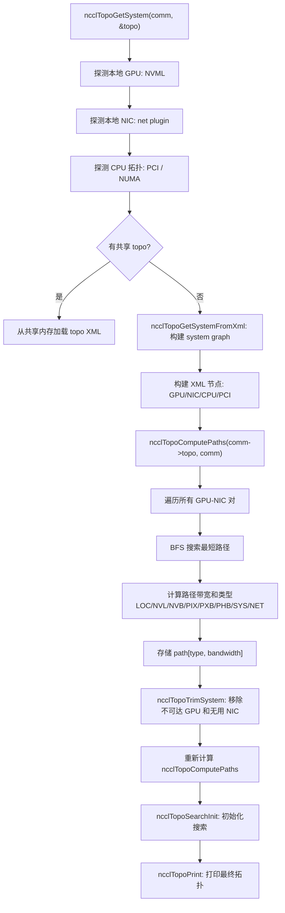

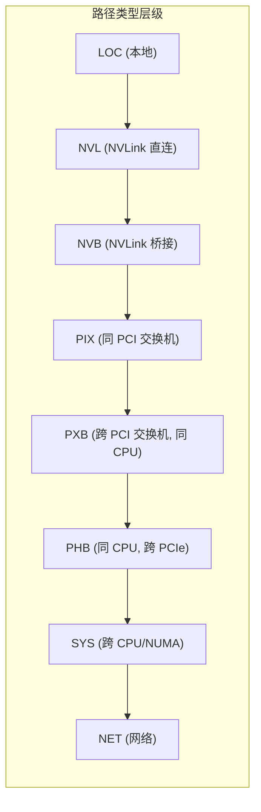

## 3. 图搜索与 Channel 分配

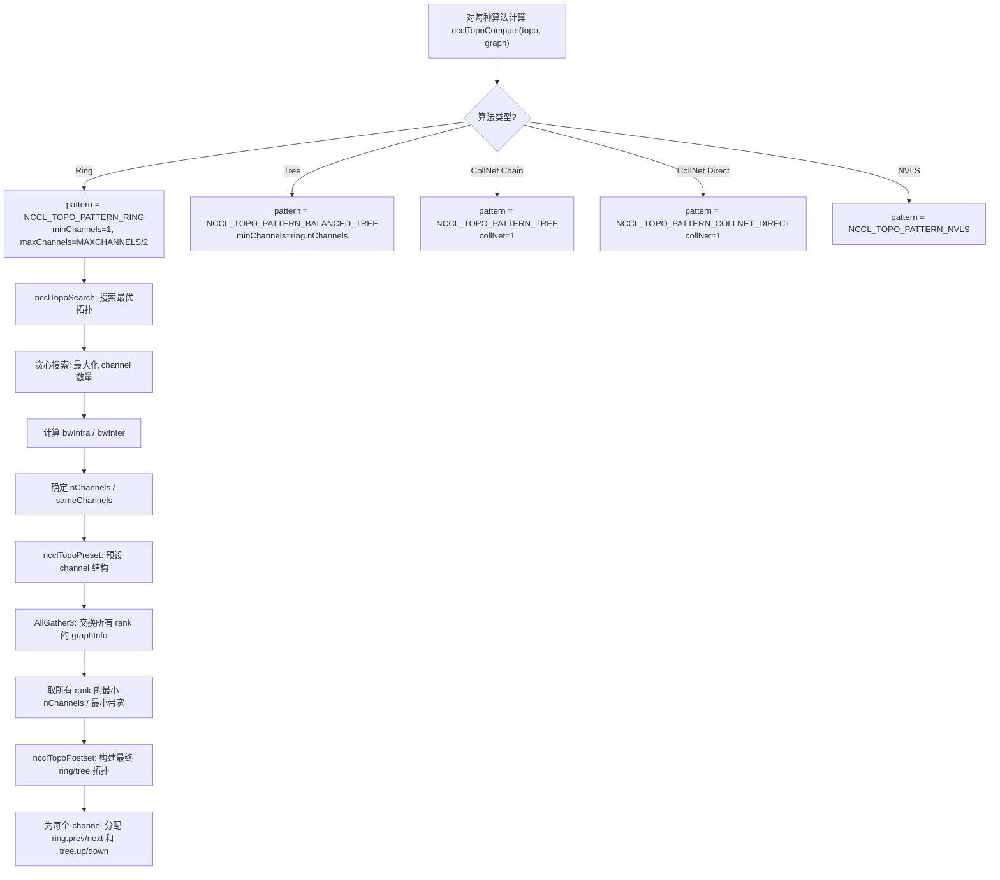

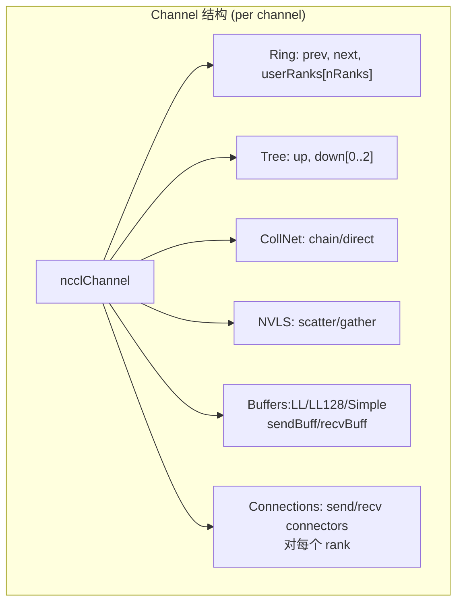

## 4. Transport 连接建立

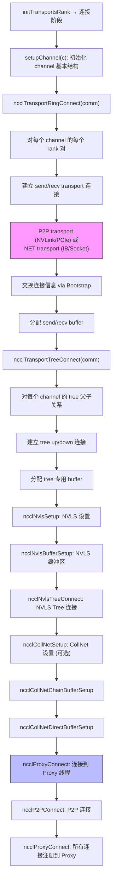

## 5. 集合通信 API 调用入口

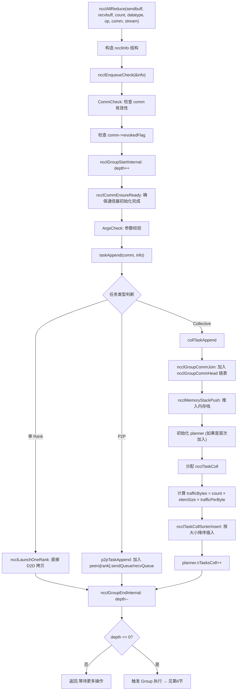

## 6. Group 操作机制

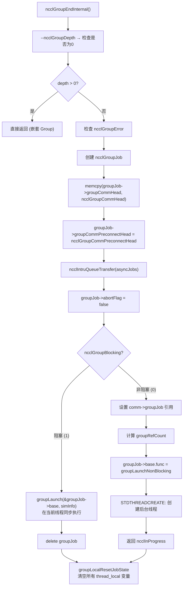

## 7. 线程本地状态与 Comm 链表管理

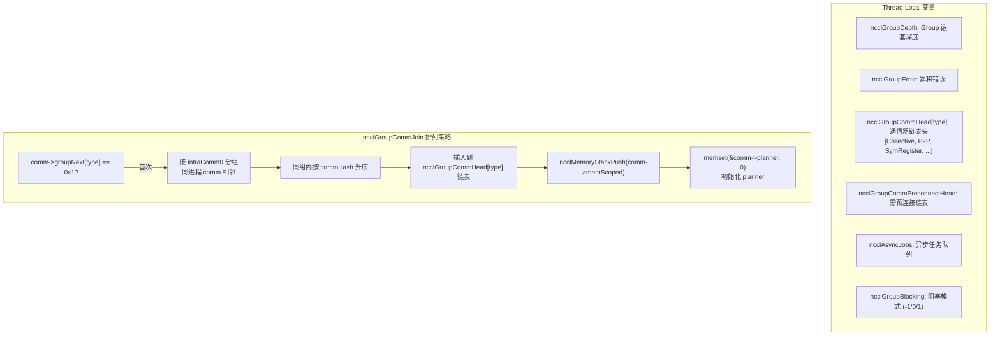

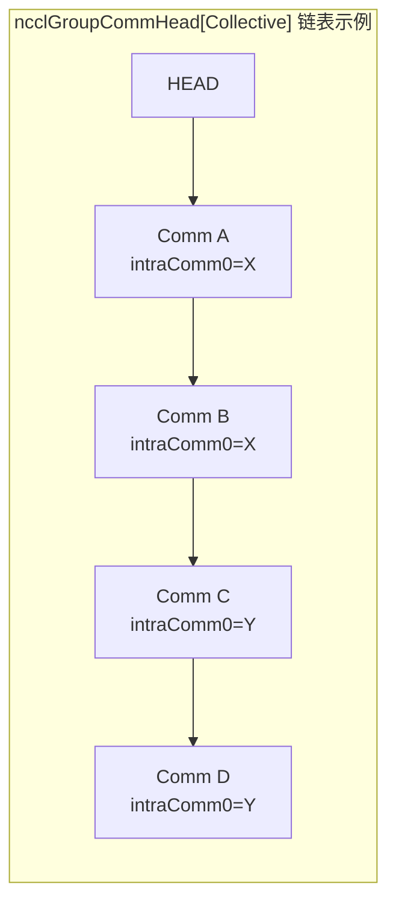

## 8. 任务累积与排序

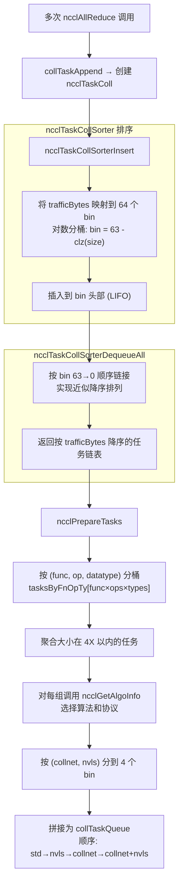

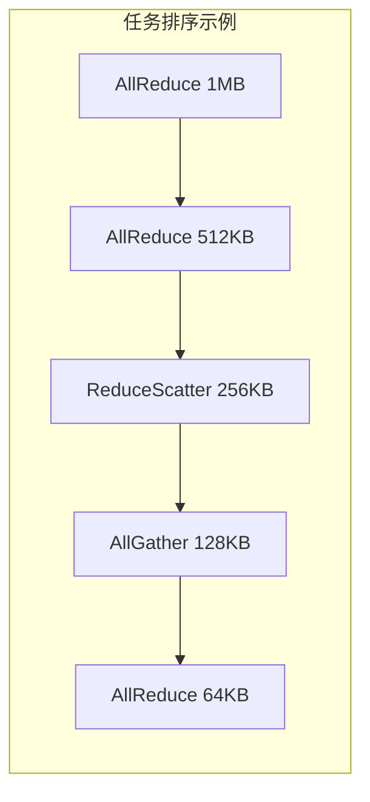

## 9. 算法与协议选择

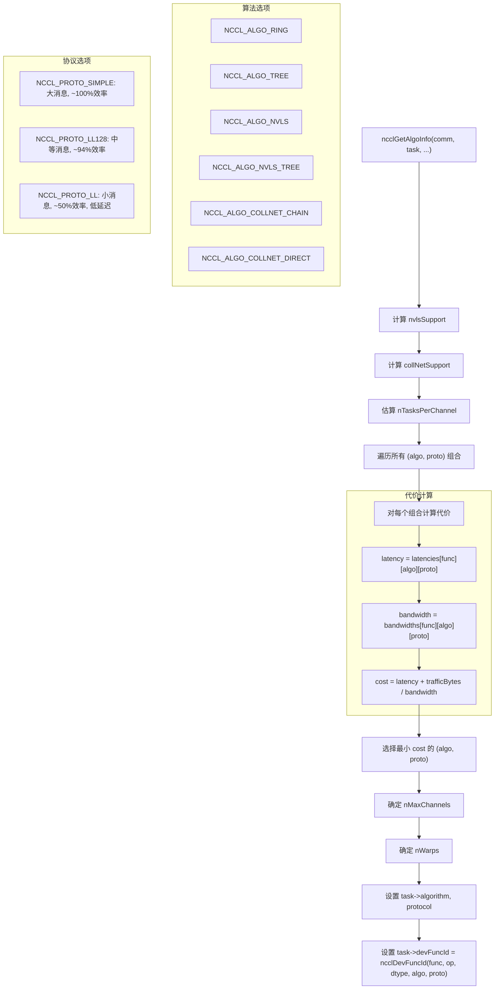

## 10. Channel-Based Distribution (CBD)

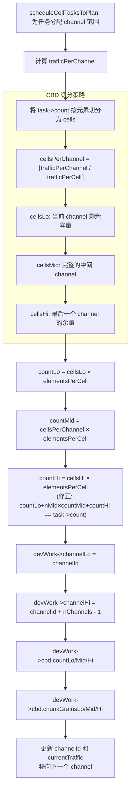

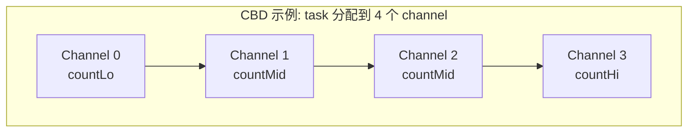

## 11. Kernel Plan 构建

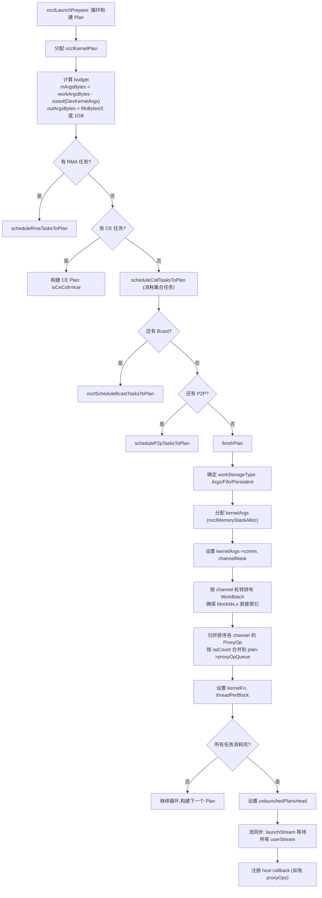

## 12. groupLaunch 五阶段

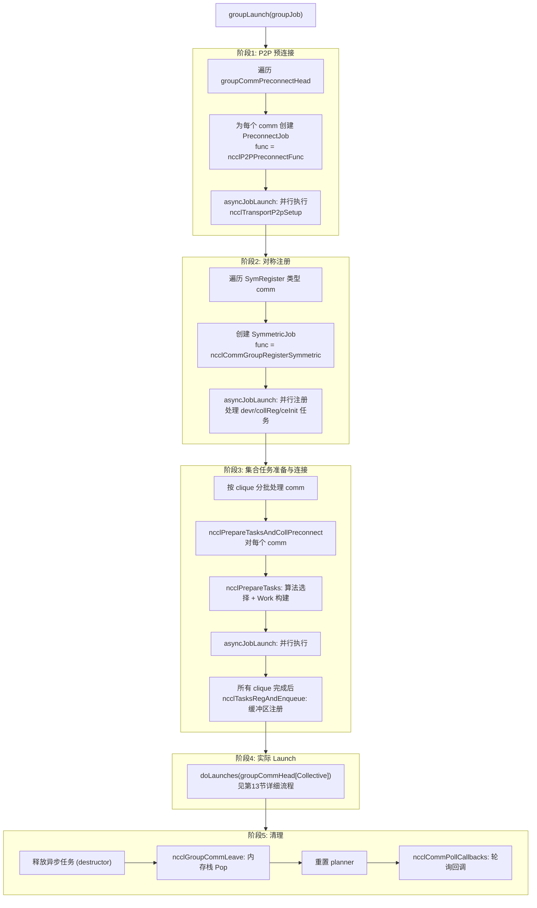

## 13. doLaunches 核心调度循环

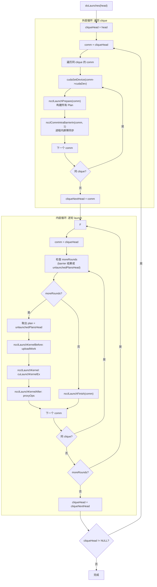

## 14. ncclLaunchPrepare 详解

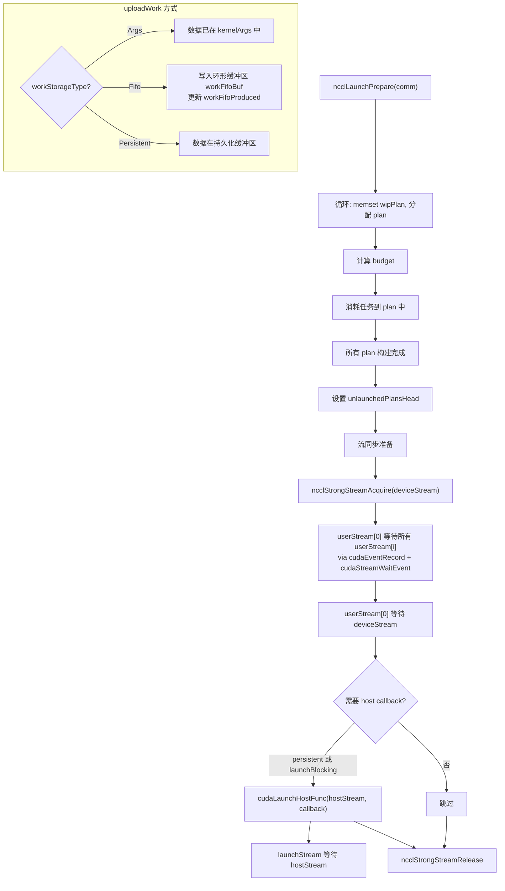

## 15. ncclLaunchKernel 与 GPU 启动配置

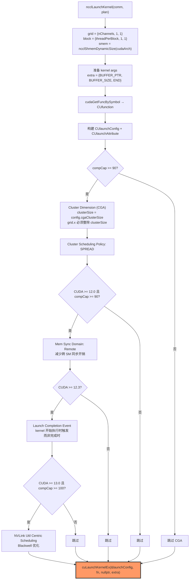

```mermaid
flowchart LR
    subgraph "Kernel 执行模型"
        direction TB
        G["Grid<br/>blockIdx.x = channel ID"] --> B0["Block 0<br/>Channel 0<br/>threadPerBlock threads"]
        G --> B1["Block 1<br/>Channel 1"]
        G --> B2["Block 2<br/>Channel 2"]
        G --> BN["Block N<br/>Channel N"]

        B0 --> W0["Warp 0: RecvWait"]
        B0 --> W1["Warp 1: Reduce"]
        B0 --> W2["Warp 2: SendWait"]
        B0 --> W3["Warp 3: PostSend"]
    end
```

## 16. Proxy 操作流程

```mermaid
flowchart TD
    A["hostStreamPlanCallback / hostStreamPlanTask"] --> B["遍历 plan->proxyOpQueue"]
    B --> C["ncclProxySaveOp: 优化/合并 proxy op"]
    C --> D["发送到 proxy 线程: ncclProxySendMessage"]

    D --> E["Proxy 线程接收"]
    E --> F{操作类型}

    F -->|"Ring Send"| G["通过 transport 发送数据<br/>IB verbs / Socket / P2P"]
    F -->|"Ring Recv"| H["通过 transport 接收数据<br/>写入 recv buffer"]
    F -->|"Tree Up"| I["向上发送规约结果"]
    F -->|"Tree Down"| J["向下广播结果"]
    F -->|"CollNet"| K["与 CollNet 交换数据"]
    F -->|"NVLS"| L["NVLS scatter/gather 操作"]

    G --> M["完成: ncclProxyCompleted"]
    H --> M
    I --> M
    J --> M
    K --> M
    L --> M

    M --> N["更新 device 端 step 计数器<br/>通知 kernel 数据就绪"]
```

## 17. Work 数据上传与存储

```mermaid
flowchart TD
    A["uploadWork(comm, plan)"] --> B{"workStorageType?"}

    B -->|Args| C["Work 已在 kernelArgs 中<br/>kernelArgs + batches + works<br/>一起传给 cuLaunchKernelEx"]

    B -->|Fifo| D["写入环形缓冲区"]
    D --> D1["fifoWritePtr = workFifoBuf + (workFifoProduced % workFifoBytes)"]
    D1 --> D2["memcpy(fifoWritePtr, works, workBytes)"]
    D2 --> D3["workFifoProduced += workBytes"]
    D3 --> D4["kernelArgs 中存储 fifo offset"]

    B -->|Persistent| E["Work 在持久化缓冲区<br/>(CUDA Graph 场景)"]
    E --> E1["kernelArgs 中存储持久化偏移"]

    subgraph "Kernel Args 内存布局"
        L1["ncclDevKernelArgs<br/>  comm (设备端通信器)<br/>  channelMask<br/>  workStorageType"]
        L1 --> L2["ncclDevWorkBatch[0]<br/>  for channel 0"]
        L2 --> L3["ncclDevWorkBatch[1]<br/>  for channel 0 (extends)"]
        L3 --> L4["ncclDevWorkBatch[2]<br/>  for channel 1"]
        L4 --> L5["ncclDevWorkColl<br/>  work 数据 (Args 模式)"]
    end
```

## 18. 异步任务生命周期

```mermaid
stateDiagram-v2
    state "ncclAsyncJob 状态" as states {
        [*] --> Created: ncclAsyncLaunch
        Created --> InQueue: 入队 ncclAsyncJobs
        InQueue --> Running: asyncJobLaunch 创建线程
        Running --> Done: ncclAsyncJobMain 完成<br/>ATOMIC_STORE(state, Done)
        Done --> Joined: 主线程 ncclThreadJoin
        Joined --> Freed: destructor 调用

        state "单任务优化" as opt {
            InQueue --> Done: isThreadMain=true<br/>直接在主线程执行
        }
    }
```

```mermaid
flowchart TD
    A["asyncJobLaunch(asyncJobs, abortFlag)"] --> B{"队列中只有1个任务?"}
    B -->|是| C["isThreadMain = true<br/>直接调用 ncclAsyncJobMain<br/>返回 result"]
    B -->|否| D["为每个任务创建 std::thread"]

    D --> E["轮询等待"]
    E --> F["检查每个 job 的 state<br/>ATOMIC_LOAD(state)"]
    F --> G{state?}
    G -->|Running| H["jobsDone = false<br/>usleep(1) 避免忙等"]
    G -->|Done| I["ncclThreadJoin<br/>state = Joined<br/>检查 result"]
    G -->|Joined| J["已处理,跳过"]

    H --> E
    I --> K{"有错误?"}
    K -->|是| L["设置所有 job 的 abortFlag<br/>ATOMIC_STORE(abortFlag, 1)"]
    K -->|否| M["继续"]
    M --> E
```

## 19. 阻塞与非阻塞模式对比

```mermaid
flowchart TD
    subgraph "阻塞模式"
        direction TB
        BA["ncclGroupEnd"] --> BB["groupLaunch 同步执行"]
        BB --> BC["所有阶段在用户线程完成"]
        BC --> BD["返回 ncclSuccess"]
    end

    subgraph "非阻塞模式"
        direction TB
        NB1["ncclGroupEnd"] --> NB2["创建后台线程"]
        NB2 --> NB3["groupLaunchNonBlocking"]
        NB3 --> NB4["返回 ncclInProgress"]

        NB4 --> NB5["后续操作检查完成状态"]
        NB5 --> NB6["ncclGroupJobComplete<br/>ATOMIC_EXCHANGE(joined)"]
        NB6 --> NB7["ncclAsyncJobComplete: join 线程"]
        NB7 --> NB8["refCount-- → 0? → delete"]
    end
```

## 20. Ring AllReduce Device Kernel

```mermaid
sequenceDiagram
    participant K as Kernel (每个 Block=1 Channel)
    participant Prev as 前一个 GPU
    participant Self as 当前 GPU
    participant Next as 下一个 GPU

    Note over K: Primitives<T,RedOp,FanSymmetric<1>,1,Proto,0>
    Note over K: ncclCollCbdPart → gridOffset, channelCount, chunkCount

    Note over K,Next: === Reduce-Scatter 阶段 (nRanks-1 步) ===

    loop "j = 0; j < nRanks-1; j++"
        K->>K: offset = (ringIx + nRanks - j) % nRanks × chunkSize
        alt j == 0
            K->>Next: prims.directSend(offset, nelem)
        else j < nRanks-1
            Prev->>K: prims.directRecvReduceDirectSend(offset, nelem)
        else j == nRanks-1
            Prev->>K: prims.directRecvReduceCopyDirectSend(offset, nelem, postOp=true)
        end
    end

    Note over K,Next: === AllGather 阶段 (nRanks-1 步) ===

    loop "j = 1; j < nRanks; j++"
        K->>K: offset = (ringIx + nRanks - j) % nRanks × chunkSize
        alt j < nRanks-1
            Prev->>K: prims.directRecvCopyDirectSend(offset, nelem)
        else j == nRanks-1
            Prev->>K: prims.directRecv(offset, nelem)
        end
    end
```

## 21. Tree AllReduce Device Kernel

```mermaid
flowchart TD
    A["runTreeUpDown(tid, nthreads, work)"] --> B{node 角色?}

    subgraph "Reduce 阶段 (上行)"
        B -->|"根节点 (up==-1)"| C["directRecvReduceCopy<br/>接收所有子节点, 规约到 recvbuff<br/>postOp=true: 应用规约操作"]
        B -->|"叶子节点 (down[0]==-1)"| D["directSend<br/>发送 sendbuff 到父节点"]
        B -->|"中间节点"| E["directRecvReduceDirectSend<br/>接收子节点, 规约, 转发到父节点"]
    end

    C --> F
    D --> F
    E --> F

    subgraph "Broadcast 阶段 (下行)"
        F --> F1{node 角色?}
        F1 -->|"根节点"| G["directSendFromOutput<br/>从 recvbuff 发送到子节点"]
        F1 -->|"叶子节点"| H["directRecv<br/>接收结果到 recvbuff"]
        F1 -->|"中间节点"| I["directRecvCopyDirectSend<br/>接收并转发到子节点"]
    end
```

```mermaid
flowchart TD
    A["runTreeSplit(tid, nthreads, work)"] --> B["nthreadsSplit = nthreads/2"]

    subgraph "线程分割"
        B --> C["tid < nthreadsSplit: Reduce 线程"]
        B --> D["tid >= nthreadsSplit: Broadcast 线程"]
    end

    C --> E["同时执行 Reduce 上行<br/>和 Broadcast 下行"]
    D --> E

    E --> F["Simple: 50/50 分割<br/>LL/LL128: 70/30 分割"]
```

## 22. NVLS AllReduce Device Kernel

```mermaid
flowchart TD
    A["runNvls(tid, nthreads, work)"] --> B["计算 warp 分配:<br/>totalWarps = NCCL_MAX_NTHREADS/WARP_SIZE"]
    B --> C["scatterWarps, gatherWarps, reduceWarps, bcastWarps"]

    subgraph "NVLS Scatter 阶段"
        C --> D["将数据 scatter 到所有 rank 的 NVLS buffer"]
        D --> E["使用 NVLink Switch 直接写入远程内存"]
    end

    subgraph "NVLS Gather + Reduce 阶段"
        E --> F["从所有 rank 的 scatter buffer gather 数据"]
        F --> G["本地 reduce 所有 gathered 数据"]
    end

    subgraph "NVLS Broadcast 阶段"
        G --> H["将 reduce 结果写入 NVLS multicast buffer"]
        H --> I["所有 rank 通过 NVLS 读取结果"]
    end
```

## 23. Device Kernel 线程角色分配

```mermaid
flowchart TD
    A["tid = threadIdx.x<br/>nthreads = blockDim.x"] --> B["nrecv, nsend = 连接数"]

    B --> C{"tid < nrecv?"}
    C -->|是| D["flags |= RoleWaitRecv<br/>等待接收数据就绪<br/>index = tid"]

    C -->|否| E{"tid < nrecv+nsend?"}
    E -->|是| F["flags |= RoleWaitSend<br/>等待发送槽位可用<br/>index = tid-nrecv"]

    E -->|否| G{"tid >= nthreads-nsend?"}
    G -->|是| H["flags |= RolePostSend<br/>通知发送完成<br/>index = tid-(nthreads-nsend)"]

    G -->|否| I{"tid >= nthreads-nrecv-nsend?"}
    I -->|是| J["flags |= RolePostRecv<br/>通知接收完成<br/>index = tid-(nthreads-nrecv-nsend)"]

    I -->|否| K["flags |= RoleInput | RoleOutput<br/>计算线程: 执行 reduce/copy<br/>从 recvBuff 读取, 规约, 写入 sendBuff/outputBuff"]
```

```mermaid
flowchart LR
    subgraph "线程布局 (示例: 512 threads, 1 recv, 1 send)"
        direction LR
        T0["T0<br/>WaitRecv"] --> T1["T1..T494<br/>Compute<br/>(Reduce/Copy)"]
        T1 --> T2["T495..T509<br/>空闲"]
        T2 --> T3["T510<br/>PostRecv"]
        T3 --> T4["T511<br/>PostSend"]
    end
```

## 24. Simple 协议原语

```mermaid
flowchart TD
    A["ProtoSimple"] --> B["MaxGroupWidth = 2<br/>支持一次处理 2 个 slice"]

    B --> C["同步机制: Step 计数器"]
    C --> D["发送方: 等待 connStepCache + NCCL_STEPS < step + StepPerSlice"]
    D --> E["接收方: 等待 connStepCache >= step"]

    subgraph "数据流动"
        F["directSend:<br/>直接从 sendbuff 写入远程 recvBuff"]
        F --> G["directRecvReduceDirectSend:<br/>从远程 recvBuff 读取<br/>本地 reduce<br/>写入下一个远程 sendBuff"]
        G --> H["directRecvReduceCopyDirectSend:<br/>同上 + 拷贝到本地 output"]
        H --> I["directRecvCopyDirectSend:<br/>从远程读取, 拷贝到本地, 转发"]
        I --> J["directRecv:<br/>从远程读取到本地"]
    end

    subgraph "缓冲区布局"
        K["buffSize / NCCL_STEPS<br/>每个 step 等分缓冲区"]
        K --> L["Step 0<br/>sliceSize bytes"]
        L --> M["Step 1<br/>sliceSize bytes"]
        M --> N["..."]
        N --> O["Step NCCL_STEPS-1"]
    end
```

## 25. LL 协议原语

```mermaid
flowchart TD
    A["ProtoLL (Low Latency)"] --> B["MaxGroupWidth = 1<br/>数据效率 ~50%"]

    subgraph "数据格式: 16 字节/line"
        C["data1 (4B) | flag1 (4B) | data2 (4B) | flag2 (4B)"]
    end

    B --> D["同步: Flag 匹配"]
    D --> E["readLL: volatile load v4.u32<br/>等待 flag1 == recvFlag && flag2 == recvFlag"]
    E --> F["writeLL: store v4.u32<br/>设置 data + flag"]

    subgraph "Flag 递增机制"
        G["每次完整传输后<br/>recvFlag += 1"]
        G --> H["发送方用对应 flag 写入数据"]
        H --> I["接收方 volatile load 直到 flag 匹配"]
    end

    style A fill:#fbb,stroke:#333
```

## 26. LL128 协议原语

```mermaid
flowchart TD
    A["ProtoLL128"] --> B["数据效率 ~94%<br/>7/8 数据 + 1/8 flag"]

    subgraph "128 字节行格式 (32 threads × 4B)"
        C["T0: data(4B) | T1: data(4B) | ... | T6: data(4B) | T7: flag(4B)"]
        C --> C2["每 8 个线程中 7 个传数据, 1 个传 flag"]
        C2 --> C3["16 个这样的组 × 8B = 128B<br/>数据: 112B, Flag: 16B"]
    end

    B --> D["同步: 128-bit flag 检查"]
    D --> E["load128: 一次加载 128 字节"]
    E --> F["检查最后 16 字节的 flag 是否匹配"]

    subgraph "与 Simple/LL 对比"
        G["Simple: 高吞吐, 高延迟<br/>~100% 数据效率"]
        G --> H["LL128: 中等吞吐, 中等延迟<br/>~94% 数据效率"]
        H --> I["LL: 低吞吐, 最低延迟<br/>~50% 数据效率"]
    end

    style A fill:#bfb,stroke:#333
```

## 27. 内存管理栈机制

```mermaid
flowchart TD
    subgraph "ncclMemoryStack 作用域机制"
        A["comm 加入 Group:<br/>ncclMemoryStackPush(&comm->memScoped)"] --> B["记录当前栈顶位置 savepoint"]
        B --> C["任务分配使用 memScoped<br/>ncclMemoryStackAlloc 用于 TaskColl/WorkList 等"]

        C --> D["Group 完成: ncclGroupCommLeave"]
        D --> E["ncclMemoryStackPop(&comm->memScoped)"]
        E --> F["栈顶回到 savepoint<br/>所有本 Group 的临时分配一次性释放"]
    end

    subgraph "内存池 (Memory Pool)"
        G["memPool_ncclTaskColl<br/>ncclTaskColl 对象池"]
        G --> H["memPool_ncclKernelPlan<br/>ncclKernelPlan 对象池"]
        H --> I["memPool_ncclProxyOp<br/>ncclProxyOp 对象池"]
        I --> J["memPool_ncclTaskP2p<br/>ncclTaskP2p 对象池"]
    end

    subgraph "永久 vs 临时分配"
        K["memPermanent: 通信器生命周期<br/>如 peers[], channels[]"]
        K --> L["memScoped: Group 生命周期<br/>如 ncclDevWorkColl, WorkBatch"]
    end
```

## 28. 错误处理与 Abort 机制

```mermaid
flowchart TD
    A["错误发生"] --> B{"在 Group 中?"}

    B -->|是| C["ncclGroupErrCheck(ret)<br/>设置 ncclGroupError"]
    C --> D["继续累积错误<br/>GroupEnd 时统一处理"]

    B -->|否| E["直接返回错误码"]

    D --> F["ncclGroupEndInternal 检测到错误"]
    F --> G["groupCleanup:<br/>遍历所有 comm 和 asyncJob"]

    subgraph "清理流程"
        G --> H["ncclGroupCommLeave<br/>重置 comm->groupNext"]
        H --> I["清空 planner.planQueue<br/>释放 ncclKernelPlan + ncclProxyOp"]
        I --> J["重置 planner (memset)"]
        J --> K["调用 job->undo (回滚)"]
        K --> L["调用 job->destructor (释放)"]
    end

    subgraph "Abort 传播"
        M["asyncJobLaunch 检测到错误"] --> N["设置 groupAbortFlag"]
        N --> O["遍历所有 job<br/>设置 job->abortFlag = 1<br/>设置 job->abortFlagDev = 1"]
        O --> P["Device Kernel 检查 abortFlagDev<br/>发现为 1 → 提前退出"]
    end

    subgraph "非阻塞 Abort"
        Q["ncclGroupJobAbort(groupJob)"] --> R["ATOMIC_EXCHANGE(joined, true)"]
        R --> S["设置 abortFlag"]
        S --> T["ncclAsyncJobComplete: join 线程"]
        T --> U["refCount-- → 释放"]
    end
```

---

*文档生成时间: 2026-03-30*
*基于 NCCL 源码: /root/source/nccl*

---

## 附录 A: Ring AllReduce offset 计算详解

```mermaid
flowchart TD
    A["ncclCollCbdPart(work, channelId, protoId, elemSize, nullptr, &gridOffset, &channelCount, &chunkCount)"] --> B["gridOffset: 当前 channel 在全局数据中的起始偏移"]
    B --> C["channelCount: 当前 channel 处理的总元素数<br/>(来自 CBD 的 countLo/Mid/Hi)"]
    C --> D["chunkCount: 每个 chunk 的元素数<br/>= channelCount / nRanks (对齐到16)"]

    D --> E["loopCount = nRanks × chunkCount"]
    E --> F["外层循环: elemOffset = 0; < channelCount; += loopCount"]
    F --> G["remCount = channelCount - elemOffset"]
    G --> H["if remCount < loopCount:<br/>  chunkCount = alignUp(remCount/nRanks, 16)"]

    H --> I["Reduce-Scatter: j=0..nRanks-2"]
    I --> J["chunk = (ringIx + nRanks - j) % nRanks<br/>offset = gridOffset + elemOffset + chunk × chunkCount<br/>nelem = min(chunkCount, remCount - chunk × chunkCount)"]

    J --> K["j==0: directSend(offset, nelem)"]
    K --> L["j==1..nRanks-2: directRecvReduceDirectSend(offset, nelem)"]
    L --> M["j==nRanks-1: directRecvReduceCopyDirectSend(offset, nelem, postOp=true)"]

    M --> N["AllGather: j=1..nRanks-1"]
    N --> O["chunk = (ringIx + nRanks - j) % nRanks<br/>offset = gridOffset + elemOffset + chunk × chunkCount"]

    O --> P["j==1..nRanks-2: directRecvCopyDirectSend(offset, nelem)"]
    P --> Q["j==nRanks-1: directRecv(offset, nelem)"]
```

## 附录 B: Proxy 线程架构

```mermaid
flowchart TD
    A["ncclProxyCreate(comm)"] --> B["创建 proxy 线程 (std::thread)"]
    B --> C["proxy 线程主循环: ncclProxyThread"]

    C --> D["epoll_wait: 等待事件"]
    D --> E{"事件类型"}
    E -->|"网络可读"| F["ncclNetRecv: 接收网络数据"]
    E -->|"网络可写"| G["ncclNetSend: 发送网络数据"]
    E -->|"新操作到达"| H["处理 proxy operation"]

    H --> I["proxyOp->func(proxyOp)<br/>执行具体传输操作"]
    I --> J["Ring: 在 rank 间转发数据<br/>Tree: 向上/向下传输"]
    J --> K["完成后更新 device step counter"]

    K --> L["kernel 检测到 step 更新<br/>继续处理下一个 slice"]
```

## 附录 C: Work Fifo 环形缓冲区机制

```mermaid
flowchart TD
    A["workFifoBuf (GPU 内存)"] --> B["大小: workFifoBytes (2的幂次)"]
    B --> C["writePtr = workFifoProduced % workFifoBytes"]

    subgraph "环形缓冲区"
        direction LR
        S0["已消费区域"] --> S1["最新写入<br/>offset=P%F"] --> S2["空闲区域"]
    end

    subgraph "生产者 (Host)"
        P1["uploadWork:<br/>memcpy(fifoBuf + offset, workData, workBytes)"]
        P2["workFifoProduced += workBytes"]
    end

    subgraph "消费者 (Device)"
        C1["kernel 读取 workFifoBufDev[consumed % fifoBytes]"]
        C2["通过 ncclDevWorkBatch.offsetBase 定位 work"]
    end

    subgraph "同步"
        SYN1["Host: workFifoProduced 记录写入量"]
        SYN2["Device: 通过完成事件回调更新 workFifoConsumed"]
        SYN3["防止: produced - consumed > fifoBytes (溢出)"]
    end
```

