# NVIDIA Triton Inference Server 完整架构分析

## 目录

1. [概述](#1-概述)
2. [整体架构](#2-整体架构)
3. [Core 子模块详解](#3-core-子模块详解)
4. [Server 子模块详解](#4-server-子模块详解)
5. [Backend 子模块详解](#5-backend-子模块详解)
6. [Client 子模块详解](#6-client-子模块详解)
7. [Model Analyzer 子模块详解](#7-model-analyzer-子模块详解)
8. [Model Navigator 子模块详解](#8-model-navigator-子模块详解)
9. [推理请求完整生命周期](#9-推理请求完整生命周期)
10. [关键机制详解](#10-关键机制详解)
11. [性能优化策略](#11-性能优化策略)
12. [总结](#12-总结)

---

## 1. 概述

NVIDIA Triton Inference Server 是一个开源的、生产级的推理服务框架，专为在大规模生产环境中部署AI模型而设计。它支持多种深度学习框架（TensorFlow、PyTorch、TensorRT、ONNX Runtime等），并提供统一的推理API。

### 1.1 项目结构

Triton 由六个主要子仓库组成：

```
triton-inference-server/
├── core/           # 核心推理引擎和API实现
├── server/         # HTTP/gRPC服务器实现
├── backend/        # 后端抽象层和通用工具
├── client/         # 多语言客户端库
├── model_analyzer/ # 模型性能分析工具
└── model_navigator/# 模型优化和导航工具
```

---

## 2. 整体架构

### 2.1 架构图

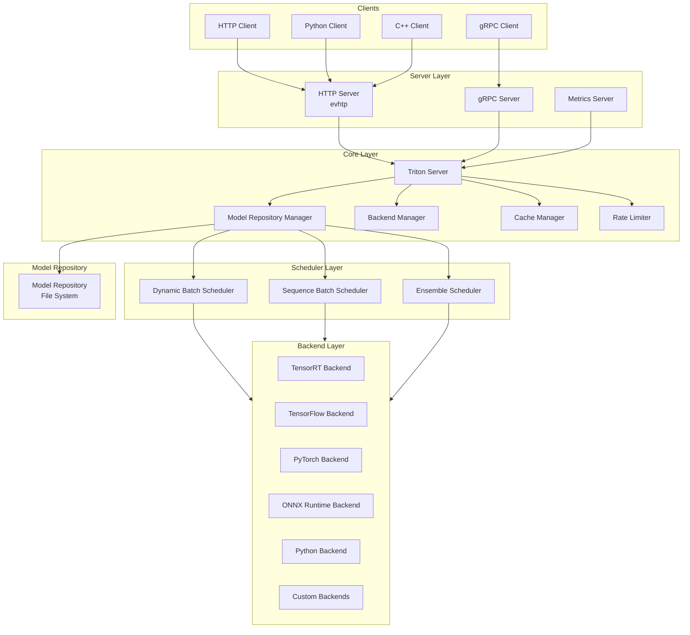

### 2.2 核心组件关系

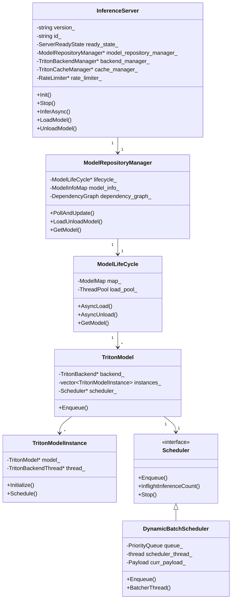

---

## 3. Core 子模块详解

Core 是 Triton 的核心引擎，实现了推理服务的主要逻辑。

### 3.1 核心类分析

#### 3.1.1 InferenceServer

`InferenceServer` 是整个推理服务的主入口，负责协调所有组件的生命周期。

**关键定义** (`core/src/server.h:78-391`):

```cpp
class InferenceServer {
 public:
  InferenceServer();
  ~InferenceServer();
  
  // 初始化服务器，创建各管理器
  Status Init();
  
  // 停止服务器，卸载所有模型
  Status Stop(const bool force = false);
  
  // 异步推理入口
  Status InferAsync(std::unique_ptr<InferenceRequest>& request);
  
  // 模型加载/卸载
  Status LoadModel(const std::unordered_map<...>& models);
  Status UnloadModel(const std::string& model_name, bool unload_dependents);
  
 private:
  // 核心组件
  std::unique_ptr<ModelRepositoryManager> model_repository_manager_;
  std::shared_ptr<TritonBackendManager> backend_manager_;
  std::shared_ptr<TritonCacheManager> cache_manager_;
  std::shared_ptr<RateLimiter> rate_limiter_;
  
  // 服务器状态
  ServerReadyState ready_state_;
};
```

**初始化流程** (`core/src/server.cc:130-288`):

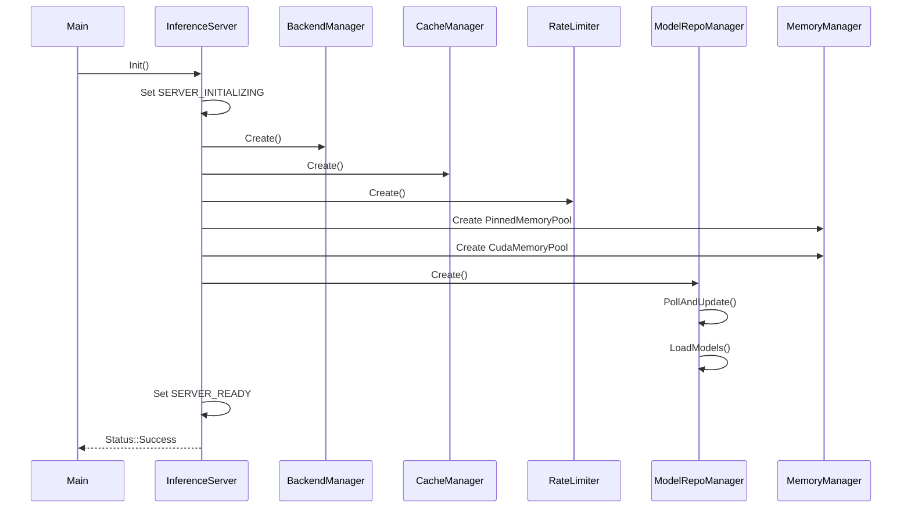

#### 3.1.2 InferenceRequest

`InferenceRequest` 封装了推理请求的所有信息，包括输入张量、输出请求、参数等。

**关键结构** (`core/src/infer_request.h:59-897`):

```cpp
class InferenceRequest {
 public:
  // 输入张量类
  class Input {
    std::string name_;
    inference::DataType datatype_;
    std::vector<int64_t> shape_;
    std::shared_ptr<Memory> data_;
  };
  
  // 序列ID（用于序列批处理）
  class SequenceId {
    enum class DataType { UINT64, STRING };
    DataType id_type_;
    std::string sequence_label_;
    uint64_t sequence_index_;
  };
  
  // 请求状态
  enum class State {
    INITIALIZED,   // 已初始化，未入队
    PENDING,       // 等待执行
    FAILED_ENQUEUE,// 入队失败
    EXECUTING,     // 正在执行
    RELEASED       // 已释放
  };
  
  // 核心方法
  Status PrepareForInference();
  static Status Run(std::unique_ptr<InferenceRequest>& request);
  static Status Release(std::unique_ptr<InferenceRequest>&& request, uint32_t flags);
  
 private:
  std::shared_ptr<Model> model_shared_;
  Model* model_raw_;
  
  std::unordered_map<std::string, Input> original_inputs_;
  std::unordered_map<std::string, std::shared_ptr<Input>> override_inputs_;
  std::set<std::string> original_requested_outputs_;
  
  // 回调函数
  TRITONSERVER_InferenceRequestReleaseFn_t release_fn_;
  TRITONSERVER_InferenceResponseCompleteFn_t response_callback_;
  std::shared_ptr<InferenceResponseFactory> response_factory_;
};
```

**请求状态转换** (`core/src/infer_request.cc:131-199`):

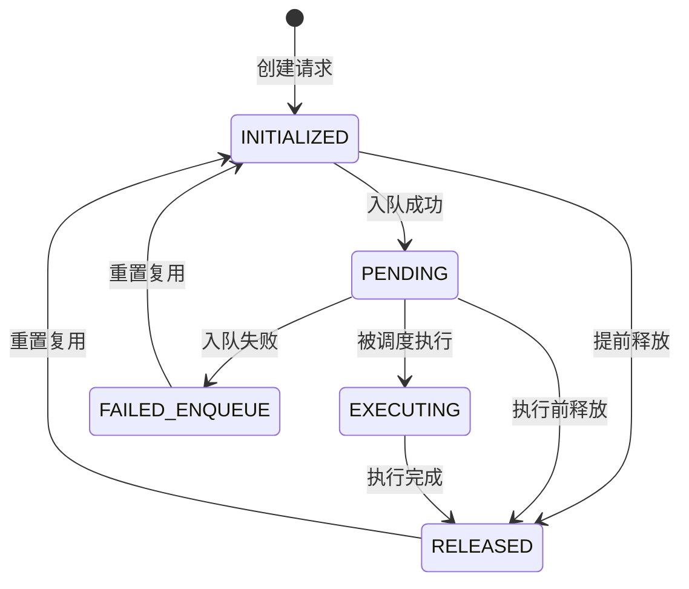

### 3.2 模型仓库管理

#### 3.2.1 ModelRepositoryManager

负责管理模型仓库的发现、监控和更新。

**核心结构** (`core/src/model_repository_manager/model_repository_manager.h:86-704`):

```cpp
class ModelRepositoryManager {
 public:
  // 模型索引信息
  struct ModelIndex {
    const std::string name_;
    const int64_t version_;
    const ModelReadyState state_;
    const std::string reason_;
  };
  
  // 依赖图节点
  struct DependencyNode {
    Status status_;
    ModelIdentifier model_id_;
    bool explicitly_load_;
    inference::ModelConfig model_config_;
    
    std::set<std::string> missing_upstreams_;
    std::unordered_map<DependencyNode*, std::set<int64_t>> upstreams_;
    std::set<DependencyNode*> downstreams_;
    std::set<int64_t> loaded_versions_;
  };
  
  // 核心方法
  Status PollAndUpdate();
  Status LoadUnloadModel(...);
  Status GetModel(const ModelIdentifier& model_id, int64_t version, shared_ptr<Model>* model);
  
 private:
  std::unique_ptr<ModelLifeCycle> lifecycle_;
  DependencyGraph dependency_graph_;
  ModelInfoMap model_info_;
};
```

#### 3.2.2 ModelLifeCycle

管理单个模型的生命周期，包括加载、卸载和版本管理。

**关键实现** (`core/src/model_repository_manager/model_lifecycle.h:168-347`):

```cpp
class ModelLifeCycle {
 public:
  static Status Create(InferenceServer* server, const ModelLifeCycleOptions& options, ...);
  
  // 异步加载模型
  Status AsyncLoad(
      const ModelIdentifier& model_id,
      const std::string& model_path,
      const inference::ModelConfig& model_config,
      const bool is_config_provided,
      const ModelTimestamp& prev_timestamp,
      const ModelTimestamp& curr_timestamp,
      const shared_ptr<TritonRepoAgentModelList>& agent_model_list,
      function<void(Status)>&& OnComplete);
  
  // 异步卸载模型
  Status AsyncUnload(const ModelIdentifier& model_id);
  
 private:
  struct ModelInfo {
    inference::ModelConfig model_config_;
    const std::string model_path_;
    ModelReadyState state_;
    std::string state_reason_;
    std::shared_ptr<Model> model_;
  };
  
  ModelMap map_;
  std::unique_ptr<ThreadPool> load_pool_;
};
```

### 3.3 调度器系统

#### 3.3.1 Scheduler 接口

所有调度器实现的基础接口。

**定义** (`core/src/scheduler.h:36-81`):

```cpp
class Scheduler {
 public:
  virtual ~Scheduler() {}
  
  // 初始化函数类型
  using StandardInitFunc = std::function<Status(uint32_t runner_idx)>;
  using StandardWarmupFunc = std::function<Status(uint32_t runner_idx)>;
  using StandardRunFunc = std::function<void(uint32_t runner_idx, 
      vector<unique_ptr<InferenceRequest>>&& requests)>;
  
  // 入队请求
  virtual Status Enqueue(std::unique_ptr<InferenceRequest>& request) = 0;
  
  // 获取在途推理数量
  virtual size_t InflightInferenceCount() = 0;
  
  // 停止调度
  virtual void Stop() = 0;
};
```

#### 3.3.2 DynamicBatchScheduler

动态批处理调度器，是最常用的调度策略。

**关键实现** (`core/src/dynamic_batch_scheduler.h:50-199`):

```cpp
class DynamicBatchScheduler : public Scheduler {
 public:
  static Status Create(
      TritonModel* model,
      TritonModelInstance* model_instance,
      const int nice,
      const bool dynamic_batching_enabled,
      const int32_t max_batch_size,
      const unordered_map<string, bool>& enforce_equal_shape_tensors,
      const bool preserve_ordering,
      const set<int32_t>& preferred_batch_sizes,
      const uint64_t max_queue_delay_microseconds,
      unique_ptr<Scheduler>* scheduler);
  
  Status Enqueue(std::unique_ptr<InferenceRequest>& request) override;
  
 private:
  // 核心数据结构
  PriorityQueue queue_;                    // 优先级队列
  std::thread scheduler_thread_;           // 调度线程
  std::mutex mu_;                          // 互斥锁
  std::condition_variable cv_;             // 条件变量
  std::shared_ptr<Payload> curr_payload_;  // 当前负载
  
  // 批处理参数
  size_t max_batch_size_;
  std::set<int32_t> preferred_batch_sizes_;
  uint64_t pending_batch_delay_ns_;
  
  // 核心方法
  void BatcherThread(const int nice);
  uint64_t GetDynamicBatch();
  void NewPayload();
};
```

**动态批处理算法** (`core/src/dynamic_batch_scheduler.cc:488-600`):

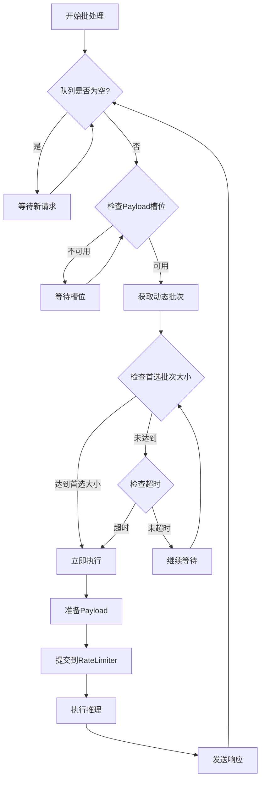

**Enqueue 流程** (`core/src/dynamic_batch_scheduler.cc:185-290`):

```cpp
Status DynamicBatchScheduler::Enqueue(std::unique_ptr<InferenceRequest>& request) {
  // 1. 检查服务器状态
  if (stop_) {
    return Status(Status::Code::UNAVAILABLE, "Server is stopping");
  }
  
  // 2. 记录队列开始时间
  if (request->QueueStartNs() == 0) {
    request->CaptureQueueStartNs();
  }
  
  // 3. 响应缓存查找
  std::unique_ptr<InferenceResponse> cached_response;
  if (response_cache_enabled_) {
    CacheLookUp(request, cached_response);
  }
  
  // 4. 缓存命中处理
  if (cached_response != nullptr) {
    InferenceResponse::Send(std::move(cached_response), ...);
    InferenceRequest::Release(std::move(request), ...);
    return Status::Success;
  }
  
  // 5. 非动态批处理模式
  if (!dynamic_batching_enabled_) {
    auto payload = rate_limiter_->GetPayload(Payload::Operation::INFER_RUN, nullptr);
    payload->AddRequest(std::move(request));
    return rate_limiter_->EnqueuePayload(model_, payload);
  }
  
  // 6. 动态批处理入队
  {
    std::lock_guard<std::mutex> lock(mu_);
    queued_batch_size_ += std::max(1U, request->BatchSize());
    RETURN_IF_ERROR(queue_.Enqueue(request->Priority(), request));
    
    // 唤醒批处理线程
    if (wake_batcher) {
      cv_.notify_one();
    }
  }
  
  return Status::Success;
}
```

### 3.4 后端模型管理

#### 3.4.1 TritonModel

表示一个 Triton 模型，管理其配置、实例和调度器。

**关键结构** (`core/src/backend_model.h:48-291`):

```cpp
class TritonModel : public Model {
 public:
  static Status Create(
      InferenceServer* server,
      const std::string& model_path,
      const triton::common::BackendCmdlineConfigMap& backend_cmdline_config_map,
      const triton::common::HostPolicyCmdlineConfigMap& host_policy_map,
      const ModelIdentifier& model_id,
      const int64_t version,
      inference::ModelConfig model_config,
      const bool is_config_provided,
      unique_ptr<TritonModel>* model);
  
  // 实例管理
  Status UpdateInstanceGroup(const inference::ModelConfig& new_model_config);
  vector<shared_ptr<TritonModelInstance>> GetInstancesByDevice(int32_t device_id) const;
  
  // 后端关联
  const shared_ptr<TritonBackend>& Backend() const { return backend_; }
  
 private:
  InferenceServer* server_;
  shared_ptr<TritonBackend> backend_;
  vector<shared_ptr<TritonModelInstance>> instances_;
  vector<shared_ptr<TritonModelInstance>> passive_instances_;
};
```

#### 3.4.2 TritonModelInstance

表示模型的一个执行实例，可以是 CPU 或 GPU。

**关键结构** (`core/src/backend_model_instance.h:52-262`):

```cpp
class TritonModelInstance {
 public:
  // 实例签名（用于实例匹配）
  class Signature {
    const inference::ModelInstanceGroup group_config_;
    const int32_t device_id_;
    size_t Hash() const;
  };
  
  static Status CreateInstance(
      TritonModel* model,
      const std::string& name,
      const Signature& signature,
      TRITONSERVER_InstanceGroupKind kind,
      int32_t device_id,
      const vector<string>& profile_names,
      const bool passive,
      const string& host_policy_name,
      const inference::ModelRateLimiter& rate_limiter_config,
      const vector<SecondaryDevice>& secondary_devices,
      shared_ptr<TritonModelInstance>* triton_model_instance);
  
  // 核心方法
  Status Initialize();
  Status WarmUp();
  Status Schedule(vector<unique_ptr<InferenceRequest>>&& requests);
  
 private:
  TritonModel* model_;
  std::string name_;
  Signature signature_;
  TRITONSERVER_InstanceGroupKind kind_;
  int32_t device_id_;
  
  shared_ptr<TritonBackendThread> triton_backend_thread_;
};
```

### 3.5 Rate Limiter

限制推理请求的调度速率，管理资源分配。

**核心结构** (`core/src/rate_limiter.h:44-200`):

```cpp
class RateLimiter {
 public:
  using ResourceMap = std::map<int, std::map<std::string, size_t>>;
  
  static Status Create(
      const bool ignore_resources_and_priority,
      const ResourceMap& resource_map,
      unique_ptr<RateLimiter>* rate_limiter);
  
  // 注册/注销模型实例
  Status RegisterModelInstance(TritonModelInstance* instance, const RateLimiterConfig& config);
  void UnregisterModelInstance(TritonModelInstance* instance);
  
  // Payload槽位检查
  bool PayloadSlotAvailable(
      const TritonModel* model,
      const TritonModelInstance* model_instance,
      const bool support_prefetching,
      const bool force_non_blocking = false);
  
  // 入队/出队Payload
  Status EnqueuePayload(const TritonModel* model, shared_ptr<Payload> payload);
  void DequeuePayload(deque<TritonModelInstance*>& instance, shared_ptr<Payload>* payload);
  
 private:
  // 实例上下文状态
  class ModelInstanceContext {
    enum State { AVAILABLE, STAGED, ALLOCATED, REMOVED };
    State state_;
    TritonModelInstance* triton_model_instance_;
    RateLimiterConfig rate_limiter_config_;
    atomic<uint64_t> exec_count_;
  };
  
  PriorityQueue priority_queue_;
};
```

---

## 4. Server 子模块详解

Server 模块实现了 Triton 的 HTTP 和 gRPC 服务端。

### 4.1 HTTP Server

基于 evhtp 库实现的高性能 HTTP 服务器。

**关键结构** (`server/src/http_server.h:80-722`):

```cpp
class HTTPServer {
 public:
  virtual ~HTTPServer() { IGNORE_ERR(Stop()); }
  
  TRITONSERVER_Error* Start();
  TRITONSERVER_Error* Stop(uint32_t* exit_timeout_secs = nullptr, const string& service_name = "HTTP");
  
 protected:
  virtual void Handle(evhtp_request_t* req) = 0;
  
  int32_t port_;
  bool reuse_port_;
  std::string address_;
  int thread_cnt_;
  evhtp_t* htp_;
  struct event_base* evbase_;
};

class HTTPAPIServer : public HTTPServer {
 public:
  static TRITONSERVER_Error* Create(
      const shared_ptr<TRITONSERVER_Server>& server,
      triton::server::TraceManager* trace_manager,
      const shared_ptr<SharedMemoryManager>& smb_manager,
      const int32_t port,
      const bool reuse_port,
      const string& address,
      const string& header_forward_pattern,
      const int thread_cnt,
      const size_t max_input_size,
      const RestrictedFeatures& restricted_apis,
      unique_ptr<HTTPServer>* http_server);
  
 private:
  void Handle(evhtp_request_t* req) override;
  
  // 推理请求类
  class InferRequestClass {
    TRITONSERVER_Server* server_;
    evhtp_request_t* req_;
    shared_ptr<TRITONSERVER_InferenceRequest> triton_request_;
    shared_ptr<SharedMemoryManager> shm_manager_;
  };
};
```

### 4.2 gRPC Server

基于 gRPC 协议的高性能服务端。

**关键结构** (`server/src/grpc/grpc_server.h`):

```cpp
namespace triton::server::grpc {

class Server {
 public:
  static TRITONSERVER_Error* Create(
      const shared_ptr<TRITONSERVER_Server>& server,
      TraceManager* trace_manager,
      const shared_ptr<SharedMemoryManager>& shm_manager,
      const GrpcOptions& grpc_options,
      unique_ptr<Server>* grpc_server);
  
  TRITONSERVER_Error* Start();
  TRITONSERVER_Error* Stop();
  
 private:
  std::unique_ptr<grpc::Server> grpc_server_;
  std::vector<std::unique_ptr<grpc::Service>> services_;
};

}  // namespace triton::server::grpc
```

### 4.3 主入口

服务器启动流程 (`server/src/main.cc:248-586`):

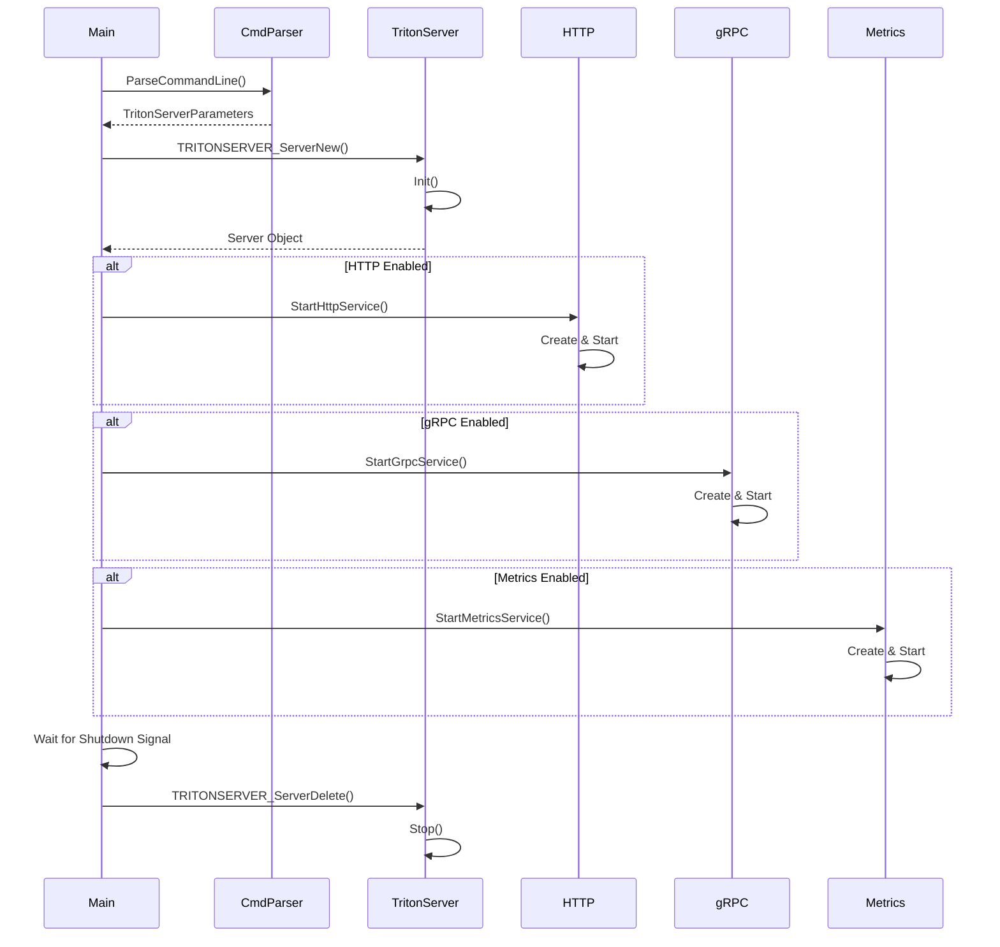

---

## 5. Backend 子模块详解

Backend 模块提供了后端实现的通用工具和抽象。

### 5.1 核心工具函数

**张量处理** (`backend/src/backend_common.cc:71-270`):

```cpp
// 获取内存类型
TRITONSERVER_MemoryType GetUsePinnedMemoryType(TRITONSERVER_MemoryType ref_buffer_type) {
  if (ref_buffer_type == TRITONSERVER_MEMORY_CPU_PINNED) {
    return TRITONSERVER_MEMORY_CPU_PINNED;
  }
  return (ref_buffer_type == TRITONSERVER_MEMORY_CPU) ? 
         TRITONSERVER_MEMORY_GPU : TRITONSERVER_MEMORY_CPU;
}

// 计算张量字节大小
int64_t GetByteSize(const TRITONSERVER_DataType& dtype, const vector<int64_t>& dims) {
  size_t dt_size = TRITONSERVER_DataTypeByteSize(dtype);
  if (dt_size == 0) return -1;
  
  int64_t cnt = GetElementCount(dims);
  if (cnt <= 0) return cnt;
  
  if (cnt > INT64_MAX / dt_size) return -3;
  return cnt * dt_size;
}

// 读取输入张量
TRITONSERVER_Error* ReadInputTensor(
    TRITONBACKEND_Request* request,
    const string& input_name,
    char* buffer,
    size_t* buffer_byte_size,
    TRITONSERVER_MemoryType memory_type,
    int64_t memory_type_id,
    cudaStream_t cuda_stream,
    bool* cuda_used,
    const char* host_policy_name,
    const bool copy_on_stream) {
  // ... 实现细节
}
```

### 5.2 输入收集器

**BackendInputCollector** (`backend/src/backend_input_collector.cc`):

用于收集和处理来自多个请求的输入张量。

### 5.3 输出响应器

**BackendOutputResponder** (`backend/src/backend_output_responder.cc`):

用于生成和发送推理响应。

---

## 6. Client 子模块详解

Client 模块提供了多种语言的客户端库。

### 6.1 HTTP Client

**C++ HTTP Client** (`client/src/c++/library/http_client.h:105-651`):

```cpp
class InferenceServerHttpClient : public InferenceServerClient {
 public:
  static Error Create(
      unique_ptr<InferenceServerHttpClient>* client,
      const string& server_url,
      bool verbose = false,
      const HttpSslOptions& ssl_options = HttpSslOptions());
  
  // 服务器健康检查
  Error IsServerLive(bool* live, const Headers& headers = Headers(), ...);
  Error IsServerReady(bool* ready, const Headers& headers = Headers(), ...);
  Error IsModelReady(bool* ready, const string& model_name, const string& model_version = "", ...);
  
  // 推理请求
  Error Infer(
      InferResult** result,
      const InferOptions& options,
      const vector<InferInput*>& inputs,
      const vector<const InferRequestedOutput*>& outputs = {},
      const Headers& headers = Headers(),
      const Parameters& query_params = Parameters());
  
  // 异步推理
  Error AsyncInfer(
      InferResult** result,
      const InferOptions& options,
      const vector<InferInput*>& inputs,
      const vector<const InferRequestedOutput*>& outputs = {},
      const Headers& headers = Headers(),
      const Parameters& query_params = Parameters(),
      void (*callback)(InferResult*, void*) = nullptr,
      void* userp = nullptr);
  
  // 流式推理
  Error StartStream(
      void (*callback)(InferResult*, void*), bool enable_stats,
      const Headers& headers = Headers(), const Parameters& query_params = Parameters());
};
```

### 6.2 gRPC Client

提供基于 gRPC 协议的高性能客户端实现。

### 6.3 Python Client

提供 Python 语言的客户端库。

---

## 7. Model Analyzer 子模块详解

Model Analyzer 是一个用于分析和优化模型性能的工具。

### 7.1 核心组件

**目录结构** (`model_analyzer/model_analyzer/`):

```
model_analyzer/
├── analyzer.py          # 主分析器
├── entrypoint.py        # 入口点
├── model_manager.py     # 模型管理
├── cli/                 # 命令行接口
├── config/              # 配置管理
├── device/              # 设备管理
├── monitor/             # 性能监控
├── output/              # 结果输出
├── perf_analyzer/       # 性能分析
├── plots/               # 图表生成
├── record/              # 记录管理
├── reports/             # 报告生成
├── result/              # 结果处理
├── state/               # 状态管理
└── triton/              # Triton 集成
```

### 7.2 工作流程


---

## 8. Model Navigator 子模块详解

Model Navigator 提供模型优化和导航功能。

### 8.1 核心功能

- 模型格式转换
- 性能优化
- 自动化部署准备

---

## 9. 推理请求完整生命周期

### 9.1 请求处理流程图

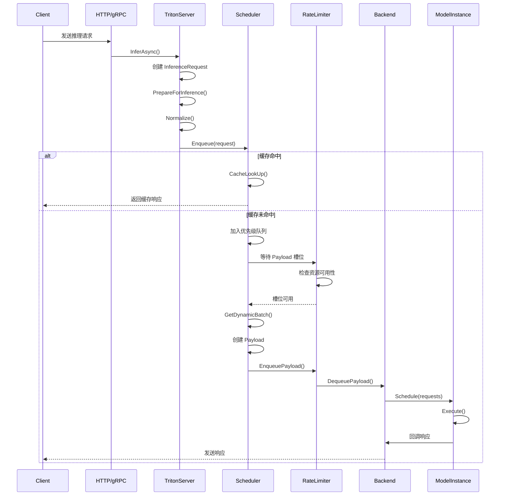

### 9.2 详细步骤说明

#### 步骤 1: 请求接收

1. HTTP/gRPC 服务器接收客户端请求
2. 解析请求头和请求体
3. 创建 `InferenceRequest` 对象

#### 步骤 2: 请求准备

```cpp
// core/src/infer_request.cc
Status InferenceRequest::PrepareForInference() {
  // 1. 验证请求
  RETURN_IF_ERROR(ValidateRequestInputs());
  RETURN_IF_ERROR(ValidateCorrelationId());
  
  // 2. 标准化张量形状
  RETURN_IF_ERROR(Normalize());
  
  // 3. 准备输出
  SetResponseFactory();
  
  return Status::Success;
}
```

#### 步骤 3: 调度入队

```cpp
// core/src/server.cc:570-587
Status InferenceServer::InferAsync(unique_ptr<InferenceRequest>& request) {
  // 检查服务器状态
  if ((ready_state_ != ServerReadyState::SERVER_READY) &&
      (ready_state_ != ServerReadyState::SERVER_EXITING)) {
    return Status(Status::Code::UNAVAILABLE, "Server not ready");
  }
  
  // 记录请求开始时间
  request->CaptureRequestStartNs();
  
  // 执行请求
  return InferenceRequest::Run(request);
}
```

#### 步骤 4: 批处理

```cpp
// core/src/dynamic_batch_scheduler.cc:302-447
void DynamicBatchScheduler::BatcherThread(const int nice) {
  while (!scheduler_thread_exit_.load()) {
    // 等待请求或超时
    std::unique_lock<std::mutex> lock(mu_);
    
    if (queue_.Empty()) {
      cv_.wait_for(lock, std::chrono::microseconds(default_wait_microseconds));
      continue;
    }
    
    // 获取动态批次
    uint64_t wait_microseconds = GetDynamicBatch();
    
    // 提取请求
    if (wait_microseconds == 0 && queue_.PendingBatchCount() != 0) {
      curr_payload_->ReserveRequests(queue_.PendingBatchCount());
      for (size_t idx = 0; idx < queue_.PendingBatchCount(); ++idx) {
        std::unique_ptr<InferenceRequest> request;
        queue_.Dequeue(&request);
        curr_payload_->AddRequest(std::move(request));
      }
    }
    
    // 提交执行
    if (curr_payload_->GetState() == Payload::State::READY) {
      rate_limiter_->EnqueuePayload(model_, curr_payload_);
    }
  }
}
```

#### 步骤 5: 后端执行

```cpp
// core/src/backend_model_instance.cc
Status TritonModelInstance::Schedule(
    vector<unique_ptr<InferenceRequest>>&& requests) {
  // 准备请求
  RETURN_IF_ERROR(PrepareRequestsForExecution(requests));
  
  // 转换为后端请求格式
  vector<TRITONBACKEND_Request*> triton_requests;
  for (auto& request : requests) {
    triton_requests.push_back(reinterpret_cast<TRITONBACKEND_Request*>(request.get()));
  }
  
  // 执行
  Execute(triton_requests);
  
  return Status::Success;
}

void TritonModelInstance::Execute(vector<TRITONBACKEND_Request*>& triton_requests) {
  // 调用后端执行函数
  TRITONSERVER_Error* err = backend_->ModelInstanceExecFn()(
      reinterpret_cast<TRITONBACKEND_ModelInstance*>(this),
      triton_requests.data(),
      triton_requests.size());
}
```

#### 步骤 6: 响应返回

```cpp
// core/src/infer_response.cc
void InferenceResponse::Send(
    unique_ptr<InferenceResponse>&& response,
    const uint32_t flags) {
  // 获取响应回调
  auto& factory = response->response_factory_;
  
  // 调用回调发送响应
  factory->ResponseCallback()(response.release(), flags, factory->UserPointer());
}
```

---

## 10. 关键机制详解

### 10.1 模型管理机制

#### 10.1.1 模型发现

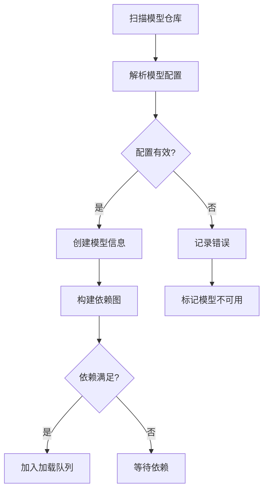

#### 10.1.2 模型加载流程

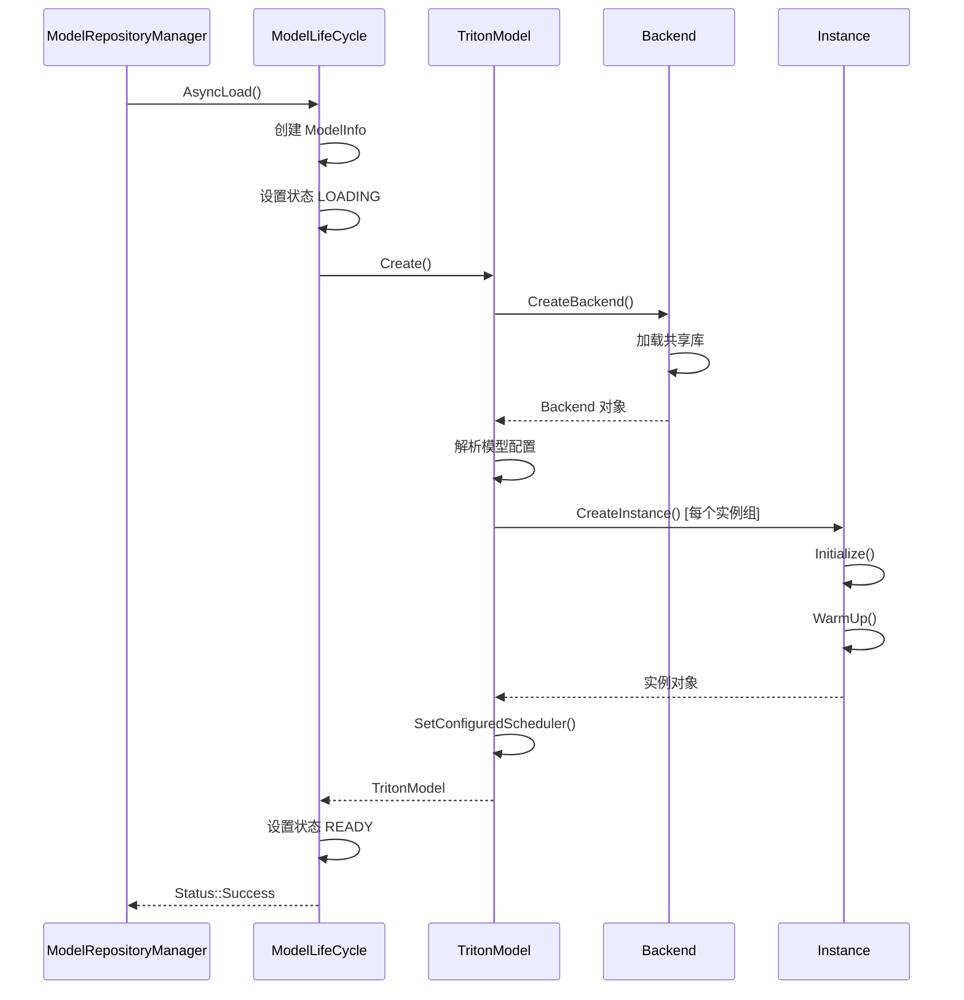

### 10.2 动态批处理机制

#### 10.2.1 批处理决策算法

```cpp
// core/src/dynamic_batch_scheduler.cc:488-600
uint64_t DynamicBatchScheduler::GetDynamicBatch() {
  bool send_now = false;
  
  // 重置游标
  queue_.ResetCursor();
  
  // 检查每个请求
  while (!queue_.Empty()) {
    // 获取下一个请求
    const InferenceRequest* request = queue_.GetNextRequest();
    
    // 检查批次大小限制
    size_t request_batch_size = std::max(1U, request->BatchSize());
    if (pending_batch_size_ + request_batch_size > max_batch_size_) {
      break;
    }
    
    // 检查张量形状一致性
    if (!enforce_equal_shape_tensors_.empty()) {
      // 检查形状是否匹配
      if (!CheckShapeCompatibility(request)) {
        break;
      }
    }
    
    // 加入待处理批次
    queue_.MarkPending();
    pending_batch_size_ += request_batch_size;
    
    // 检查是否达到首选批次大小
    if (preferred_batch_sizes_.count(pending_batch_size_) > 0) {
      send_now = true;
    }
  }
  
  // 决定是否立即执行
  if (send_now) {
    return 0;  // 立即执行
  }
  
  // 返回等待时间
  return pending_batch_delay_ns_;
}
```

#### 10.2.2 批处理时序图

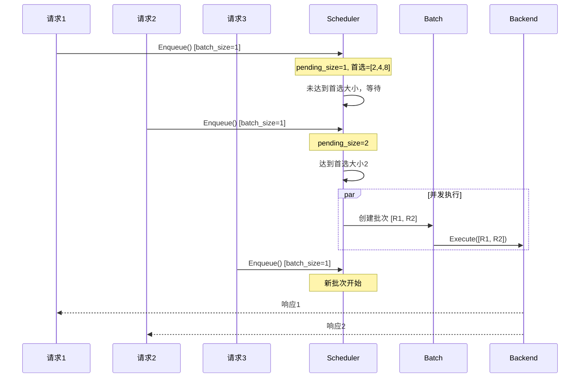

### 10.3 序列批处理机制

序列批处理用于处理有状态推理请求，如对话系统、视频分析等。

#### 10.3.1 序列调度策略

**Direct 策略**: 直接在序列槽位上执行

**Oldest 策略**: 选择最老的序列请求优先执行

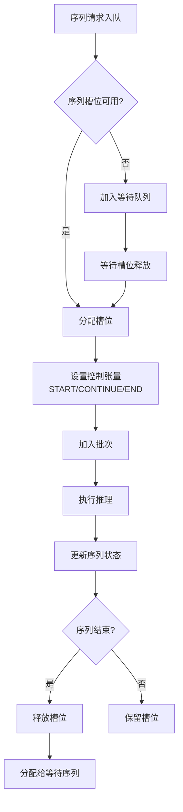

### 10.4 Ensemble 机制

Ensemble 模型允许将多个模型组合成一个推理流水线。

#### 10.4.1 Ensemble 调度

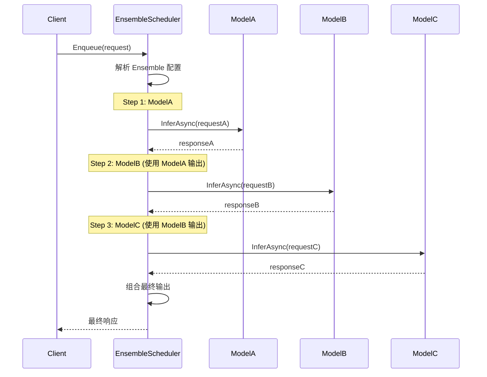

### 10.5 响应缓存机制

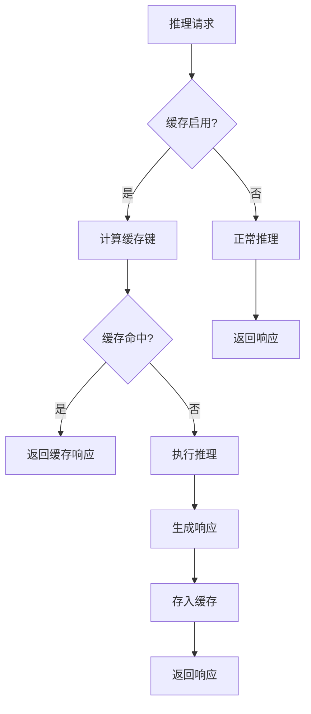

### 10.6 模型版本管理

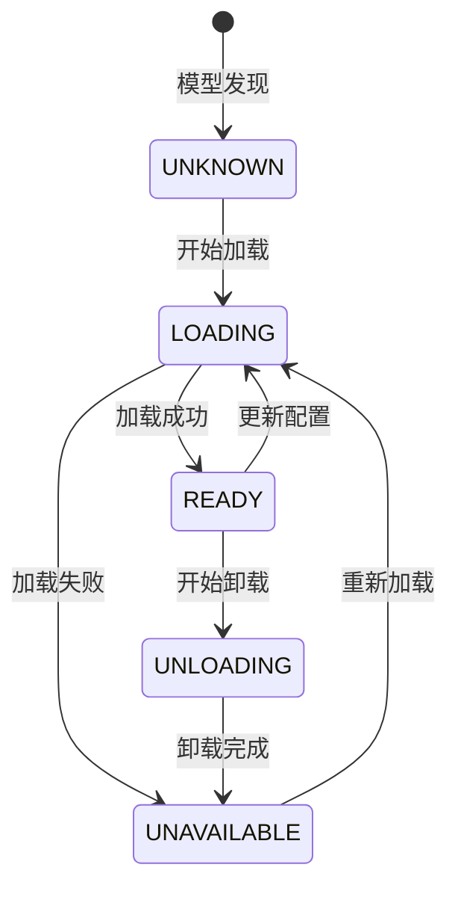

---

## 11. 性能优化策略

### 11.1 批处理优化

#### 11.1.1 首选批次大小配置

```protobuf
# model_config.pb.txt
dynamic_batching {
  preferred_batch_size: [ 2, 4, 8, 16 ]
  max_queue_delay_microseconds: 100
}
```

- 设置多个首选批次大小可以在不同负载下优化吞吐量
- 较小的首选批次可以降低延迟
- 较大的首选批次可以提高 GPU 利用率

#### 11.1.2 队列延迟优化

```cpp
// 调整最大队列延迟
uint64_t max_queue_delay_microseconds = 100;  // 100微秒
```

- 较短的延迟可以降低尾部延迟
- 较长的延迟可以提高批次填充率

### 11.2 内存优化

#### 11.2.1 Pinned Memory Pool

```cpp
// core/src/server.cc:107
pinned_memory_pool_size_ = 1 << 28;  // 256MB 默认大小
```

- 使用 Pinned Memory 可以加速 CPU-GPU 数据传输
- 根据工作负载调整池大小

#### 11.2.2 CUDA Memory Pool

```cpp
// core/src/server.cc:224-232
for (const auto gpu : supported_gpus) {
  if (cuda_memory_pool_size_.find(gpu) == cuda_memory_pool_size_.end()) {
    cuda_memory_pool_size_[gpu] = 1 << 26;  // 64MB 默认大小
  }
}
```

### 11.3 实例优化

#### 11.3.1 多实例配置

```protobuf
instance_group [
  {
    kind: KIND_GPU
    count: 2
    gpus: [ 0 ]
  },
  {
    kind: KIND_GPU
    count: 2
    gpus: [ 1 ]
  }
]
```

- 在多 GPU 服务器上创建多个实例可以提高并行度
- 考虑 GPU 内存限制来设置实例数量

#### 11.3.2 实例队列策略

```protobuf
dynamic_batching {
  default_queue_policy {
    timeout_action: REJECT
    default_timeout_microseconds: 30000000
  }
}
```

### 11.4 后端优化

#### 11.4.1 TensorRT 优化

- 使用 TensorRT 进行模型优化
- 启用 FP16 或 INT8 量化
- 使用 TensorRT 的动态批处理支持

#### 11.4.2 CUDA Graph

- 对于固定输入形状的模型，启用 CUDA Graph
- 减少内核启动开销

### 11.5 网络优化

#### 11.5.1 HTTP 配置

```cpp
// server/src/main.cc
g_triton_params.http_thread_cnt_ = 8;  // HTTP 线程数
g_triton_params.http_max_input_size_ = 64 * 1024 * 1024;  // 64MB 最大输入
```

#### 11.5.2 gRPC 配置

```cpp
// gRPC 选项
grpc_options.use_ssl_ = false;
grpc_options.ssl_options_ = ...;
```

### 11.6 监控和可观测性

#### 11.6.1 Prometheus 指标

- `nv_inference_request_success`: 成功推理请求数
- `nv_inference_request_failure`: 失败推理请求数
- `nv_inference_exec_count`: 推理执行次数
- `nv_inference_queue_duration_us`: 队列等待时间
- `nv_inference_compute_infer_duration_us`: 推理计算时间

#### 11.6.2 性能分析

使用 Model Analyzer 工具进行性能分析：

```bash
model-analyzer profile \
  --model-repository /models \
  --profile-models my_model \
  --output-model-repository /result
```

---

## 12. 总结

### 12.1 架构特点

1. **模块化设计**: Triton 采用清晰的分层架构，各模块职责明确
2. **可扩展性**: 支持自定义后端、自定义调度策略
3. **高性能**: 动态批处理、多实例并行、CUDA 优化
4. **灵活性**: 支持多种框架、多种协议、多种部署方式

### 12.2 核心数据流

```
Client Request
     ↓
HTTP/gRPC Server
     ↓
InferenceServer.InferAsync()
     ↓
InferenceRequest.PrepareForInference()
     ↓
Scheduler.Enqueue()
     ↓
[Cache Lookup] → Cache Hit → Response
     ↓
DynamicBatcher.GetDynamicBatch()
     ↓
RateLimiter.EnqueuePayload()
     ↓
Backend.Execute()
     ↓
Model Instance Execution
     ↓
Response Callback
     ↓
Client Response
```

### 12.3 关键设计模式

1. **工厂模式**: Backend 创建、Model 创建
2. **策略模式**: 不同调度器实现
3. **观察者模式**: 模型状态变化通知
4. **生产者-消费者模式**: 请求队列处理
5. **状态机模式**: 请求状态转换、模型生命周期

### 12.4 性能关键点

| 组件 | 优化策略 |
|------|----------|
| 批处理 | 动态批处理、首选批次大小 |
| 内存 | Pinned Memory、CUDA Memory Pool |
| 调度 | 多实例并行、优先级队列 |
| 网络 | HTTP/2、gRPC 流式传输 |
| 后端 | TensorRT 优化、CUDA Graph |

---

*文档生成时间: 2026-03-30*
*Triton 版本: 基于 API Version 1.34*
